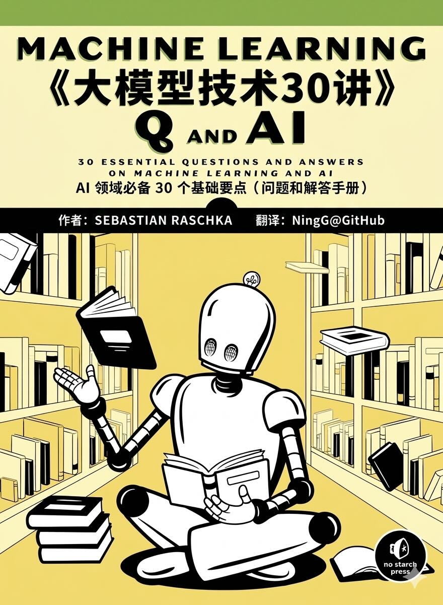
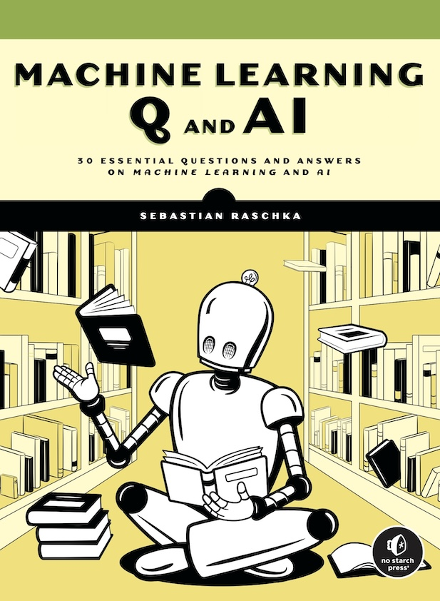

# 大模型技术30讲（英文&中英文&中文批注）

大模型技术30讲（原版），30 Essential Questions and Answers on Machine Learning and AI

## 1.背景

买了一本《大模型技术30讲》，简单阅读了下，要点突出，对于入门、加深关键点理解，很有用。

但是，也存在问题 & 未满足的诉求：
- 1.《大模型技术30讲》纸质版 *（2025年3月第2次印刷）*，印刷质量，偏差；
- 2.大部分`术语`，都翻译为中文，不利于中英对比，特别是 AI 领域基本都是英文的，需要我们熟悉`英文术语`。
- 3.希望有 `电子版` 资料，方便利用 AI 工具辅助理解，提升效率。

因此，找到 [原始文档：Machine Learning Q and AI](https://sebastianraschka.com/books/ml-q-and-ai/)，反复消化原始信息。

然后，将原始信息，转录为 md 格式，并且，存储在 github 上。

## 2.项目介绍

本项目是系统性学习大模型技术要点的教程，基于原始的 *《30 Essential Questions and Answers on Machine Learning and AI》* ，基于最先进的 AI 工具`翻译`，逐行校正添加`中文批注`，增强可读性。

### 2.1.你将收获什么？

1. 系统性学习：大模型技术要点的教程
2. 熟悉核心的术语（英文 + 中文）
3. 共同维护，中文批注，增强可读性，贡献给开源社区

### 2.2.迭代计划

1. 首版：中文批注: ✅
2. 导出 pdf 文件: ✅
3. 同步到多个开源社区: TODO

## 3.在线阅读

  

    在线阅读：
    <a href="https://ningg.top/Machine-Learning-Q-and-AI/" target="_blank">《大模型技术30讲》</a>
    ，pdf 文件：
    <a href="https://ningg.top/Machine-Learning-Q-and-AI/pdf/大模型技术30讲(英文&中文批注)_LLM_30_Essential_Lectures_AI.pdf" target="_blank">《大模型技术30讲-PDF版本》</a>
  

 
  
<em>深入理解 LLM 核心原理，直击要点</em>

    
    

## 4.如何贡献   

我们欢迎任何形式的贡献！

- 🐛 报告 Bug - 发现问题请提交 [Issue](https://github.com/ningg/Machine-Learning-Q-and-AI/issues)
- 💡 功能建议 - 有好想法就告诉我们
- 📝 内容完善 - 帮助改进教程内容

> Note: 后续资料会附上贡献者名单.

## 30 Essential Questions and Answers on Machine Learning and AI

> Machine learning and AI are moving at a rapid pace. Researchers and
> practitioners are constantly struggling to keep up with the breadth of
> concepts and techniques. This book provides bite-sized bits of
> knowledge for your journey from machine learning beginner to expert,
> covering topics from various machine learning areas. Even experienced
> machine learning researchers and practitioners will encounter
> something new that they can add to their arsenal of techniques.

## What People Are Saying

> "Sebastian has a gift for distilling complex, AI-related topics into
> practical takeaways that can be understood by anyone. His new book,
> Machine Learning Q and AI, is another great resource for AI
> practitioners of any level."? ""Cameron R. Wolfe, Writer of Deep
> (Learning) Focus

> "Sebastian uniquely combines academic depth, engineering agility,
> and the ability to demystify complex ideas. He can go deep into any
> theoretical topics, experiment to validate new ideas, then explain
> them all to you in simple words. If you're starting your journey
> into machine learning, Sebastian is your guide."? ""Chip Huyen,
> Author of Designing Machine Learning Systems

> "One could hardly ask for a better guide than Sebastian, who is,
> without exaggeration, the best machine learning educator currently in
> the field. On each page, Sebastian not only imparts his extensive
> knowledge but also shares the passion and curiosity that mark true
> expertise."? ""Chris Albon, Director of Machine Learning, The
> Wikimedia Foundation

> "Sebastian Raschka's new book, Machine Learning Q and AI, is a
> one-stop shop for overviews of crucial AI topics beyond the core
> covered in most introductory courses"¦If you have already stepped
> into the world of AI via deep neural networks, then this book will
> give you what you need to locate and understand the next level."?
> ""Ronald T. Kneusel, author of How AI Works

 

## Table of Contents

- [Introduction](./introduction/_books_ml-q-and-ai-chapters_introduction.md)

### Part I: Neural Networks and Deep Learning

- [Chapter 1: Embeddings, Latent Space, and Representations](./ch01/_books_ml-q-and-ai-ch01.md)
- [Chapter 2: Self-Supervised Learning](./ch02/_books_ml-q-and-ai-ch02.md)
- [Chapter 3: Few-Shot Learning](./ch03/_books_ml-q-and-ai-ch03.md)
- [Chapter 4: The Lottery Ticket  Hypothesis](./ch04/_books_ml-q-and-ai-ch04.md)
- [Chapter 5: Reducing Overfitting with Data](./ch05/_books_ml-q-and-ai-ch05.md)
- [Chapter 6: Reducing Overfitting with Model Modifications](./ch06/_books_ml-q-and-ai-ch06.md)
- [Chapter 7: Multi-GPU Training Paradigms](./ch07/_books_ml-q-and-ai-ch07.md)
- [Chapter 8: The Success of Transformers](./ch08/_books_ml-q-and-ai-ch08.md)
- [Chapter 9: Generative AI Models](./ch09/_books_ml-q-and-ai-ch09.md)
- [Chapter 10: Sources of Randomness](./ch10/_books_ml-q-and-ai-ch10.md)

### Part II: Computer Vision

- [Chapter 11: Calculating the Number of Parameters](./ch11/_books_ml-q-and-ai-ch11.md)
- [Chapter 12: Fully Connected and Convolutional Layers](./ch12/_books_ml-q-and-ai-ch12.md)
- [Chapter 13: Large Training Sets for Vision Transformers](./ch13/_books_ml-q-and-ai-ch13.md)

### Part III: Natural Language Processing

- [Chapter 14: The Distributional Hypothesis](./ch14/_books_ml-q-and-ai-ch14.md)
- [Chapter 15: Data Augmentation for Text](./ch15/_books_ml-q-and-ai-ch15.md)
- [Chapter 16: Self-Attention](./ch16/_books_ml-q-and-ai-ch16.md)
- [Chapter 17: Encoder- and Decoder-Style Transformers](./ch17/_books_ml-q-and-ai-ch17.md)
- [Chapter 18: Using and Fine-Tuning Pretrained Transformers](./ch18/_books_ml-q-and-ai-ch18.md)
- [Chapter 19: Evaluating Generative Large Language Models](./ch19/_books_ml-q-and-ai-ch19.md)

### Part IV: Production and Deployment

- [Chapter 20: Stateless and Stateful Training](./ch20/_books_ml-q-and-ai-ch20.md)
- [Chapter 21: Data-Centric AI](./ch21/_books_ml-q-and-ai-ch21.md)
- [Chapter 22: Speeding Up Inference](./ch22/_books_ml-q-and-ai-ch22.md)
- [Chapter 23: Data Distribution Shifts](./ch23/_books_ml-q-and-ai-ch23.md)

### Part V: Predictive Performance and Model Evaluation

- [Chapter 24: Poisson and Ordinal Regression](./ch24/_books_ml-q-and-ai-ch24.md)
- [Chapter 25: Confidence Intervals](./ch25/_books_ml-q-and-ai-ch25.md)
- [Chapter 26: Confidence Intervals vs. Conformal Predictions](./ch26/_books_ml-q-and-ai-ch26.md)
- [Chapter 27: Proper Metrics](./ch27/_books_ml-q-and-ai-ch27.md)
- [Chapter 28: The k in k-Fold Cross-Validation](./ch28/_books_ml-q-and-ai-ch28.md)
- [Chapter 29: Training and Test Set Discordance](./ch29/_books_ml-q-and-ai-ch29.md)
- [Chapter 30: Limited Labeled Data](./ch30/_books_ml-q-and-ai-ch30.md)

