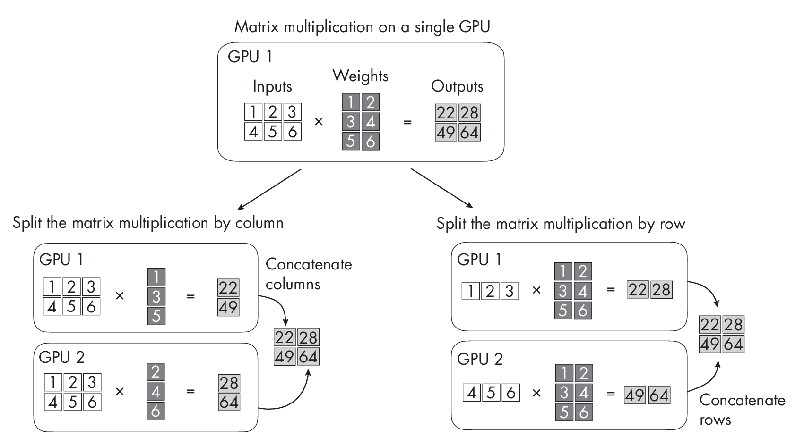

# Chapter 7: Multi-GPU Training Paradigms 

**What are the different multi-GPU training paradigms, and what are
their respective advantages and disadvantages?**

Multi-GPU training paradigms can be categorized into two groups:
dividing data for parallel processing with multiple GPUs and dividing
the model among multiple GPUs to handle memory constraints when the
model size surpasses that of a single GPU. Data parallelism falls into
the first category, while model parallelism and tensor parallelism fall
into the second category. Techniques like pipeline parallelism borrow
ideas from both categories. In addition, current software
implementations such as DeepSpeed, Colossal AI, and others blend
multiple approaches into a hybrid technique.

This chapter introduces several training paradigms and provides advice
on which to use in practice.

::: note
This chapter primarily uses the term [GPUs]{.upright} to describe the
hardware utilized for parallel processing. However, the same concepts
and techniques discussed can be applied to other specialized hardware
devices, such as tensor processing units (TPUs) or other accelerators,
depending on the specific architecture and requirements of the system.
:::

## The Training Paradigms 

The following sections discuss the model parallelism, data parallelism,
tensor parallelism, and sequence parallelism multi-GPU training
paradigms.

### Model Parallelism 

*Model parallelism*, or *inter-op parallelism*, is a technique in which
different sections of a large model are placed on different GPUs and are
computed sequentially, with intermediate results passed between the
devices. This allows for the training and execution of models that might
not fit entirely on a single device, but it can require intricate
coordination to manage the dependencies between different parts of the
model.

Model parallelism is perhaps the most intuitive form of parallelization
across devices. For example, for a simple neural network that consists
of only two layers""a hidden layer and an output layer""we can keep
one layer on one GPU and the other layer on another GPU. Of course, this
can scale to an arbitrary number of layers and GPUs.

This is a good strategy for dealing with limited GPU memory where the
complete network does not fit into one GPU. However, there are more
efficient ways of using multiple GPUs, such as tensor parallelism,
because the chain-like structure (layer 1 on GPU 1 \\(\\rightarrow\\)
layer 2 on GPU 2 \\(\\rightarrow\\) ."†."†.) in model parallelism
introduces a bottleneck. In other words, a major disadvantage of model
parallelism is that the GPUs have to wait for each other. They cannot
efficiently work in parallel, as they depend on one other's outputs.

### Data Parallelism 

*Data parallelism* has been the default mode for multi-GPU training for
several years. Here, we divide a minibatch into smaller microbatches.
Each GPU then processes a microbatch separately to compute the loss and
loss gradients for the model weights. After the individual devices
process the microbatches, the gradients are combined to compute the
weight update for the next round.

An advantage of data parallelism over model parallelism is that the GPUs
can run in parallel. Each GPU processes a portion of the training
minibatch, that is, a microbatch. However, a caveat is that each GPU
requires a full copy of the model. This is obviously not feasible if we
have large models that don't fit into the GPU's VRAM.

### Tensor Parallelism 

*Tensor parallelism*, or *intra-op parallelism*, is a more efficient
form of model parallelism. Here, the weight and activation matrices are
spread across the devices instead of distributing whole layers across
devices: the individual matrices are split, so we split an individual
matrix multiplication across GPUs.

We can implement tensor parallelism using basic principles of linear
algebra; we can split a matrix multiplication across two GPUs in a row-
or column-wise fashion, as illustrated in
Figure [\[fig-ch07-fig01\]](#fig-ch07-fig01){reference="fig-ch07-fig01"
reference-type="ref"} for two GPUs. (This concept can be extended to an
arbitrary number of GPUs.)

::: figurewide
{style="width:5.525in"}
:::

Like model parallelism, tensor parallelism allows us to work around
memory limitations. At the same time, it also lets us execute operations
in parallel, similar to data parallelism.

A small weakness of tensor parallelism is that it can result in high
communication overhead between the multiple GPUs across which the
matrices are split or sharded. For instance, tensor parallelism requires
frequent synchronization of the model parameters across devices, which
can slow down the overall training process.

Figure [1.1](#fig-ch07-fig02){reference="fig-ch07-fig02"
reference-type="ref"} compares model, data, and tensor parallelism.

{#fig-ch07-fig02
style="width:98.0%"}

In model parallelism, we put different layers onto different GPUs to
work around GPU memory limitations. In data parallelism, we split a
batch across GPUs to train copies of the model in parallel, averaging
gradients for the weight update afterward. In tensor parallelism, we
split matrices (inputs and weights) across different GPUs for parallel
processing when models are too large to fit into GPU memory.

### Pipeline Parallelism 

In *pipeline parallelism*, activations are passed during the forward
pass, as in model parallelism. The twist is that the gradients of the
input tensor are passed backward to prevent the devices from being idle.
In a sense, pipeline parallelism is a sophisticated hybrid version of
data and model parallelism.

We can think of pipeline parallelism as a form of model parallelism that
tries to minimize the sequential computation bottleneck, enhancing the
parallelism between the individual layers sitting on different devices.
However, pipeline parallelism also borrows ideas from data parallelism,
such as splitting minibatches further into microbatches.

Pipeline parallelism is definitely an improvement over model
parallelism, though it is not perfect and there will be idle bubbles. A
further disadvantage of pipeline parallelism is that it may require
significant effort to design and implement the pipeline stages and
associated communication patterns. Additionally, the performance gains
it generates may not be as substantial as those from other
parallelization techniques, such as pure data parallelism, especially
for small models or in cases where the communication overhead is high.

For modern architectures that are too large to fit into GPU memory, it
is more common nowadays to use a blend of data parallelism and tensor
parallelism techniques instead of pipeline parallelism.

### Sequence Parallelism 

*Sequence parallelism* aims to address computational bottlenecks when
working with long sequences using transformer-based LLMs. More
specifically, one shortcoming of transformers is that the self-attention
mechanism (the original scaled-dot product attention) scales
quadratically with the input sequence length. There are, of course, more
efficient alternatives to the original attention mechanism that scale
linearly.

However, these efficient self-attention mechanisms are less popular, and
most people still prefer the original scaled-dot product attention
mechanism as of this writing. Sequence parallelism, illustrated in
Figure [1.2](#fig-ch07-fig03){reference="fig-ch07-fig03"
reference-type="ref"}, splits the input sequence into smaller chunks to
be distributed across GPUs, which aims to reduce computation memory
constraints of self-attention mechanisms.

{#fig-ch07-fig03}

How does sequence parallelism relate to the multi-GPU techniques
discussed earlier? Sequence parallelism deals specifically with
sequential data, tensor parallelism deals with the model's internal
structure, and data parallelism deals with how the training data is
divided. Theoretically, since each of these parallelism strategies
addresses a different aspect of the computational challenge, they can
thus be combined in various ways to optimize the training or inference
process. Sequence parallelism is not as well studied as other
parallelization techniques, however.

While sequence parallelism appears useful in practice, it also
introduces additional communication overheads similar to the
aforementioned parallelism techniques. Like data parallelism, it
requires us to duplicate the model and make sure it fits into the device
memory. Another of its disadvantages (depending on the implementation)
for multi-GPU training of transformers is that breaking up the input
sequence into smaller subsequences can decrease the model's accuracy
(mainly when the model is applied to longer sequences).

## Recommendations 

Practical recommendations depend on the context. If we train small
models that fit onto a single GPU, then data parallelism strategies may
be the most efficient. Performance gains from pipeline parallelism may
not be as significant as those from other parallelization techniques,
such as data parallelism, especially for small models or in cases where
the communication overhead is high.

If models are too large to fit into the memory of a single GPU, we need
to explore model or tensor parallelism. Tensor parallelism is naturally
moreefficient; the GPUs can work in parallel since there is no
sequential dependency as in model parallelism.

Modern multi-GPU strategies also typically combine data parallelism and
tensor parallelism.

### Exercises 

7-1. Suppose we are implementing our own version of tensor parallelism,
which works great when we train our model with a standard stochastic
gradient descent optimizer. However, when we try the Adam optimizer by
Diederik P. Kingma and Jimmy Ba, we encounter an out-of-memory device.
What problem might explain this issue?

7-2. Suppose we don't have access to a GPU and are considering using
data parallelism on the CPU. Is this a good idea?

## References 

- The original paper on the Adam optimizer: Diederik P. Kingma and Jimmy
  Ba, "Adam: A Method for Stochastic Optimization"? (2014),
  <https://arxiv.org/abs/1412.6980>.

- FormoreonDeepSpeedandColossal-AIformulti-GPUtraining:
  <https://github.com/microsoft/DeepSpeed> and
  <https://github.com/hpcaitech/ColossalAI>.

- Pipeline parallelism tutorials and research by the DeepSpeed team:
  <https://www.deepspeed.ai/tutorials/pipeline> and Yanping Huang et
  al., "GPipe: Efficient Training of Giant Neural Networks Using
  Pipeline Parallelism"? (2018), <https://arxiv.org/abs/1811.06965>.

- The paper proposing sequence parallelism for transformer-based
  language models: Shenggui Li et al., "Sequence Parallelism: Long
  Sequence Training from \[a\] System\[s\] Perspective"? (2022),
  <https://arxiv.org/abs/2105.13120>.

- The scaled-dot product attention mechanism was proposed with the
  original transformer architecture: Ashish Vaswani et al., "Attention
  Is All You Need"? (2017), <https://arxiv.org/abs/1706.03762>.

- A survey covering alternatives to the original self-attention
  mechanism that scale linearly: Yi Tay et al., "Efficient
  Transformers: A Survey"? (2020), <https://arxiv.org/abs/2009.06732>.

- A survey covering additional techniques to improve the training
  efficiency of transformers: Bohan Zhuang et al., "A Survey on
  Efficient Training of Transformers"? (2023),
  <https://arxiv.org/abs/2302.01107>.

- Modern multi-GPU strategies typically combine data parallelism and
  tensor parallelism. Popular examples include DeepSpeed stages 2 and 3,
  described in this tutorial on the zero redundancy optimizer:
  <https://www.deepspeed.ai/tutorials/zero/>.

\

------------------------------------------------------------------------

