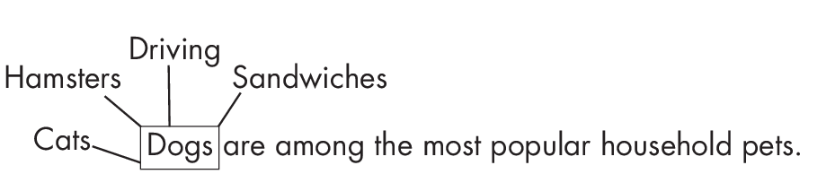

# Part 3: Natural Language Processing 

## Chapter 14: The Distributional Hypothesis 

**What is the distributional hypothesis in natural language processing
(NLP)? Where is it used, and how far does it hold true?**

The distributional hypothesis is a linguistic theory suggesting that
words occurring in the same contexts tend to have similar meanings,
according to the original source, "Distributional Structure"? by
Zellig S. Harris. Succinctly, the more similar the meanings of two words
are, the more often they appear in similar contexts.

Consider the sentence in
Figure [1.1](#fig-ch14-fig01){reference="fig-ch14-fig01"
reference-type="ref"}, for example. The words *cats* and *dogs* often
occur in similar contexts, and we could replace *cats* with *dogs*
without making the sentence sound awkward. We could also replace *cats*
with *hamsters*, since both are mammals and pets, and the sentence would
still sound plausible. However, replacing *cats* with an unrelated word
such as *sandwiches* would render the sentence clearly wrong, and
replacing *cats* with the unrelated word *driving* would also make the
sentence grammatically incorrect.

{#fig-ch14-fig01
style="width:105.0%"}

It is easy to construct counterexamples using polysemous words, that is,
words that have multiple meanings that are related but not identical.
For example, consider the word *bank*. As a noun, it can refer to a
financial institution, the "rising ground bordering a river,"? the
"steep incline of a hill,"? or a "protective cushioning rim"?
(according to the Merriam-Webster dictionary). It can even be a verb: to
bank on something means to rely or depend on it. These different
meanings have different distributional properties and may not always
occur in similar contexts.

Nonetheless, the distributional hypothesis is quite useful. Word em-
 beddings (introduced in Chapter [\[ch01\]](../ch01){reference="ch01"
reference-type="ref"}) such as Word2vec, as well as many large language
transformer models, rely on this idea. This includes the masked language
model in BERT and the next-word pretraining task used in GPT.

### Word2vec, BERT, and GPT 

The Word2vec approach uses a simple,two-layer neuralnetwork to encode
words into embedding vectors such that the embedding vectors of similar
words are both semantically and syntactically close. There are two ways
to train a Word2vec model: the continuous bag-of-words (CBOW) approach
and the skip-gram approach.When using CBOW, the Word2vec model learns to
predict the current words by using the surrounding context words.
Conversely, in the skip-gram model, Word2vec predicts the context words
from a selected word. While skip-gram is more effective for infrequent
words, CBOW is usually faster to train.

After training, word embeddings are placed within the vector space so
that words with common contexts in the corpus""that is, words with
semantic and syntactic similarities""are positioned close to each
other, as illustrated in
Figure [1.2](#fig-ch14-fig02){reference="fig-ch14-fig02"
reference-type="ref"}. Conversely, dissimilar words are located farther
apart in the embedding space.

{#fig-ch14-fig02
style="width:105.0%"}

BERT is an LLM based on the transformer architecture (see
Chapter [\[ch08\]](../ch08){reference="ch08" reference-type="ref"})
that uses a masked language modeling approach that involves masking
(hiding) some of the words in a sentence. Its task is to predict these
masked words based on the other words in the sequence, as illustrated in
Figure [1.3](#fig-ch14-fig03){reference="fig-ch14-fig03"
reference-type="ref"}. This is a form of the self-supervised learning
used to pretrain LLMs (see Chapter [\[ch02\]](../ch02){reference="ch02"
reference-type="ref"} for more on self-supervised learning). The
pretrained model produces embeddings in which similar words (or tokens)
are close in the embedding space.

{#fig-ch14-fig03}

GPT, which like BERT is also an LLM based on the transformer
architecture, functions as a decoder. Decoder-style models like GPT
learn to predict subsequent words in a sequence based on the preceding
ones, as illustrated in
Figure [1.4](#fig-ch14-fig04){reference="fig-ch14-fig04"
reference-type="ref"}. GPT contrasts with BERT, an encoder model, as it
emphasizes predicting what follows rather than encoding the entire
sequence simultaneously.

{#fig-ch14-fig04}

Where BERT is a bidirectional language model that considers the whole
input sequence, GPT only strictly parses previous sequence elements.
This means BERT is usually better suited for classification tasks,
whereas GPT is more suited for text generation tasks. Similar to BERT,
GPT produces high-quality contextualized word embeddings that capture
semantic similarity.

### Does the Hypothesis Hold? 

For large datasets, the distributional hypothesis more or less holds
true, making it quite useful for understanding and modeling language
patterns, word relationships, and semantic meanings. For example, this
concept enables techniques like word embedding and semantic analysis,
which, in turn, facilitate natural language processing tasks such as
text classification, sentiment analysis, and machine translation.

In conclusion, while there are counterexamples in which the
distributional hypothesis does not hold, it is a very useful concept
that forms the cornerstone of modern language transformer models.

### Exercises 

14-1. Does the distributional hypothesis hold true in the case of
homophones, or words that sound the same but have different meanings,
such as *there* and *their*?

14-2. Can you think of another domain where a concept similar to the
distributional hypothesis applies? (Hint: think of other input
modalities for neural networks.)

### References 

- The original source describing the distributional hypothesis:
  Zellig S. Harris, "Distributional Structure"? (1954),
  [*https://doi.org/10.1080/*](https://doi.org/10.1080/00437956.1954.11659520)
  [*00437956.1954.11659520*](https://doi.org/10.1080/00437956.1954.11659520).

- The paper introducing the Word2vec model: Tomas Mikolov et al.,
  "Efficient Estimation of Word Representations in Vector Space"?
  (2013), <https://arxiv.org/abs/1301.3781>.

- The paper introducing the BERT model: Jacob Devlin et al., "BERT:
  Pre-training of Deep Bidirectional Transformers for Language
  Understanding"? (2018), <https://arxiv.org/abs/1810.04805>.

- The paper introducing the GPT model: Alec Radford and Karthik
  Narasimhan, "Improving Language Understanding by Generative
  Pre-Training"? (2018),
  [*https://www.semanticscholar.org/paper/Improving*](https://www.semanticscholar.org/paper/Improving-Language-Understanding-by-Generative-Radford-Narasimhan/cd18800a0fe0b668a1cc19f2ec95b5003d0a5035)
  [*-Language-Understanding-by-Generative-Radford-Narasimhan/cd18800a0*](https://www.semanticscholar.org/paper/Improving-Language-Understanding-by-Generative-Radford-Narasimhan/cd18800a0fe0b668a1cc19f2ec95b5003d0a5035)
  [*fe0b668a1cc19f2ec95b5003d0a5035*](https://www.semanticscholar.org/paper/Improving-Language-Understanding-by-Generative-Radford-Narasimhan/cd18800a0fe0b668a1cc19f2ec95b5003d0a5035).

- BERT produces embeddings in which similar words (or tokens) are close
  in the embedding space: Nelson F. Liu et al., "Linguistic Knowledge
  and Transferability of Contextual Representations"? (2019),
  <https://arxiv.org/abs/1903.08855>.

- The paper showing that GPT produces high-quality contextualized word
  embeddings that capture semantic similarity: Fabio Petroni et al.,
  "Language Models as Knowledge Bases?"? (2019),
  <https://arxiv.org/abs/1909.01066>.

\

------------------------------------------------------------------------

