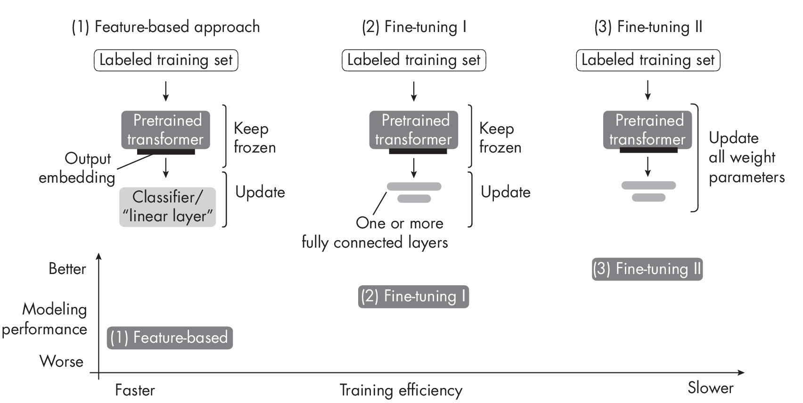

# Chapter 18: Using and Fine-Tuning Pretrained Transformers [](#chapter-18-using-and-fine-tuning-pretrained-transformers)


**What are the different ways to use and fine-tune pretrained large
language models?**

The three most common ways to use and fine-tune pretrained LLMs include
a feature-based approach, in-context prompting, and updating a subset of
the model parameters. First, most pretrained LLMs or language
transformers can be utilized without the need for further fine-tuning.
For instance, we can employ a feature-based method to train a new
downstream model, such as a linear classifier, using embeddings
generated by a pretrained transformer. Second, we can showcase examples
of a new task within the input itself, which means we can directly
exhibit the expected outcomes without requiring any updates or learning
from the model. This concept is also known as *prompting*. Finally,
it's also possible to fine-tune all or just a small number of
parameters to achieve the desired outcomes.

Thefollowingsectionsdiscussthesetypesofapproachesingreaterdepth.

## Using Transformers for Classification Tasks [](#using-transformers-for-classification-tasks)

Let'sstartwiththeconventionalmethodsforutilizingpretrainedtransformers:
training another model on feature embeddings, fine-tuning outputlayers,
and fine-tuning all layers. We'll discuss these in the context of
classification. (We will revisit prompting later in the section
"In-Context Learning, Indexing, and Prompt Tuning"? on page .)

In the feature-based approach, we load the pretrained model and keep it
"frozen,"? meaning we do not update any parameters of the pretrained
model. Instead, we treat the model as a feature extractor that we apply
to our new dataset. We then train a downstream model on these
embeddings.
Thisdownstreammodelcanbeanymodelwelike(randomforests,XGBoost, and so
on), but linear classifiers typically perform best. This is likely
because pretrained transformers like BERT and GPT already extract
high-quality, in-  formative features from the input data. These
feature embeddings often capture complex relationships and patterns,
making it easy for a linear classifier to effectively separate the
data into different classes. Furthermore, linear classifiers, such as
logistic regression machines and support vector machines, tend to have
strong regularization properties. These regularization properties help
prevent overfitting when working with high-dimensional feature spaces
generated by pretrained transformers. This feature-based approach is the
most efficient method since it doesn't require updating the
transformer model at all. Finally, the embeddings can be precomputed for
a given training dataset (since they don't change) when training a
classifier for multiple training epochs.

Figure [1.1](#fig-ch18-fig01){reference="fig-ch18-fig01"
reference-type="ref"} illustrates how LLMs are typically created and
adopted for downstream tasks using fine-tuning. Here, a pretrained
model, trained on a general text corpus, is fine-tuned to perform tasks
like German-to-English translation.

{#fig-ch18-fig01}

The conventional methods for fine-tuning pretrained LLMs include
updating only the output layers, a method we'll refer to as
*fine-tuning I*, and updating all layers, which we'll call
*fine-tuning II*.

Fine-tuning I is similar to the feature-based approach described
earlier, but it adds one or more output layers to the LLM itself. The
backbone of the LLM remains frozen, and we update only the model
parameters in these new layers. Since we don't need to backpropagate
through the whole network, this approach is relatively efficient
regarding throughput and memory requirements.

In fine-tuning II, we load the model and add one or more output layers,
similarly to fine-tuning I. However, instead of backpropagating only
through the last layers, we update *all* layers via backpropagation,
making this the most expensive approach. While this method is
computationally more expensive than the feature-based approach and
fine-tuning I, it typically leads to better modeling or predictive
performance. This is especially true for more specialized
domain-specific datasets.

Figure [\[fig-ch18-fig02\]](#fig-ch18-fig02){reference="fig-ch18-fig02"
reference-type="ref"} summarizes the three approaches described in this
section so far.

::: figurewide
{style="width:5.625in"}
:::

In addition to the conceptual summary of the three fine-tuning methods
described in this section,
Figure [\[fig-ch18-fig02\]](#fig-ch18-fig02){reference="fig-ch18-fig02"
reference-type="ref"} also provides a rule-of-thumb guideline for these
methods regarding training efficiency. Since fine-tuning II involves
updating more layers and parameters than fine-tuning I, backpropagation
is costlier for fine-tuning II. For similar reasons, fine-tuning II is
costlier than a simpler feature-based approach.

## In-Context Learning, Indexing, and Prompt Tuning [](#in-context-learning-indexing-and-prompt-tuning)

LLMs like GPT-2 and GPT-3 popularized the concept of *in-context
learning*, often called *zero-shot* or *few-shot learning* in this
context, which is illustrated in
Figure [1.2](#fig-ch18-fig03){reference="fig-ch18-fig03"
reference-type="ref"}.

{#fig-ch18-fig03 style="width:98.0%"}

As Figure [1.2](#fig-ch18-fig03){reference="fig-ch18-fig03"
reference-type="ref"} shows, in-context learning aims to provide context
or examples of the task within the input or prompt, allowing the model
to infer the desired behavior and generate appropriate responses. This
approach takes advantage of the model's ability to learn from vast
amounts of data during pretraining, which includes diverse tasks and
contexts.

::: note
The definition of few-shot learning, considered synonymous with
in-context learning-based methods, differs from the conventional
approach to few-shot learning discussed in
Chapter [\[ch03\]](../ch03){reference="ch03" reference-type="ref"}.
:::

For example, suppose we want to use in-context learning for few-shot
German""English translation using a large-scale pretrained language
model like GPT-3. To do so, we provide a few examples of
German""English translations to help the model understand the desired
task, as follows:

:::: {.language-plaintext .highlighter-rouge}
::: highlight
``` highlight
Translate the following German sentences into English:

Example 1:
German: "Ich liebe Pfannkuchen."
English: "I love pancakes."

Example 2:
German: "Das Wetter ist heute schoen."
English: "The weather is nice today."

Translate this sentence:
German: "Wo ist die naechste Bushaltestelle?"
```
:::
::::

Generally, in-context learning does not perform as well as fine-tuning
for certain tasks or specific datasets since it relies on the pretrained
model's ability to generalize from its training data without further
adapting its parameters for the particular task at hand.

However, in-context learning has its advantages. It can be particularly
useful when labeled data for fine-tuning is limited or unavailable. It
also enables rapid experimentation with different tasks without
fine-tuning the model parameters in cases where we don't have direct
access to the model or where we interact only with the model through a
UI or API (for example, ChatGPT).

Related to in-context learning is the concept of *hard prompt tuning*,
where *hard* refers to the non-differentiable nature of the input
tokens. Where the previously described fine-tuning methods update the
model parameters to better perform the task at hand, hard prompt tuning
aims to optimize the prompt itself to achieve better performance. Prompt
tuning does not modify the model parameters, but it may involve using a
smaller labeled dataset to identify the best prompt formulation for the
specific task. For example, to improve the prompts for the previous
German""English translation task, we might try the following three
prompting variations:

- "Translate the German sentence "˜{german_sentence}' into English:
  {english_translation}"?

- ------------------------------------ -----------------------------------
    "German: "˜{german_sentence}'   English: {english_translation}"?
    ------------------------------------ -----------------------------------

- "From German to English: "˜{german_sentence}' -\>
  {english_translation}"?

Prompttuningisaresource-efficientalternativetoparameterfine-tuning.
However, its performance is usually not as good as full model
fine-tuning, as it does not update the model's parameters for a
specific task, potentially limiting its ability to adapt to
task-specific nuances. Furthermore, prompt tuning can be labor intensive
since it requires either human involvement comparing the quality of the
different prompts or another similar method to do so. This is often
known as *hard* prompting since, again, the input tokens are not
differentiable. In addition, other methods exist that propose to use
another LLM for automatic prompt generation and evaluation.

Yet another way to leverage a purely in-context learning-based approach
is *indexing*, illustrated in
Figure [1.3](#fig-ch18-fig04){reference="fig-ch18-fig04"
reference-type="ref"}.

{#fig-ch18-fig04}

In the context of LLMs,we can think of indexing as a workaround based on
in-context learning that allows us to turn LLMs into information
retrieval systems to extract information from external resources and
websites. In Figure [1.3](#fig-ch18-fig04){reference="fig-ch18-fig04"
reference-type="ref"}, an indexing module parses a document or website
into smaller chunks, embedded into vectors that can be stored in a
vector database. When a user submits a query, the indexing module
computes the vector similarity between the embedded query and each
vector stored in the database. Finally, the indexing module retrieves
the top *k* most similar embeddings to synthesize the response.

## Parameter-Efficient Fine-Tuning [](#parameter-efficient-fine-tuning)

In recent years, many methods have been developed to adapt pretrained
transformers more efficiently for new target tasks. These methods are
commonly referred to as *parameter-efficient fine-tuning*, with the most
popular methods at the time of writing summarized in
Figure [1.4](#fig-ch18-fig05){reference="fig-ch18-fig05"
reference-type="ref"}.

{#fig-ch18-fig05}

In contrast to the hard prompting approach discussed in the previous
section, *softprompting* strategies optimize embedded versions of the
prompts. While in hard prompt tuning we modify the discrete input
tokens, in soft prompt tuning we utilize trainable parameter tensors
instead. The idea behind soft prompt tuning is to prepend a trainable
parameter tensor (the "soft prompt"?) to the embedded query tokens.
The prepended tensor is then tuned to improve the modeling performance
on a target data-  set using gradient descent. In Python-like
pseudocode, soft prompt tuning can be described as

:::: {.language-plaintext .highlighter-rouge}
::: highlight
``` highlight
x = EmbeddingLayer(input_ids)
x = concatenate([soft_prompt_tensor, x],
                 dim=seq_len)
output = model(x)
```
:::
::::

where the `soft_prompt_tensor`{.language-plaintext .highlighter-rouge}
has the same feature dimension as the embedded inputs produced by the
embedding layer. Consequently, the modified input matrix has additional
rows (as if it extended the original input sequence with additional
tokens, making it longer).

Another popular prompt tuning method is prefix tuning. *Prefix tuning*
is similar to soft prompt tuning, except that in prefix tuning, we
prepend trainable tensors (soft prompts) to each transformer block
instead of only the embedded inputs, which can stabilize the training.
The implementation of prefix tuning is illustrated in the following
pseudocode:

:::: {.language-plaintext .highlighter-rouge}
::: highlight
``` highlight
def transformer_block_with_prefix(x):
    soft_prompt = FullyConnectedLayers(# Prefix
      soft_prompt)                     # Prefix
    x = concatenate([soft_prompt, x],  # Prefix
                     dim=seq_len)      # Prefix
    residual = x
    x = SelfAttention(x)
    x = LayerNorm(x + residual)
    residual = x
    x = FullyConnectedLayers(x)
    x = LayerNorm(x + residual)
    return x
```
:::
::::

Let's break
Listing [\[prefixTuning\]](#prefixTuning){reference="prefixTuning"
reference-type="ref"} into three main parts: implementing the soft
prompt, concatenating the soft prompt (prefix) with the input, and
implementing the rest of the transformer block.

First, the `soft_prompt`{.language-plaintext .highlighter-rouge}, a
tensor, is processed through a set of fully connected layers . Second,
the transformed soft prompt is concatenated with the main input,
`x`{.language-plaintext .highlighter-rouge} . The dimension along which
they are concatenated is denoted by `seq_len`{.language-plaintext
.highlighter-rouge}, referring to the sequence length dimension. Third,
the subsequent lines of code describe the standard operations in a
transformer block, including self-attention, layer normalization, and
feed-forward neural network layers, wrapped around residual connections.

As shown in
Listing [\[prefixTuning\]](#prefixTuning){reference="prefixTuning"
reference-type="ref"}, prefix tuning modifies a transformer block by
adding a trainable soft prompt.
Figure [1.5](#fig-ch18-fig06){reference="fig-ch18-fig06"
reference-type="ref"} further illustrates the difference between a
regular transformer block and a prefix tuning transformer block.

{#fig-ch18-fig06 style="width:95.0%"}

Both soft prompt tuning and prefix tuning are considered parameter
efficient since they require training only the prepended parameter
tensors and not the LLM parameters themselves.

*Adaptermethods* are related to prefix tuning in that they add
additional parameters to the transformer layers. In the original adapter
method, additionalfully connected layers were added after the multihead
self-attention and existing fully connected layers in each transformer
block, as illustrated in
Figure [1.6](#fig-ch18-fig07){reference="fig-ch18-fig07"
reference-type="ref"}.

{#fig-ch18-fig07
style="width:95.0%"}

Only the new adapter layers are updated when training the LLM using the
original adapter method, while the remaining transformer layers remain
frozen. Since the adapter layers are usually small""the first fully
connected layer in an adapter block projects its input into a
low-dimensional representation, while the second layer projects it back
into the original input dimension""this adapter method is usually
considered parameter efficient.

In pseudocode, the original adapter method can be written as follows:

:::: {.language-plaintext .highlighter-rouge}
::: highlight
``` highlight
def transformer_block_with_adapter(x):
    residual = x
    x = SelfAttention(x)
    x = FullyConnectedLayers(x)  # Adapter
    x = LayerNorm(x + residual)
    residual = x
    x = FullyConnectedLayers(x)
    x = FullyConnectedLayers(x)  # Adapter
    x = LayerNorm(x + residual)
    return x
```
:::
::::

*Low-rankadaptation(LoRA)*, another popular parameter-efficient
fine-tuning method worth considering,refers to reparameterizing
pretrained LLM weights using low-rank transformations. LoRA is related
to the conceptof *low-ranktransformation*, a technique to approximate a
high-dimensional matrix or dataset using a lower-dimensional
representation. The lower-dimensional representation
(or*low-rankapproximation*)is achieved by finding a combination of fewer
dimensions that can effectively capture most of the information in the
original data. Popular low-rank transformation techniques include
principal component analysis and singular vector decomposition.

For example, suppose \\(\\Delta\\)*W* represents the parameter update
for a weight matrix of the LLM with dimension
\\(\\mathbb{R}\\)*^A\\(\\times\\)B^*. We can decompose the weight update
matrix into two smaller matrices: \\(\\Delta\\)*W* = *W~A~W~B~*, where
*W~A~*\\(\\in\\) \\(\\mathbb{R}\\)*^A\\(\\times\\)h^* and
*W~A~*\\(\\in\\) \\(\\mathbb{R}\\)*^h\\(\\times\\)B^*. Here, we keep the
original weight frozen and train only the new matrices *W~A~* and
*W~B~*.

How is this method parameter efficient if we introduce new weight
matrices? These new matrices can be very small. For example, if *A* = 25
and *B* = 50, then the size of \\(\\Delta\\)*W* is 25 \\(\\times\\) 50 =
1,250. If *h* = 5, then *W~A~* has 125 parameters, *W~B~* has 250
parameters, and the two matrices combined have only 125 + 250 = 375
parameters in total.

After learning the weight update matrix, we can then write the matrix
multiplication of a fully connected layer, as shown in this pseudocode:

:::: {.language-plaintext .highlighter-rouge}
::: highlight
``` highlight
def lora_forward_matmul(x):
    h = x . W  # Regular matrix multiplication
    h += x . (W_A . W_B) * scalar
    return h
```
:::
::::

In
Listing [\[matrixMultiplication\]](#matrixMultiplication){reference="matrixMultiplication"
reference-type="ref"},`scalar`{.language-plaintext .highlighter-rouge}
is a scaling factor that adjusts the magnitude of the combined result
(original model output plus low-rank adaptation). This balances the
pretrained model's knowledge and the new task-specific adaptation.

According to the original paper introducing the LoRA method, models
using LoRA perform slightly better than models using the adapter method
across several task-specific benchmarks. Often, LoRA performs even
better than models fine-tuned using the fine-tuning II method described
earlier.

## Reinforcement Learning with Human Feedback [](#reinforcement-learning-with-human-feedback)

The previous section focused on ways to make fine-tuning more efficient.
Switching gears, how can we improve the modeling performance of LLMs via
fine-tuning?

The conventional way to adapt or fine-tune an LLM for a new target
domain or task is to use a supervised approach with labeled target data.
For instance, the fine-tuning II approach allows us to adapt a
pretrained LLM and fine-tune it on a target task such as sentiment
classification, using a dataset that contains texts with sentiment
labels like *positive*, *neutral*, and *negative*.

Supervised fine-tuning is a foundational step in training an LLM. An
additional, more advanced step is *reinforcement learning with human
feedback (RLHF)*, which can be used to further improve the model's
alignment with human preferences. For example, ChatGPT and its
predecessor, InstructGPT, are two popular examples of pretrained LLMs
(GPT-3) fine-tuned using RLHF.

In RLHF, a pretrained model is fine-tuned using a combination of
supervised learning and reinforcement learning. This approach was
popularized by the original ChatGPT model, which was in turn based on
InstructGPT. Human feedback is collected by having humans rank or rate
different model outputs, providing a reward signal. The collected reward
labels can be used to train a reward model that is then used to guide
the LLMs' adaptation to human preferences. The reward model is learned
via supervised learning, typically using a pretrained LLM as the base
model, and is then used to adapt the pretrained LLM to human preferences
via additional fine-tuning. The training in this additional fine-tuning
stage uses a flavor of reinforcement learning called *proximal policy
optimization*.

RLHF uses a reward model instead of training the pretrained model on the
human feedback directly because involving humans in the learning process
would create a bottleneck since we cannot obtain feedback in realtime.

## Adapting Pretrained Language Models [](#adapting-pretrained-language-models)

While fine-tuning all layers of a pretrained LLM remains the gold
standard for adaption to new target tasks, several efficient
alternatives exist for leveraging pretrained transformers. For instance,
we can effectively apply LLMsto new tasks while minimizing computational
costs and resources by utilizing feature-based methods, in-context
learning, or parameter-efficient fine-tuning techniques.

The three conventional methods""feature-based approach, fine-tuning I,
and fine-tuning II""provide different computational efficiency and
performance trade-offs. Parameter-efficient fine-tuning methods like
soft prompt tuning, prefix tuning, and adapter methods further optimize
the adaptation process, reducing the number of parameters to be updated.
Meanwhile, RLHF presents an alternative approach to supervised
fine-tuning, potentially improving modeling performance.

In sum, the versatility and efficiency of pretrained LLMs continue to
advance, offering new opportunities and strategies for effectively
adapting these models to a wide array of tasks and domains. As research
in this area progresses, we can expect further improvements and
innovations in using pretrained language models.

### Exercises [](#exercises)

18-1. When does it make more sense to use in-context learning rather
than fine-tuning, and vice versa?

18-2. In prefix tuning, adapters, and LoRA, how can we ensure that the
model preserves (and does not forget) the original knowledge?

## References [](#references)

- The paper introducing the GPT-2 model: Alec Radford et al.,
  "Language Models Are Unsupervised Multitask Learners"? (2019),
  [*https://*](https://www.semanticscholar.org/paper/Language-Models-are-Unsupervised-Multitask-Learners-Radford-Wu/9405cc0d6169988371b2755e573cc28650d14dfe)
  [*www.semanticscholar.org/paper/Language-Models-are-Unsupervised*](https://www.semanticscholar.org/paper/Language-Models-are-Unsupervised-Multitask-Learners-Radford-Wu/9405cc0d6169988371b2755e573cc28650d14dfe)
  [*-Multitask-Learners-Radford-Wu/9405cc0d6169988371b2755e573*](https://www.semanticscholar.org/paper/Language-Models-are-Unsupervised-Multitask-Learners-Radford-Wu/9405cc0d6169988371b2755e573cc28650d14dfe)
  [*cc28650d14dfe*](https://www.semanticscholar.org/paper/Language-Models-are-Unsupervised-Multitask-Learners-Radford-Wu/9405cc0d6169988371b2755e573cc28650d14dfe).

- The paper introducing the GPT-3 model: Tom B. Brown et al.,
  "Language Models Are Few-Shot Learners"? (2020),
  <https://arxiv.org/abs/2005.14165>.

- The automatic prompt engineering method, which proposes using another
  LLM for automatic prompt generation and evaluation: Yongchao Zhou et
  al., "Large Language Models Are Human-Level Prompt Engineers"?
  (2023), <https://arxiv.org/abs/2211.01910>.

- LlamaIndex is an example of an indexing approach that leverages
  in-context learning: <https://github.com/jerryjliu/llama_index>.

- DSPy is a popular open source library for retrieval augmentation and
  indexing: <https://github.com/stanfordnlp/dsp>.

- A first instance of soft prompting: Brian Lester, Rami Al-Rfou, and
  Noah Constant, "The Power of Scale for Parameter-Efficient Prompt
  Tuning"? (2021), <https://arxiv.org/abs/2104.08691>.

- The paper that first described prefix tuning: Xiang Lisa Li and Percy
  Liang, "Prefix-Tuning: Optimizing Continuous Prompts for
  Generation"? (2021), <https://arxiv.org/abs/2101.00190>.

- The paper introducing the original adapter method: Neil Houlsby et
  al., "Parameter-Efficient Transfer Learning for NLP"? (2019)
  <https://arxiv.org/abs/1902.00751>.

- The paper introducing the LoRA method: Edward J. Hu et al., "LoRA:
  Low-Rank Adaptation of Large Language Models"? (2021),
  <https://arxiv.org/abs/2106.09685>.

- A survey of more than 40 research papers covering parameter- efficient
  fine-tuning methods: Vladislav Lialin, Vijeta Deshpande, and Anna
  Rumshisky, "Scaling Down to Scale Up: A Guide to Parameter-Efficient
  Fine-Tuning"? (2023),
  [*https://arxiv.org/abs/*](https://arxiv.org/abs/2303.15647)
  [*2303.15647*](https://arxiv.org/abs/2303.15647).

- The InstructGPT paper: Long Ouyang et al., "Training Language Models
  to Follow Instructions with Human Feedback"? (2022),
  <https://arxiv.org/abs/2203.02155>.

- Proximal policy optimization, which is used for reinforcement learning
  with human feedback: John Schulman et al., "Proximal Policy
  Optimization Algorithms"? (2017), <https://arxiv.org/abs/1707.06347>.

\

------------------------------------------------------------------------

