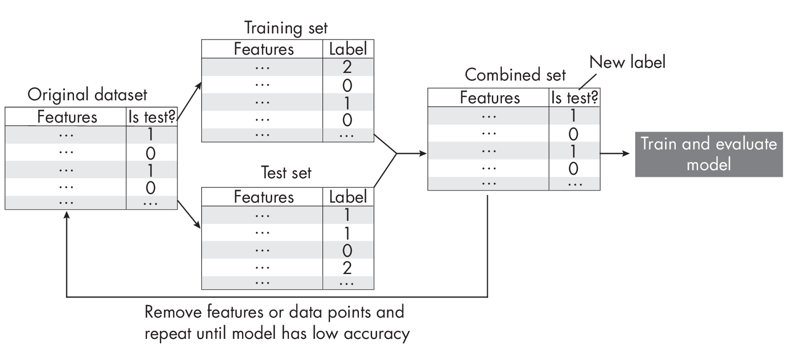

# Chapter 29: Training and Test Set Discordance 

**Suppose we train a model that performs much better on the test dataset
than on the training dataset. Since a similar model configuration
previously worked well on a similar dataset, we suspect something might
be unusual with the data. What are some approaches for looking into
training and test set discrepancies, and what strategies can we use to
mitigate these issues?**

Before investigating the datasets in more detail, we should check for
technical issues in the data loading and evaluation code. For instance,
a simple sanity check is to temporarily replace the test set with the
training set and to reevaluate the model. In this case, we should see
identical training and test set performances (since these datasets are
now identical). If we notice a discrepancy, we likely have a bug in the
code; in my experience, such bugs are frequently related to incorrect
shuffling or inconsistent (often missing) data normalization.

If the test set performance is much better than the training set
performance, we can rule out overfitting. More likely, there are
substantial diff-  erences in the training and test data distributions.
These distributionaldifferences may affect both the features and the
targets. Here, plotting the target or label distributions of training
and test data is a good idea. For example, a common issue is that the
test set is missing certain class labels if the dataset was not shuffled
properly before splitting it into training and test data. For small
tabular datasets, it is also feasible to compare feature distributions
in the training and test sets using histograms.

Looking at feature distributions is a good approach for tabular data,
but this is trickier for image and text data. A relatively easy and more
general approach to check for discrepancies between training and test
sets is adversarial validation.

*Adversarial validation*, illustrated in
Figure [\[fig-ch29-fig01\]](#fig-ch29-fig01){reference="fig-ch29-fig01"
reference-type="ref"}, is a technique to identify the degree of
similarity between the training and test data. We first merge the
training and test sets into a single dataset, and then we create a
binary target variable that distinguishes between training and test
data. For instance, we can use a new *Is test?* label where we assign
the label 0 to training data and the label 1 to test data. We then use
*k*-fold cross-validation or repartition the dataset into a training set
and a test set and train a machine learning model as usual. Ideally, we
want the model to perform poorly, indicating that the training and test
data distributions are similar. On the other hand, if the model performs
well in predicting the *Is test?* label, it suggests a discrepancy
between the training and test data that we need to investigate further.

::: figurewide
{style="width:5.625in"}
:::

What mitigation techniques should we use if we detect a training""test
set discrepancy using adversarial validation? If we're working with a
tabular dataset, we can remove features one at a time to see if this
helps address the issue, as spurious features can sometimes be highly
correlated with the target variable. To implement this strategy, we can
use sequential feature selection algorithms with an updated objective.
For example, instead of maximizing classification accuracy, we can
minimize classification accuracy. For cases where removing features is
not so trivial (such as with image and text data), we can also
investigate whether removing individual training instances that are
different from the test set can address the discrepancy issue.

### Exercises 

29-1. What is a good performance baseline for the adversarial prediction
task?

29-2. Since training datasets are often bigger than test datasets,
adversarial validation often results in an imbalanced prediction problem
(with a majority of examples labeled as *Is test?* being false instead
of true). Is this an issue, and if so, how can we mitigate that?

\

------------------------------------------------------------------------

