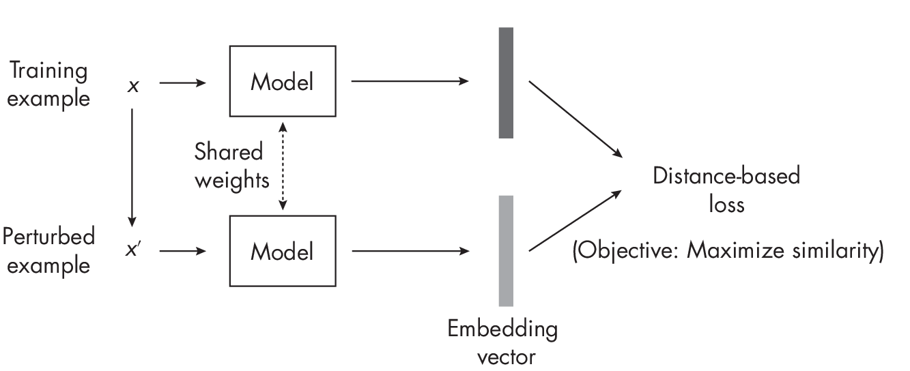

# Chapter 2: Self-Supervised Learning 

**What is self-supervised learning, when is it useful, and what are the
main approaches to implementing it?**

*Self-supervised learning* is a pretraining procedure that lets neural
networks leverage large, unlabeled datasets in a supervised fashion.
This chapter compares self-supervised learning to transfer learning, a
related method for pretraining neural networks, and discusses the
practical applications of self-supervised learning. Finally, it outlines
the main categories of self-supervised learning.

## Self-Supervised Learning vs. Transfer Learning  

Self-supervised learning is related to transfer learning, a technique in
which a model pretrained on one task is reused as the starting point for
a model on a second task. For example, suppose we are interested in
training an image classifier to classify bird species. In transfer
learning, we would pretrain a convolutional neural network on the
ImageNet dataset, a large, labeled image dataset with many different
categories, including various objects and animals. After pretraining on
the general ImageNet dataset, we would take that pretrained model and
train it on the smaller, more specific target dataset that contains the
bird species of interest. (Often, we just have to change the
class-specific output layer, but we can otherwise adopt the pretrained
network as is.)

Figure [1.1](#fig-ch02-fig01) illustrates the process of transfer learning.

Self-supervised learning is an alternative approach to transfer learning
in which the model is pretrained not on labeled data but on *unlabeled*
data. We consider an unlabeled dataset for which we do not have label
information, and then we find a way to obtain labels from the
dataset's structure to formulate a prediction task for the neural
network, as illustrated in
Figure [1.2](#fig-ch02-fig02). These self-supervised training tasks are also
called *pretext tasks*.

The main difference between transfer learning and self-supervised
learning lies in how we obtain the labels during step 1 in
Figures [1.1](#fig-ch02-fig01)
and [1.2](#fig-ch02-fig02). In transfer learning, we assume that the labels
are provided along with the dataset; they are typically created
by human labelers. In self-supervised learning, the labels can be
directly derived from the training examples.

A self-supervised learning task could be a missing-word prediction in a
natural language processing context. For example, given the sentence
"It is beautiful and sunny outside,"? we can mask out the word
*sunny*, feed the network the input "It is beautiful and \[MASK\]
outside,"? and have the network predict the missing word in the
"\[MASK\]"? location. Similarly, we could remove image patches in a
computer vision context and have the neural network fill in the blanks.
These are just two examples of self-supervised learning tasks; many more
methods and paradigms for this type of learning exist.

In sum, we can think of self-supervised learning on the pretext task as
*representation learning*. We can take the pretrained model to fine-tune
it on the target task (also known as the *downstream* task).

## Leveraging Unlabeled Data 

Large neural network architectures require large amounts of labeled data
to perform and generalize well. However, for many problem areas, we
don't have access to large labeled datasets. With self-supervised
learning, we can leverage unlabeled data. Hence, self-supervised
learning is likely to be useful when working with large neural networks
and with a limited quantity of labeled training data.

Transformer-based architectures that form the basis of LLMs and vision
transformers are known to require self-supervised learning for
pretraining to perform well.

For small neural network models such as multilayer perceptrons with two
or three layers, self-supervised learning is typically considered
neither useful nor necessary.

Self-supervised learning likewise isn't useful in traditional machine
learning with nonparametric models such as tree-based random forests or
gradient boosting. Conventional tree-based methods do not have a fixed
parameter structure (in contrast to the weight matrices, for example).
Thus, conventional tree-based methods are not capable of transfer
learning and are incompatible with self-supervised learning.

## Self-Prediction and Contrastive Self-Supervised Learning 

There are two main categories of self-supervised learning:
self-prediction and contrastive self-supervised learning. In
*self-prediction*, illustrated in
Figure [1.3](#fig-ch02-fig03), we typically change or hide parts of the input
and train the model to reconstruct the original inputs, such as by
using a perturbation mask that obfuscates certain pixels in an image.

A classic example is a denoising autoencoder that learns to remove noise
from an input image. Alternatively, consider a masked autoencoder that
reconstructs the missing parts of an image, as shown in
Figure [1.4](#fig-ch02-fig04).

Missing (masked) input self-prediction methods are also commonly used in
natural language processing contexts. Many generative LLMs, such as GPT,
are trained on a next-word prediction pretext task (GPT will be
discussed at greater length in
Chapters [\[ch14\]](./ch14/_books_ml-q-and-ai-ch14.md)
and [\[ch17\]](./ch17/_books_ml-q-and-ai-ch17.md). Here,
we feed the network text fragments, where it has to predict the next
word in the sequence (as we'll discuss further in
Chapter [\[ch17\]](./ch17/_books_ml-q-and-ai-ch17.md)).

In *contrastive self-supervised learning*, we train the neural network
to learn an embedding space where similar inputs are close to each other
and dissimilar inputs are far apart. In other words, we train the
network to produce embeddings that minimize the distance between similar
training inputs and maximize the distance between dissimilar training
examples.

Let's discuss contrastive learning using concrete example inputs.
Suppose we have a dataset consisting of random animal images. First, we
draw a random image of a cat (the network does not know the label,
because we assume that the dataset is unlabeled). We then augment,
corrupt, or perturb this cat image, such as by adding a random noise
layer and cropping it differently, as shown in
Figure [1.5](#fig-ch02-fig05).

The perturbed cat image in this figure still shows the same cat, so we
want the network to produce a similar embedding vector. We also consider
a random image drawn from the training set (for example, an elephant,
but again, the network doesn't know the label).

For the cat-elephant pair, we want the network to produce dissimilar
embeddings. This way, we implicitly force the network to capture the
image's core content while being somewhat agnostic to small
differences and noise. For example, the simplest form of a contrastive
loss is the $L_2$-norm (Euclidean distance) between the embeddings
produced by model $M(\cdot)$. Let's say we update the model
weights to decrease the distance $||M(cat) - M(cat')||_2$ and increase the distance
$||M(cat) - M(elephant)||_2$.

Figure [1.6](#fig-ch02-fig06) summarizes the central concept behind contrastive
learning for the perturbed image scenario. The model is shown twice,
which is known as a *siamese network* setup. Essentially, the same model
is utilized in two instances: first, to generate the embedding for the
original training example, and second, to produce the embedding for the
perturbed version of the sample.

This example outlines the main idea behind contrastive learning, but
many subvariants exist. Broadly, we can categorize these into *sample*
contrastive and *dimension* contrastive methods. The elephant-cat
example in Figure [1.6](#fig-ch02-fig06) illustrates a sample contrastive method, where we
focus on learning embeddings to minimize and maximize distances between
training pairs. In *dimension*-contrastive approaches, on the other
hand, we focus on making only certain variables in the embedding
representations of similar training pairs appear close to each other
while maximizing the distance of others.

### Exercises 

2-1. How could we apply self-supervised learning to video data?

2-2. Can self-supervised learning be used for tabular data represented
as rows and columns? If so, how could we approach this?

## References 

- For more on the ImageNet dataset:
  <https://en.wikipedia.org/wiki/ImageNet>.

- An example of a contrastive self-supervised learning method: Ting Chen
  et al., "A Simple Framework for Contrastive Learning of Visual
  Representations"? (2020), <https://arxiv.org/abs/2002.05709>.

- An example of a dimension-contrastive method: Adrien Bardes, Jean
  Ponce, and Yann LeCun, "VICRegL: Self-Supervised Learning of Local
  Visual Features"? (2022), <https://arxiv.org/abs/2210.01571>.

- If you plan to employ self-supervised learning in practice: Randall
  Balestriero et al., "A Cookbook of Self-Supervised Learning"?
  (2023), <https://arxiv.org/abs/2304.12210>.

- A paper proposing a method of transfer learning and self-supervised
  learning for relatively small multilayer perceptrons on tabular
  datasets: Dara Bahri et al., "SCARF: Self-Supervised Contrastive
  Learning Using Random Feature Corruption"? (2021),
  <https://arxiv.org/abs/2106.15147>.

- A second paper proposing such a method: Roman Levin et al.,
  "Transfer Learning with Deep Tabular Models"? (2022),
  [*https://arxiv.org/abs/*](https://arxiv.org/abs/2206.15306)
  [*2206.15306*](https://arxiv.org/abs/2206.15306).

\

------------------------------------------------------------------------

