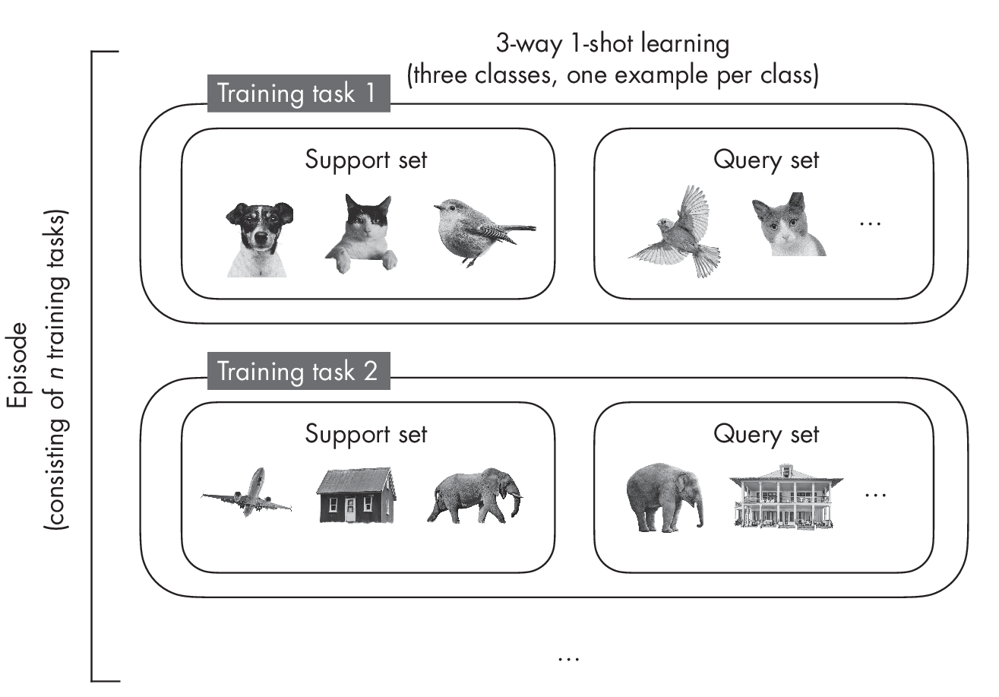
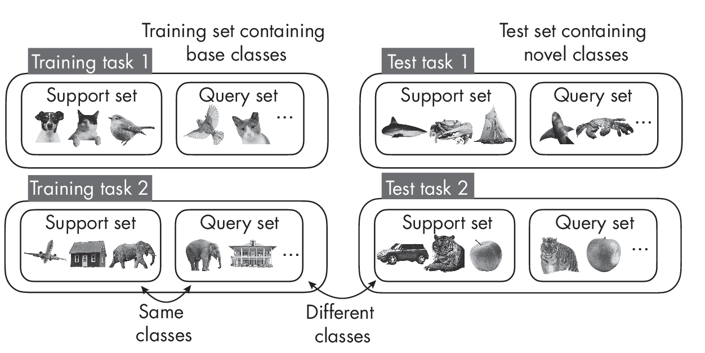
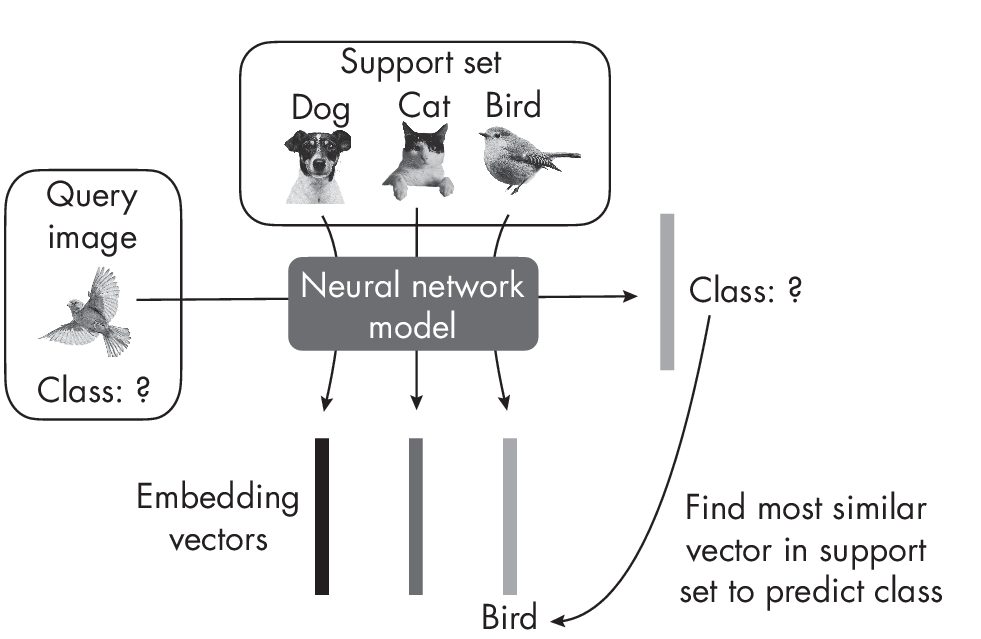

# Chapter 3: Few-Shot Learning

**What is few-shot learning? How does it differ from the conventional
training procedure for supervised learning?**

*Few-shot learning* is a type of supervised learning for small training
sets with a very small example-to-class ratio. In regular supervised
learning, we train models by iterating over a training set where the
model always sees a `fixed set` of classes. In few-shot learning, we are
working on a `support set` from which we create multiple training tasks to
assemble training episodes, where each training task consists of
different classes.

> Tips: 
> 
> - 小样本学习，关注于学习模型，以适应新的任务。
> - 在传统的监督学习中，我们通过迭代训练集来训练模型，模型总是看到固定的类集。
> - 在小样本学习中，我们从一个`支持集`开始，创建`多个训练任务`来组装训练集，每个训练任务包含不同的分类。

## Datasets and Terminology

In supervised learning, we fit a model on a `training dataset` and
evaluate it on a` test dataset`. The training set typically contains a
relatively large number of examples per class. For example, in a
supervised learning context, the Iris dataset, which has 50 examples per
class, is considered a tiny dataset. For deep learning models, on the
other hand, even a dataset like MNIST that has 5,000 training examples
per class is considered very small.

In `few-shot learning`, the number of examples per class is much smaller.
When specifying the few-shot learning task, we typically use the term
N-*way* K-*shot*, where

* *N* stands for the number of classes 
* and *K* stands for the number of examples per class. 

The most common values are *K* = 1 or *K* = 5. For instance, in a 5-way 1-shot problem, there are
five classes with only one example each.
Figure [1.1](#fig-ch03-fig01) depicts a 3-way 1-shot setting to illustrate the
concept with a smaller example.

  

Rather than fitting the model to the training dataset, we can think of
`few-shot learning` as "**learning to learn.**"? In contrast to supervised
learning, `few-shot learning` uses not a training dataset but a
so-called `support set`, from which we sample training tasks that mimic
the use-case scenario during prediction. With each training task comes a
query image to be classified. The model is trained on several training
tasks from the support set; this is called an `episode`.

> Tips: 小样本学习，可以看作是`学习如何学习`。
> 
> 与传统的监督学习不同，小样本学习不使用训练集，而是使用所谓的`支持集`，从中采样训练任务，以模仿预测时的使用场景。
> 
> 每个训练任务都有一个查询图像需要分类。
> 
> 模型在支持集的多个训练任务上进行训练；这称为`一个训练轮次`。
>
> FIXME??? 不理解

Next, during testing, the model receives a new task with classes
different from those seen during training. The classes encountered in
training are also called `base classes`, and the support set during
training is also often called the `base set`. Again, the task is to
classify the query images. Test tasks are similar to training tasks,
except that none of the classes during testing overlap with those
encountered during training, as illustrated in
Figure [1.2](#fig-ch03-fig02).

  

As Figure [1.2](#fig-ch03-fig02) shows, the support and query sets contain
different images from the same class during training. The same is true
during testing. However, notice that the classes in the support and
query sets differ from the support and query sets encountered during
training.

There are many different types of few-shot learning. In the most common,
*meta-learning*, training is essentially about updating the model's
parameters such that it can *adapt* well to a new task. On a high level,
one few-shot learning strategy is to learn a model that produces
embeddings where we can find the target class via a nearest-neighbor
search among the images in the support set.
Figure [1.3](#fig-ch03-fig03) illustrates this approach.

  

The model learns how to produce good embeddings from the support set to
classify the query image based on finding the most similar embedding
vector. 

## Exercises

3-1. MNIST (<https://en.wikipedia.org/wiki/MNIST_database>) is a classic
and popular machine learning dataset consisting of 50,000 handwritten
digits from 10 classes corresponding to the digits 0 to 9. How can we
partition the MNIST dataset for a one-shot classification context?

3-2. What are some real-world applications or use cases for few-shot
learning?

------------------------------------------------------------------------

