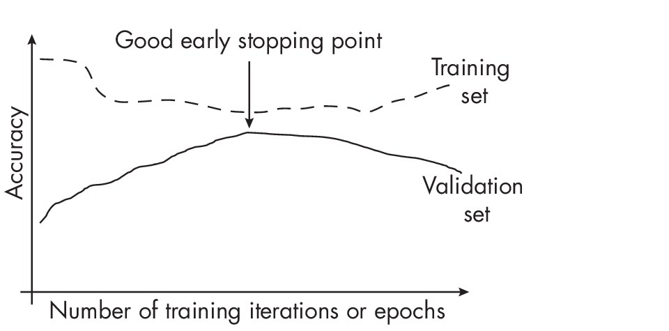
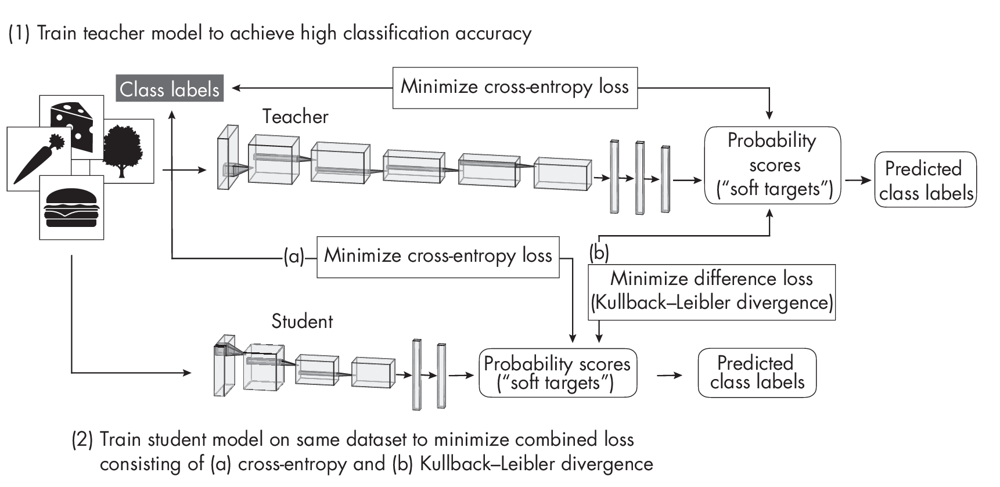

# Chapter 6: Reducing Overfitting with Model Modifications 

**Suppose we train a neural network classifier in a supervised fashion
and already employ various dataset-related techniques to mitigate
overfitting. How can we change the model or make modifications to the
training loop to further reduce the effect of overfitting?**

The most successful approaches against overfitting include
regularization techniques like dropout and weight decay. As a rule of
thumb, models with a larger number of parameters require more training
data to generalize well. Hence, decreasing the model size and capacity
can sometimes also help reduce overfitting. Lastly, building ensemble
models is among the most effective ways to combat overfitting, but it
comes with increased computational expense.

This chapter outlines the key ideas and techniques for several
categories of reducing overfitting with model modifications and then
compares them to one another. It concludes by discussing how to choose
between all types of overfitting reduction methods, including those
discussed in the previous chapter.

## Common Methods 

The various model- and training-related techniques to reduce overfitting
can be grouped into three broad categories: (1) adding regularization,
(2) choosing smaller models, and (3) building ensemble models.

### Regularization 

We can interpret regularization as a penalty against complexity. Classic
regularization techniques for neural networks include $L_2$
regularization and the related weight decay method. We implement $L_2$
regularization by adding a penalty term to the loss function that is
minimized during training. This added term represents the size of the
weights, such as the squared sum of the weights. The following formula
shows an $L_2$ regularized loss

$$
\[RegularizedLoss=Loss+\\frac{\\lambda}{n} \\sum_j w\_{j}\^{2}\]
$$

where $\\lambda$ is a hyperparameter that controls the
regularization strength.

During backpropagation, the optimizer minimizes the modified loss, now
including the additional penalty term, which leads to smaller model
weights and can improve generalization to unseen data.

Weight decay is similar to $L_2$ regularization but is applied to the
optimizer directly rather than modifying the loss function. Since weight
decay has the same effect as $L_2$ regularization, the two methods are
often used synonymously, but there may be subtle differences depending
on the implementation details and optimizer.

Many other techniques have regularizing effects. For brevity's sake,
we'll discuss just two more widely used methods: dropout and early
stopping.

Dropout reduces overfitting by randomly setting some of the activations
of the hidden units to zero during training. Consequently, the neural
network cannot rely on particular neurons to be activated. Instead, it
learns to use a larger number of neurons and multiple independent
representations of the same data, which helps to reduce overfitting.

In early stopping, we monitor the model's performance on a validation
set during training and stop the training process when the performance
on the validation set begins to decline, as illustrated in
Figure [1.1](#fig-ch06-fig01).

In Figure [1.1](#fig-ch06-fig01), we can see that the validation accuracy increases
as the training and validation accuracy gap closes. The point where the
training and validation accuracy is closest is the point with the least
amount of overfitting, which is usually a good point for early stopping.

### Smaller Models 

Classic bias-variance theory suggests that reducing model size can
reduce overfitting. The intuition behind this theory is that, as a
general rule of thumb, the smaller the number of model parameters, the
smaller its capacity to memorize or overfit to noise in the data. The
following paragraphs discuss methods to reduce the model size, including
pruning, which removes parameters from a model, and knowledge
distillation, which transfers knowledge to a smaller model.

Besides reducing the number of layers and shrinking the layers' widths
as a hyperparameter tuning procedure, another approach to obtaining
smal-  ler models is *iterative pruning*, in which we train a large
model to achieve good performance on the original dataset. We then
iteratively remove parameters of the model, retraining it on the dataset
such that it maintains the same predictive performance as the original
model. (The lottery ticket hypothesis, discussed in
Chapter [\[ch04\]](./ch04/_books_ml-q-and-ai-ch04.md),
uses iterative pruning.)

Another common approach to obtaining smaller models is *knowledge
distillation*. The general idea behind this approach is to transfer
knowledge from a large, more complex model (the *teacher*) to a smaller
model (the *student*). Ideally, the student achieves the same predictive
accuracy as the teacher, but it does so more efficiently due to the
smaller size. As a nice side effect, the smaller student may overfit
less than the larger teacher model.

Figure [1.2](#fig-ch06-fig02) diagrams the original knowledge distillation
process. Here, the teacher is first trained in a regular supervised
fashion to classify the examples in the dataset well, using a
conventional cross-entropy loss between the predicted scores and ground
truth class labels. While the smaller student network is trained on the
same dataset, the training objective is to minimize both (a) the cross
entropy between the outputs and the class labels and (b) the difference
between its outputs and the teacher outputs (measured using
*Kullback-Leibler* divergence, which quantifies the difference between
two probability distributions by calculating how much one distribution
diverges from the other in terms of information content).

By minimizing the Kullback-Leibler divergence--the difference between
the teacher and student score distributions--the student learns to
mimic the teacher while being smaller and more efficient.

### Caveats with Smaller Models 

While pruning and knowledge distillation can also enhance a model's
generalization performance, these techniques are not primary or
effective ways of reducing overfitting.

Early research results indicate that pruning and knowledge distillation
can improve the generalization performance, presumably due to smaller
model sizes. However, counterintuitively, recent research studying
phenomena like double descent and grokking also showed that larger,
overparameterized models have improved generalization performance if
they are trained beyond the point of overfitting. *Double descent*
refers to the phenomenon in which models with either a small or an
extremely large number of para-  meters have good generalization
performance, while models with a number of parameters equal to the
number of training data points have poor generalization performance.
*Grokking* reveals that as the size of a dataset decreases, the need for
optimization increases, and generalization performance can improve well
past the point of overfitting.

How can we reconcile the observation that pruned models can exhibit
better generalization performance with contradictory observations from
studies of double descent and grokking? Researchers recently showed that
the improved training process partly explains the reduction of
overfitting due to pruning. Pruning involves more extended training
periods and a replay of learning rate schedules that may be partly
responsible for the improved generalization performance.

Pruning and knowledge distillation remain excellent ways to improve the
computational efficiency of a model. However, while they can also
enhance a model's generalization performance, these techniques are not
primary or effective ways of reducing overfitting.

### Ensemble Methods 

Ensemble methods combine predictions from multiple models to improve the
overall prediction performance. However, the downside of using multiple
models is an increased computational cost.

We can think of ensemble methods as asking a committee of experts to
weigh in on a decision and then combining their judgments in some way to
make a final decision. Members in a committee often have different
backgrounds and experiences. While they tend to agree on basic
decisions, they can overrule bad decisions by majority rule. This
doesn't mean that the majority of experts is always right, but there
is a good chance that the majority of the committee is more often right,
on average, than every single member.

The most basic example of an ensemble method is majority voting. Here,
we train *k* different classifiers and collect the predicted class label
from each of these *k* models for a given input. We then return the most
frequent class label as the final prediction. (Ties are usually resolved
using a confidence score, randomly picking a label, or picking the class
label with the lowest index.)

Ensemble methods are more prevalent in classical machine learning than
deep learning because it is more computationally expensive to employ
multiple models than to rely on a single one. In other words, deep
neural networks require significant computational resources, making them
less suitable for ensemble methods.

Random forests and gradient boosting are popular examples of ensemble
methods. However, by using majority voting or stacking, for example, we
can combine any group of models: an ensemble may consist of a support
vector machine, a multilayer perceptron, and a nearest-neighbor
classifier. Here, stacking (also known as *stacked generalization*)is a
more advanced variant of majority voting that involves training a new
model to combine the predictions of several other models rather than
obtaining the label by majorit yvote.

A popular industry technique is to build models from *k-fold
cross-validation*, a model evaluationt echnique in which we train and
evaluate a model on *k* training folds.We then compute the average
performance metric across all *k* iterations to estimate the overall
performance measure of the model. After evaluation, we can either train
the model on the entire training dataset or combine the individual
models as an ensemble, as shown in
Figure [1.2](#fig-ch06-fig03).

![[k]{.upright}-fold cross-validation for creating model
ensembles](../images/ch06-fig03.png)

As shown in Figure [1.2](#fig-ch06-fig03), the *k*-fold ensemble approach trains each of the
*k* models on the respective *k* "" 1 training folds in each round.
After evaluating the models on the validation folds, we can combine them
into a majority vote classifier or build an ensemble using stacking, a
technique that combines multiple classification or regression models via
a meta-model.

While the ensemble approach can potentially reduce overfitting and
improve robustness, this approach is not always suitable. For instance,
potential downsides include managing and deploying an ensemble of
models, which can be more complex and computationally expensive than
using a single model.

## Other Methods 

So far, this book has covered some of the most prominent techniques to
reduce overfitting. Chapter [\[ch05\]](./ch05/_books_ml-q-and-ai-ch05.md) covered techniques that aim to reduce overfitting
from a data perspective. Additional techniques for reducing overfitting
with model modifications include skip-connections (found in residual
networks, for example), look-ahead optimizers, stochastic weight
averaging, multitask learning, and snapshot ensembles.

While they are not originally designed to reduce overfitting, layer
input normalization techniques such as batch normalization (BatchNorm)
and layer normalization (LayerNorm) can stabilize training and often
have a regularizing effect that reduces overfitting. Weight
normalization, which normalizes the model weights instead of layer
inputs, could also lead to better generalization performance. However,
this effect is less direct since weight normalization (WeightNorm)
doesn't explicitly act as a regularizer like weight decay does.

## Choosing a Regularization Technique 

Improving data quality is an essential first step in reducing
overfitting. However, for recent deep neural networks with large numbers
of parameters, we need to do more to achieve an acceptable level of
overfitting. Therefore, data augmentation and pretraining, along with
established techniques such as dropout and weight decay, remain crucial
overfitting reduction methods.

In practice, we can and should use multiple methods at once to reduce
overfitting for an additive effect. To achieve the best results, treat
selecting these techniques as a hyperparameter optimization problem.

### Exercises 

6-1. Supposewe'reusingearlystoppingasamechanismtoreduceover-
 fitting--inparticular,amodernearly-stoppingvariantthatcreates
checkpoints of the best model (for instance, the model with the high-
 est validation accuracy) during training so that we can load it after
the training has completed. This mechanism can be enabled in most modern
deep learning frameworks. However, a colleague recommends tuning the
number of training epochs instead. What are some of the advantages and
disadvantages of each approach?

6-2. Ensemble models have been established as a reliable and successful
method for decreasing overfitting and enhancing the reliability of
predictive modeling efforts. However, there's always a trade-off. What
are some of the drawbacks associated with ensemble techniques?

## References 

- For more on the distinction between $L_2$ regularization and weight
  decay: Guodong Zhang et al., "Three Mechanisms of Weight Decay
  Regularization"? (2018), <https://arxiv.org/abs/1810.12281>.

- Research results indicate that pruning and knowledge distillation can
  improve generalization performance, presumably due to smaller model
  sizes: Geoffrey Hinton, Oriol Vinyals, and Jeff Dean, "Distilling
  the Knowledge in a Neural Network"? (2015),
  <https://arxiv.org/abs/1503.02531>.

- Classic bias-variance theory suggests that reducing model size can
  reduce overfitting: Jerome H. Friedman, Robert Tibshirani, and Trevor
  Hastie, "Model Selection and Bias-Variance Tradeoff,"? Chapter 2.9,
  in *The Elements of Statistical Learning* (Springer, 2009).

- The lottery ticket hypothesis applies knowledge distillation to find
  smaller networks with the same predictive performance as the original
  one: Jonathan Frankle and Michael Carbin, "The Lottery Ticket
  Hypothesis: Finding Sparse, Trainable Neural Networks"? (2018),
  <https://arxiv.org/abs/1803.03635>.

- For more on double descent:
  <https://en.wikipedia.org/wiki/Double_descent>.

- The phenomenon of grokking indicates that generalization perfor-
   mance can improve well past the point of overfitting: Alethea Power
  et al., "Grokking: Generalization Beyond Overfitting on Small
  Algorithmic Datasets"? (2022), <https://arxiv.org/abs/2201.02177>.

- Recent research shows that the improved training process partly
  explains the reduction of overfitting due to pruning: Tian Jin et al.,
  "Pruning's Effect on Generalization Through the Lens of Training
  and Regularization"? (2022), <https://arxiv.org/abs/2210.13738>.

- Dropout was previously discussed as a regularization technique, but it
  can also be considered an ensemble method that approximates a weighted
  geometric mean of multiple networks: Pierre Baldi and Peter J.
  Sadowski, "Understanding Dropout"? (2013),
  [*https://proceedings.neurips.cc/paper/2013/hash/71f6278d140af599*](https://proceedings.neurips.cc/paper/2013/hash/71f6278d140af599e06ad9bf1ba03cb0-Abstract.html)
  [*e06ad9bf1ba03cb0-Abstract.html*](https://proceedings.neurips.cc/paper/2013/hash/71f6278d140af599e06ad9bf1ba03cb0-Abstract.html).

- Regularization cocktails need to be tuned on a per-dataset basis:
  Arlind Kadra et al., "Well-Tuned Simple Nets Excel on Tabular
  Datasets"? (2021), <https://arxiv.org/abs/2106.11189>.

------------------------------------------------------------------------

