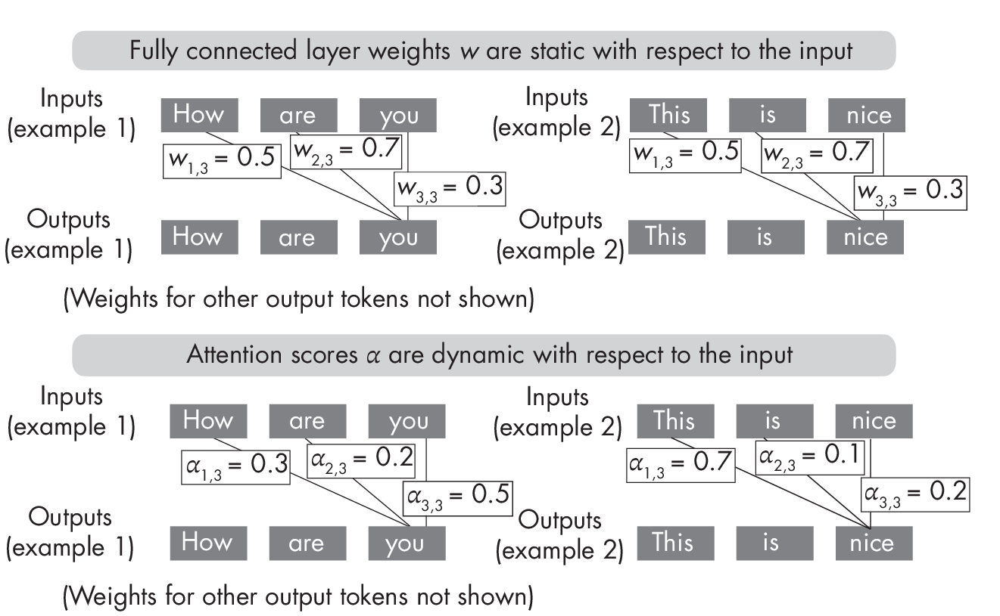
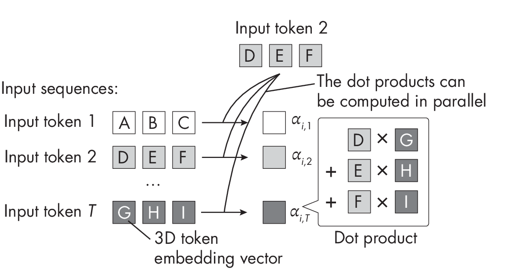

# Chapter 8: The Success of Transformers

**What are the main factors that have contributed to the success of
transformers?**

In recent years, transformers have emerged as the most successful neural
network architecture, particularly for various natural language
processing tasks. In fact, transformers are now on the cusp of becoming
state of the art for computer vision tasks as well. The success of
transformers can be attributed to several key factors, including their
`attention mechanisms`, ability to be `parallelized easily`, 
`unsupervised pretraining`, and `high parameter counts`.

> Tips: 
> 
> - 注意力机制，使得模型可以关注到输入序列中的重要部分，从而提高模型性能。
> - 模型并行化，从而提高训练速度。
> - 自监督预训练，使得模型可以利用大量无标签数据，从而提高模型性能。
> - 高参数数量，使得模型可以学习到更复杂的特征，从而提高模型性能。

## The Attention Mechanism

The self-attention mechanism found in transformers is one of the key
design components that make transformer-based LLMs so successful.
However, transformers are not the first architecture to utilize
attention mechanisms.

Attention mechanisms were first developed in the context of image
recognition back in 2010, before being adopted to aid the translation of
long sentences in recurrent neural networks.
(Chapter [\[ch16\]](./ch16/_books_ml-q-and-ai-ch16.md)
compares the attention mechanisms found in recurrent neural networks and
transformers in greater detail.)

The aforementioned attention mechanism is inspired by human vision,
focusing on specific parts of an image (foveal glimpses) at a time to
process information hierarchically and sequentially. In contrast, the
fundamental mechanism underlying transformers is a self-attention
mechanism used for sequence-to-sequence tasks, such as machine
translation and text generation. It allows each token in a sequence to
attend to all other tokens, thus providing context-aware representations
of each token.

> Tips: 人类视觉系统，是分层处理的，先关注到特定部分（`foveal glimpses` 中央凹注视），然后逐步关注到更多部分(以`分层`和`顺序`的方式处理信息)。
> 
> - 人类视觉：像看东西一样，先看重点部分，再逐步看更多细节
> - Transformer自注意力：每个词都能"看到"句子中的所有其他词，理解上下文关系

What makes attention mechanisms so unique and useful? For the following
illustration, suppose we are using an encoder network on a fixed-length
representation of the input sequence or image -- this can be a fully
connected, convolutional, or attention-based encoder.

> Tips:  FIXME, 注意力权重是动态的？？？ 因为跟元素相对位置有关？元素就是 token？
> 
> - 在Transformer中，编码器使用**自注意力机制**，计算每个输入token相对于序列中其他token的重要性，从而让模型关注输入序列中的相关部分。
> - 概念上，注意力机制允许，Transformer关注序列或图像的不同部分。
> - 表面上，这听起来非常类似于`全连接层`，其中每个输入元素与下一个层中的输入元素的权重连接。
> - 在注意力机制中，计算注意力权重涉及将每个输入元素与所有其他元素进行比较。
> - 通过这种方法获得的注意力权重是`动态`的，并且依赖于输入。
> - 相比之下，卷积或全连接层的权重在训练后是`固定的`，如Figure [1.1](#fig-ch08-fig01)所示。

In a transformer, the encoder uses self-attention mechanisms to compute
the importance of each input token relative to other tokens in the
sequence, allowing the model to focus on relevant parts of the input
sequence. Conceptually, attention mechanisms allow the transformers to
attend to different parts of a sequence or image. On the surface, this
sounds very similar to a fully connected layer where each input element
is connected via a weight with the input element in the next layer. In
attention mechanisms, the computation of the attention weights involves
comparing each input element to all others. The attention weights
obtained by this approach are dynamic and input dependent. In contrast,
the weights of a convolutional or fully connected layer are fixed after
training, as illustrated in
Figure [1.1](#fig-ch08-fig01).

  

As the top part of
Figure [1.1](#fig-ch08-fig01) shows, once trained, the weights of fully
connected layers remain fixed regardless of the input. In contrast, as
shown at the bottom, self-attention weights change depending on the
inputs, even after a transformer is trained.

> Tips: 
> 
> - 注意力机制，允许神经网络**选择性**地对**不同输入特征**的重要性进行**加权**，从而让模型专注于给定任务的输入的`最相关部分`。
> - 这提供了对每个词或图像token的**上下文理解**，允许更细致的解释，这是使Transformer如此成功的一个方面。  

Attention mechanisms allow a neural network to selectively weigh the
importance of different input features, so the model can focus on the
mostrelevant parts of the input for a given task. This provides a
contextual understanding of each word or image token, allowing for more
nuanced interpretations, which is one of the aspects that can make
transformers work so well.

## Pretraining via Self-Supervised Learning

> Tips: 
> 
> - 自监督预训练，是Transformer成功的一个重要因素。
> - 在自监督预训练中，Transformer模型被训练来预测句子中的缺失词或文档中的下一个句子。
> - 通过学习预测这些缺失词或下一个句子，模型被迫学习语言的通用表示，可以针对各种下游任务进行微调。

Pretraining transformers via self-supervised learning on large,
unlabeled datasets is another key factor in the success of transformers.
During pretraining, the transformer model is trained to predict missing
words in a sentence or the next sentence in a document, for example. By
learning to predict these missing words or the next sentence, the model
is forced to learn general representations of language that can be
fine-tuned for a wide range of downstream tasks.

While unsupervised pretraining has been highly effective for natural
language processing tasks, its effectiveness for computer vision tasks
is still an active area of research. (Refer to
Chapter [\[ch02\]](./ch02/_books_ml-q-and-ai-ch02.md) for
a more detailed discussion of self-supervised learning.)

## Large Numbers of Parameters

One noteworthy characteristic of transformers is their large model
sizes. For example, the popular 2020 GPT-3 model consists of 175 billion
trainable parameters, while other transformers, such as switch
transformers, have trillions of parameters.

The scale and number of trainable parameters of transformers are
essential factors in their modeling performance, particularly for
large-scale natural language processing tasks. 
For instance, `linear scaling laws` suggest that the training loss decreases proportionally
with an increase in model size, so a doubling of the model size can
halve the training loss.

This, in turn, can lead to better performance on the downstream target
task. However, it is essential to scale the model size and the number of
training tokens equally. This means the number of training tokens should
be doubled for every doubling of model size.

Since labeled data is limited, utilizing large amounts of data during
unsupervised pretraining is vital.

To summarize, large model sizes and large datasets are critical factors
in transformers' success. Additionally, using self-supervised
learning, the ability to pretrain transformers is closely tied to using
large model sizes and large datasets. This combination has been critical
in enabling the success of transformers in a wide range of natural
language processing tasks.

> Tips: 总而言之，Transformer的成功，很大程度上归功于其`大模型`和`大数据`的使用。
>
> - 线性缩放定律：训练损失与模型大小成正比，因此增加模型大小可以减少训练损失。
> - 训练tokens数量：训练tokens数量应该与模型大小成正比，因此增加模型大小应该增加训练tokens数量。

## Easy Parallelization

Training `large models` on `large datasets` requires `vast computational resources`,
and it's key that the computations can be parallelized to utilize
these resources.

Fortunately, transformers are easy to parallelize since they take a fixed-length
sequence of word or image tokens as input. For instance, the
self-attention mechanism used in most transformer architectures involves
computing the weighted sum between a pair of input elements.
Furthermore, these pair-wise token comparisons can be computed
independently, as illustrated in
Figure [1.2](#fig-ch08-fig02), making the self-attention mechanism relatively
easy to parallelize across different GPU cores.

  

In addition, the individual weight matrices used in the self-attention
mechanism (not shown in Figure [1.2](#fig-ch08-fig02)) can be distributed across different machines for
distributed and parallel computing.

## Exercises

8-1. As discussed in this chapter, self-attention is easily
parallelizable, yet transformers are considered computationally
expensive due to self-attention. How can we explain this contradiction?

8-2. Since self-attention scores represent importance weights for the
various input elements, can we consider self-attention to be a form of
feature selection?

## References

- An example of an attention mechanism in the context of image rec-
   ognition: Hugo Larochelle and Geoffrey Hinton, "Learning to
  Combine Foveal Glimpses with a Third-Order Boltzmann Machine"?
  (2010), <https://dl.acm.org/doi/10.5555/2997189.2997328>.

- The paper introducing the self-attention mechanism with the original
  transformer architecture: Ashish Vaswani et al., "Attention Is All
  You Need"? (2017), <https://arxiv.org/abs/1706.03762>.

- Transformers can have trillions of parameters: William Fedus, Barret
  Zoph, and Noam Shazeer, "Switch Transformers: Scaling to Trillion
  Parameter Models with Simple and Efficient Sparsity"? (2021),
  <https://arxiv.org/abs/2101.03961>.

- Linear scaling laws suggest that training loss decreases
  proportionally with an increase in model size: Jared Kaplan et al.,
  "Scaling Laws for Neural Language Models"? (2020),
  <https://arxiv.org/abs/2001.08361>.

- Research suggests that in transformer-based language models, the
  training tokens should be doubled for every doubling of model size:
  Jordan Hoffmann et al., "Training Compute-Optimal Large Language
  Models"? (2022), <https://arxiv.org/abs/2203.15556>.

- Formoreabouttheweightsusedinself-attentionandcross-attention
  mechanisms, check out my blog post: "Understanding and Coding the
  Self-Attention Mechanism of Large Language Models from Scratch"? at
  <https://sebastianraschka.com/blog/2023/self-attention-from-scratch.html>.

------------------------------------------------------------------------

