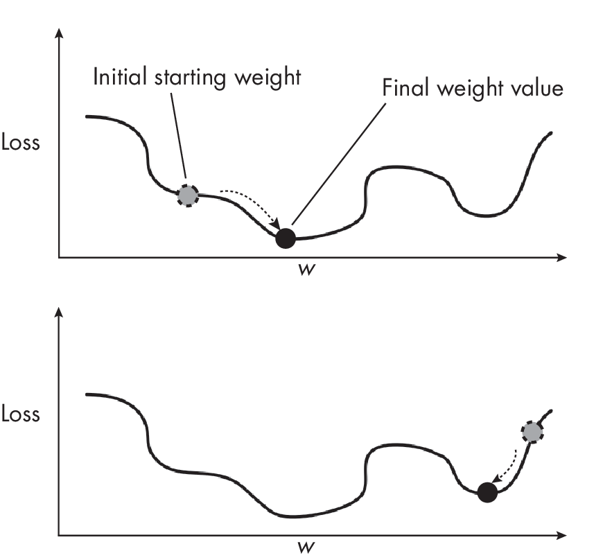
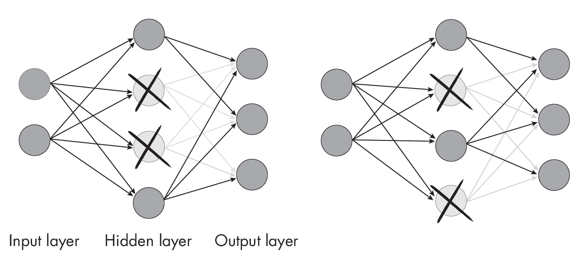
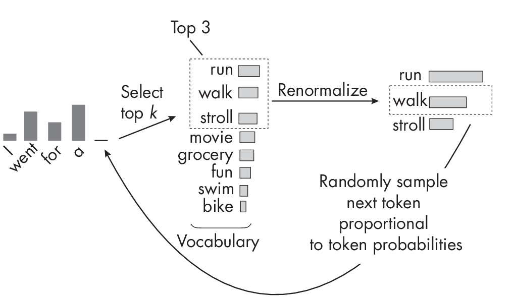
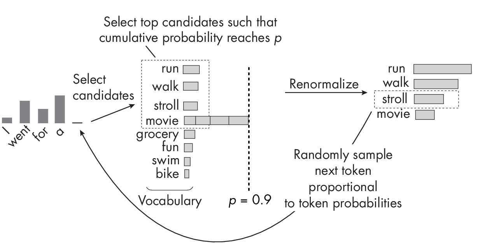

# Chapter 10: Sources of Randomness
[](#chapter-10-sources-of-randomness)


**What are the common sources of randomness when training deep neural
networks that can cause non-reproducible behavior during training and
inference?**

When training or using machine learning models such as deep neural
networks, several sources of randomness can lead to different results
every time we train or run these models, even though we use the same
overall settings. Some of these effects are accidental and some are
intended. The following sections categorize and discuss these various
sources of randomness.

> Tips: 
> 
> - 在训练和使用机器学习模型时，如深度神经网络，**随机性**会导致每次`训练`或`运行`模型时得到不同的结果，即使我们使用相同的配置。
> - 这些随机性可能是`偶然`的，也可能是`故意`的。


Optional hands-on examples for most of these categories are provided in
the *supplementary/q10-random-sources* subfolder at
<https://github.com/rasbt/MachineLearning-QandAI-book>.

## Model Weight Initialization
[](#model-weight-initialization)

All common deep neural network frameworks, including TensorFlow and
PyTorch, randomly initialize the weights and bias units at each layer by
default. This means that the final model will be different every time we
start the training. The reason these trained models will differ when we
start with different random weights is the nonconvex nature of the loss,
as illustrated in
Figure [1.1](#fig-ch10-fig01). As the figure shows, the loss will converge to different local minima depending on where the initial starting weights are located.

> Tips: 初始化权重，会导致不同的局部最优解。

<a id="fig-ch10-fig01"></a>



In practice, it is therefore recommended to run the training (if the
computational resources permit) at least a handful of times; unlucky
initial weights can sometimes cause the model not to converge or to
converge to a local minimum corresponding to poorer predictive accuracy.

> Tips: 实践中，建议`至少`运行`训练几次`，以避免不幸运的初始权重，导致模型不收敛或收敛到较差的局部最优解。

However, we can make the random weight initialization deterministic by
seeding the random generator. For instance, if we set the seed to a
specific value like 123, the weights will still initialize with small
random values. Nonetheless, the neural network will consistently
initialize with the **same small random weights**, enabling accurate
reproduction of results.

> Tips: 通过设置`随机种子`，可以使得`初始化`权重参数是`确定的`。

## Dataset Sampling and Shuffling
[](#dataset-sampling-and-shuffling)

When we train and evaluate machine learning models, we usually start by
dividing a dataset into training and test sets. This requires random
sampling since we have to decide which examples we put into a training
set and which examples we put into a test set.

In practice, we often use model evaluation techniques such as *k*-fold
cross-validation or holdout validation. In holdout validation, we split
the training set into `training`, `validation`, and `test` datasets, which are
also sampling procedures influenced by randomness. Similarly, unless we
use a fixed random seed, we get a different model each time we partition
the dataset or tune or evaluate the model using *k*-fold
cross-validation since the training partitions will differ.

> Tips: 
> 
> - 在训练和评估机器学习模型时，我们通常将数据集分为`训练集`、`验证集`和`测试集`。
> - 这需要`随机采样`，因为我们必须决定将哪些样本放入训练集，哪些放入验证集，哪些放入测试集。
> - 除非我们使用固定的随机种子，否则每次划分数据集或使用`k`折交叉验证时，我们都会得到不同的模型。


## Nondeterministic Algorithms
[](#nondeterministic-algorithms)

We may include random components and algorithms depending on the
architecture and hyperparameter choices. A popular example of this is
**dropout**.

`Dropout` works by randomly setting a fraction of a layer's units to
zero during training, which helps the model learn more robust and
generalized representations. This "**dropping out**" is typically
applied at each training iteration with a probability *p*, a
hyperparameter that controls the fraction of units dropped out. Typical
values for *p* are in the range of 0.2 to 0.8.

To illustrate this concept,
Figure [1.2](#fig-ch10-fig02) shows a small neural network where dropout
randomly drops a subset of the hidden layer nodes in each forward pass
during training.

<a id="fig-ch10-fig02"></a>



To create reproducible training runs, we must seed the random generator 
before training with dropout (analogous to seeding the random
generator before initializing the model weights). During inference, we
need to disable dropout to guarantee deterministic results. Each deep
learning framework has a specific setting for that purpose -- a PyTorch
example is included in the *supplementary/q10-random-sources* subfolder
at <https://github.com/rasbt/MachineLearning-QandAI-book>.

> Tips: 
> 
> - 为了创建可复现的训练运行，我们必须在训练前设置随机种子（类似于在初始化模型权重之前设置随机种子）。
> - 在推理时，我们需要禁用`dropout`，以保证结果的确定性。
> - 每个深度学习框架都有特定的设置，以实现这一点。

## Different Runtime Algorithms
[](#different-runtime-algorithms)

The most intuitive or simplest implementation of an algorithm or method
is not always the best one to use in practice. For example, when
training deep neural networks, we often use efficient alternatives and
approximations to gain speed and resource advantages during training and
inference.

A popular example is the convolution operation used in convolutional
neural networks. There are several possible ways to implement the
convolution operation:

The `classic direct convolution` The common implementation of discrete
convolution via an element-wise product between the input and the
window, followed by summing the result to get a single number. (See
Chapter [\[ch12\]](./ch12/_books_ml-q-and-ai-ch12.md) for
a discussion of the convolution operation.)

`FFT-based` convolution Uses `fast Fourier transform` (FFT) to convert the
convolution into an element-wise multiplication in the frequency domain.

`Winograd-based` convolution An efficient algorithm for small filter sizes
(like $3\times3$ that
reduces the number of multiplications required for the convolution.

Different convolution algorithms have different trade-offs in terms of
memory usage, computational complexity, and speed. By default, libraries
such as the **CUDA Deep Neural Network library** (`cuDNN`), which are used in
PyTorch and TensorFlow, can choose different algorithms for performing
convolution operations when running deep neural networks on GPUs.
However, the deterministic algorithm choice has to be explicitly
enabled. In PyTorch, for example, this can be done by setting


``` 
torch.use_deterministic_algorithms(True)
```

While these approximations yield similar results, subtle numerical
differences can accumulate during training and cause the training to
converge to slightly different local minima.

> Tips:  算法自身也会带来随机性，特别是不同优化算法实现，本身得到的就是近似效果。
> 
> - **不同的卷积算法**在`内存`使用、`计算复杂度`和`速度`方面有不同的权衡。
> - 默认情况下，PyTorch和TensorFlow等库中的`CUDA Deep Neural Network library`（`cuDNN`）可以选择不同的算法来执行卷积操作。
> - 但是，确定性算法的选择必须显式启用。
> - 在PyTorch中，可以通过设置`torch.use_deterministic_algorithms(True)`来启用确定性算法。

## Hardware and Drivers
[](#hardware-and-drivers)

Training deep neural networks on different hardware can also produce
different results due to small numeric differences, even when the same
algorithms are used and the same operations are executed. These
differences may sometimes be due to different numeric precision for
floating-point operations. However, small numeric differences may also
arise due to hardware and software optimization, even at the same
precision.

> Tips: 硬件和驱动也会带来随机性，特别是不同硬件平台，不同优化库，不同优化算法实现，本身得到的就是近似效果。
> 
> - 不同的`数值精度`，会导致不同的结果。
> - 不同的`硬件`和`软件`优化，会导致不同的结果。

For instance, different hardware platforms may have specialized
optimizations or libraries that can slightly alter the behavior of deep
learning algorithms. To give one example of how different GPUs can
produce different modeling results, the following is a quotation from
the official NVIDIA documentation: "Across different architectures, no
cuDNN routines guarantee bit-wise reproducibility. For example, there is
no guarantee of bit-wise reproducibility when comparing the same routine
run on NVIDIA  $Volta^{TM}$ and NVIDIA  $Turing^{TM}$ \[. . .\] and NVIDIA Ampere
architecture."?

> Tips: 
> 
> - 不同的硬件平台可能具有专门的优化或库，可以稍微改变深度学习算法的性能。
> - 例如，不同的GPU可以产生不同的建模结果。


## Randomness and Generative AI
[](#randomness-and-generative-ai)

Besides the various sources of randomness mentioned earlier, certain
models may also exhibit random behavior during inference that we can
think of as "**randomness by design**."? For instance, generative image
and language models may create different results for identical prompts
to produce a diverse sample of results. For image models, this is often
so that users can select the most accurate and aesthetically pleasing
image. For language models, this is often to vary the responses, for
example, in chat agents, to avoid repetition.

> Tips: 
> 
> - 除了前面提到的各种随机性来源，某些模型在**推理时**也可能表现出**随机行为**，我们可以将其视为“**设计上的随机性**”。
> - 例如，生成式图像和语言模型可能会对相同的提示产生不同的结果，以产生多样化的结果样本。
> - 对于图像模型，这通常是为了让用户选择最准确和最吸引人的图像。
> - 对于语言模型，这通常是为了避免重复，例如在聊天代理中。


The intended randomness in generative image models during inference is
often due to sampling different noise values at each step of the reverse
process. In diffusion models, a noise schedule defines the noise
variance added at each step of the diffusion process.

> Tips: 
> 
> - 在生成式图像模型中，推理时的随机性，通常是由于在反向过程中对不同的`噪声值`进行采样。
> - 在扩散模型中，`噪声调度`定义了在扩散过程中添加的`噪声方差`。


Autoregressive LLMs like GPT tend to create different outputs for the
same input prompt (GPT will be discussed at greater length in
Chapters [\[ch14\]](./ch14/_books_ml-q-and-ai-ch14.md)
and [\[ch17\]](./ch17/_books_ml-q-and-ai-ch17.md)). The
ChatGPT user interface even has a Regenerate Response button for that
purpose. The ability to generate different results is due to the
sampling strategies these models employ. Techniques such as top-*k*
sampling, nucleus sampling, and temperature scaling influence the
model's output by controlling the degree of randomness. This is a
feature, not a bug, since it allows for diverse responses and prevents
the model from producing overly deterministic or repetitive outputs.
(See Chapter [\[ch09\]](./ch09/_books_ml-q-and-ai-ch09.md)
for a more in-depth overview of generative AI and deep learning models;
see Chapter [\[ch17\]](./ch17/_books_ml-q-and-ai-ch17.md)
for more detail on autoregressive LLMs.)

> Tips: 
> 
> - 自回归语言模型（如GPT）倾向于对相同的输入提示，产生不同的输出。
> - 这是因为这些模型，采用了不同的`采样策略`。
> - 例如，`top-*k*采样`、`核采样`和`温度缩放`等技术，通过控制随机性程度，影响模型的输出。


*Top-[k]{.upright} sampling*, illustrated in
Figure [1.3](#fig-ch10-fig03), works by sampling tokens from the top *k* most
probable candidates at each step of the next-word generation process.

<a id="fig-ch10-fig03"></a>



Given an input prompt, the language model produces a probability
distribution over the entire vocabulary (the candidate words) for the
next token. Each token in the vocabulary is assigned a probability based
on the model's understanding of the context. The selected top-*k*
tokens are then renormalized so that the probabilities sum to 1.
Finally, a token is sampled from the renormalized top-*k* probability
distribution and is appended to the input prompt. This process is
repeated for the desired length of the generated text or until a stop
condition is met.

*Nucleus sampling* (also known as *top-p sampling*),
illustrated in Figure [1.4](#fig-ch10-fig04), is an alternative to top-*k* sampling.

<a id="fig-ch10-fig04"></a>



Similar to top-*k* sampling, the goal of nucleus sampling is to balance
diversity and coherence in the output. However, nucleus and top-*k*
sampling differ in how to select the candidate tokens for sampling at
each step of the generation process. Top-*k* sampling selects the *k*
most probable tokens from the probability distribution produced by the
language model, regardless of their probabilities. The value of *k*
remains fixed throughout the generation process. Nucleus sampling, on
the other hand, selects tokens based on a probability threshold *p*, as
shown in Figure [1.4](#fig-ch10-fig04). It then accumulates the most probable tokens in
descending order until their cumulative probability meets or exceeds the
threshold *p*. In contrast to top-*k* sampling, the size of the
candidate set (nucleus) can vary at each step.

> Tips: 
> 
> - 与top-*k*采样类似，核采样的目标是平衡输出中的多样性和连贯性。
> - 然而，核采样和top-*k*采样在选择每个生成步骤中的候选标记时有所不同。
> - **top-*k*采样**从语言模型产生的概率分布中选择`概率最高`的*k*个标记，而**核采样**则根据`累计的概率阈值`*p*选择标记。

## Exercises
[](#exercises)

10-1. Suppose we train a neural network with top-*k* or nucleus sampling
where *k* and *p* are hyperparameter choices. Can we make the model
behave deterministically during inference without changing the code?

10-2. In what scenarios might random dropout behavior during inference
be desired?

## References
[](#references)

- For more about different data sampling and model evaluation
  techniques, see my article: "Model Evaluation, Model Selection, and
  Algorithm Selection in Machine Learning"? (2018),
  <https://arxiv.org/abs/1811.12808>.

- The paper that originally proposed the dropout technique: Nitish
  Srivastavaetal.,"Dropout:ASimpleWaytoPreventNeuralNet-  works from
  Overfitting"? (2014),
  [*https://jmlr.org/papers/v15/sriva*](https://jmlr.org/papers/v15/srivastava14a.html)
  [*stava14a.html*](https://jmlr.org/papers/v15/srivastava14a.html).

- A detailed paper on FFT-based convolution: Lu Chi, Borui Jiang, and
  Yadong Mu, "Fast Fourier Convolution"? (2020),
  <https://dl.acm.org/doi/abs/10.5555/3495724.3496100>.

- Details on Winograd-based convolution: Syed Asad Alam et al.,
  "Winograd Convolution for Deep Neural Networks: Efficient Point
  Selection"? (2022), <https://arxiv.org/abs/2201.10369>.

- More information about the deterministic algorithm settings in
  PyTorch:
  <https://pytorch.org/docs/stable/generated/torch.use_deterministic_algorithms.html>.

- For details on the deterministic behavior of NVIDIA graphics cards,
  see the "Reproducibility"? section of the official NVIDIA
  documentation:
  <https://docs.nvidia.com/deeplearning/cudnn/developer-guide/index.html#reproducibility>.


------------------------------------------------------------------------

