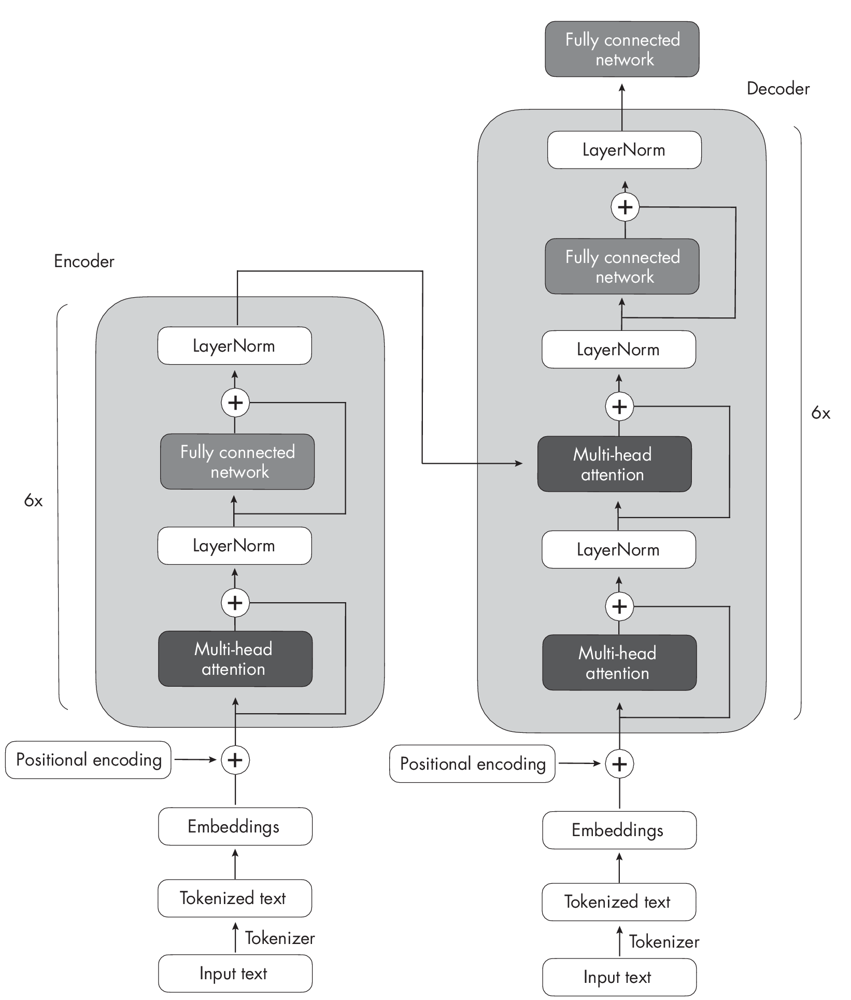
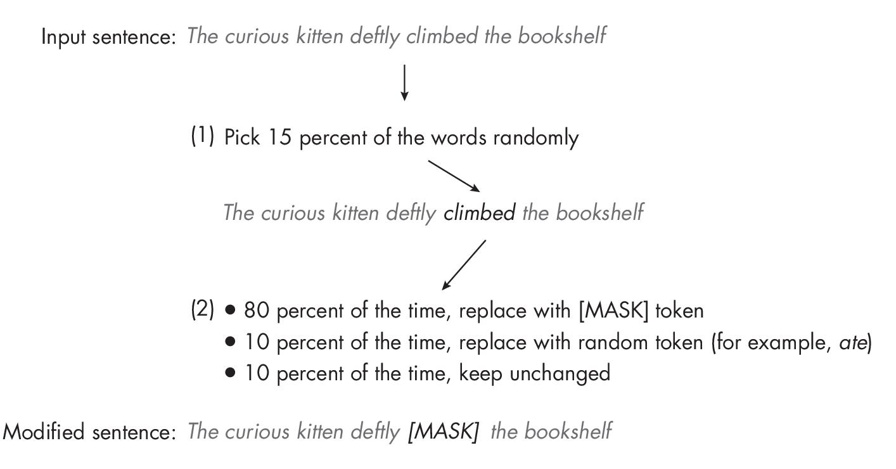
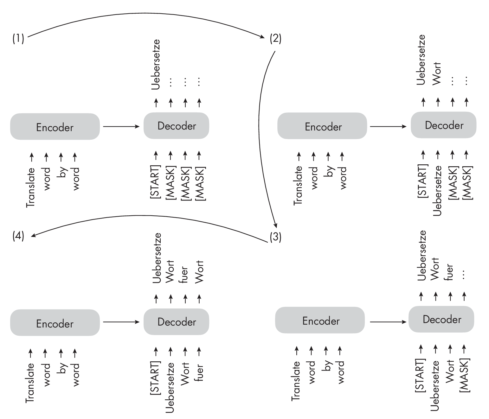
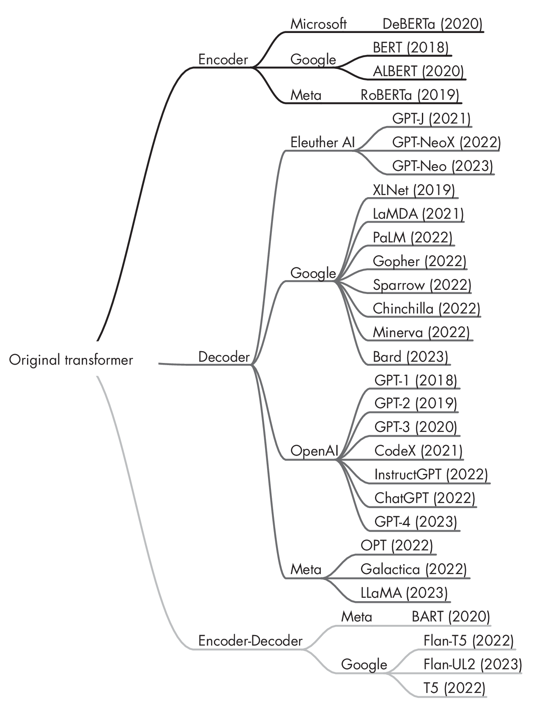

# Chapter 17: Encoder- and Decoder-Style Transformers

**What are the differences between encoder- and decoder-based language
transformers?**

Both encoder- and decoder-style architectures use the same
self-attention layers to encode word tokens. The main difference is that
encoders are designed to learn embeddings that can be used for various
predictive modeling tasks such as classification. In contrast, decoders
are designed to generate new texts, for example, to answer user queries.

>Tips: 编码器（encoder）和解码器（decoder）架构都采用自注意力（self-attention）层来对词元进行编码。
> 
> 主要区别在于：
> 
> - 编码器，侧重于**学习文本**的上下文表示（embedding），以便用于分类等各种预测任务；
> - 而解码器，则专注于**生成**新的文本内容，比如用于回答用户问题等生成式任务。

This chapter starts by describing the original transformer architecture
consisting of an encoder that processes input text and a decoder that
produces translations. The subsequent sections then describe how models
like BERT and RoBERTa utilize only the encoder to understand context and
how the GPT architectures emphasize decoder-only mechanisms for text
generation.

## The Original Transformer

The original transformer architecture introduced in
Chapter [\[ch16\]](../ch16/_books_ml-q-and-ai-ch16.md) was
developed for English-to-French and English-to-German language
translation. It utilized both an encoder and a decoder, as illustrated
in
Figure [\[fig-ch17-fig01\]](#fig-ch17-fig01).

In Figure [\[fig-ch17-fig01\]](#fig-ch17-fig01), the input text (that is, the sentences of the text
to betranslated) is first `tokenized` into individual word tokens, which
are then encoded via an` embedding layer` before they enter the encoder
part (see Chapter [\[ch01\]](./ch01/_books_ml-q-and-ai-ch01.md) for more on embeddings). 
After a `positional encoding vector` is added to each embedded word,the embeddings go through
a `multi-head self-attention layer`. This layer is followed by an `addition step`, indicated by a plus sign (+) in
Figure [\[fig-ch17-fig01\]](#fig-ch17-fig01), which performs a `layer normalization` and adds the
original embeddings via a `skip connection`, also known as a **residual** or
**shortcut** connection. Following this is a LayerNormblock, short for
*layernormalization*, which normalizes the activations of the previous
layer to improve the stability of the neural network's training. The
addition of the original embeddings and the layer normalization steps
are often summarized as the *`Add & Normstep`*. 

Finally, after entering the `fully connected network` -- a small, multilayer perceptron consisting of
two fully connected layers with a nonlinear activation function in
between -- the outputs are again added and normalized before they are
passed to a `multi-head self-attention layer` of the decoder.

> Tips: 
> 
> - `tokenized`：将文本拆分成单词或词元（token）。
> - `embedding layer`：将词元转换为向量表示。
> - `positional encoding vector`：将词元的位置信息添加到向量表示中。
> - `multi-head self-attention layer`：对词元进行自注意力计算。
> - `addition step`：将原始向量表示和自注意力计算结果相加，也称为 **残差连接** 、**跳跃连接** 、**快捷连接** 。
> - `layer normalization`：对每个层的激活进行归一化，以提高神经网络的稳定性。
> - `Add & Normstep`：将原始向量表示和自注意力计算结果相加，并进行归一化。
> - `fully connected network`：一个小的多层感知器，包含两个全连接层和一个非线性激活函数。

The decoder in
Figure [\[fig-ch17-fig01\]](#fig-ch17-fig01) has a similar overall structure to the encoder.
The key difference is that the inputs and outputs are different: the
encoder receives the input text to be translated, while the decoder
generates the translated text.

### Encoders

The encoder part in the original transformer, as illustrated in
Figure [\[fig-ch17-fig01\]](#fig-ch17-fig01), is responsible for understanding and extracting
the relevant information from the input text. It then outputs a
continuous representation (embedding) of the input text, which is passed
to the decoder. Finally, the decoder generates the translated text
(target language) based on the continuous representation received from
the encoder.

Over the years, various `encoder-only` architectures have been developed
based on the encoder module of the original transformer model outlined
earlier. One notable example is `BERT`, which stands for
 **Bidirectional Encoder Representations from Transformers**.

As noted in Chapter [\[ch14\]](./ch14/_books_ml-q-and-ai-ch14.md), BERT is an encoder-only architecture based on the
transformer's encoder module. The BERT model is pretrained on a large
text corpus using masked language modeling and next-sentence prediction
tasks. Figure [1.1](#fig-ch17-fig02) illustrates the masked language modeling
pretraining objective used in BERT-style transformers.

> Tips: `BERT` 是基于**掩码语言建模**和**预测下一句任务** 预训练的模型。

As Figure [1.1](#fig-ch17-fig02) demonstrates, the main idea behind masked language
modeling is to mask (or replace) random word tokens in the input
sequence and then train the model to predict the original masked tokens
based on the surrounding context.

In addition to the `masked language modeling` pretraining task illustrated in
Figure [1.1](#fig-ch17-fig02), the next-sentence prediction task asks the model
to predict whether the original document's sentence order of two
randomly shuffled sentences is correct. For example, say that two
sentences, in random order, are separated by the \[SEP\] token (*SEP* is
short for *separate*). The brackets are a part of the token's notation
and are used to make it clear that this is a special token as opposed to
a regular word in the text. BERT-style transformers also use a \[CLS\]
token. The \[CLS\] token serves as a placeholder token for the model,
prompting the model to return a *True* or *False* label indicating
whether the sentences are in the correct order:

- "\[CLS\] Toast is a simple yet delicious food. \[SEP\] It's often
  served with butter, jam, or honey."?

- "\[CLS\] It's often served with butter, jam, or honey. \[SEP\]
  Toast is a simple yet delicious food."?

The masked language and next-sentence pretraining objectives allow BERT
to learn rich contextual representations of the input texts, which can
then be fine-tuned for various downstream tasks like sentiment analysis,
question answering, and named entity recognition. It's worth noting
that this pretraining is a form of self-supervised learning (see
Chapter [\[ch02\]](./ch02/_books_ml-q-and-ai-ch02.md) for
more details on this type of learning).

> Tips: 值得一提的是，这种**预训练**方式是一种**自监督学习**（self-supervised learning）

`RoBERTa`, which stands for **Robustly Optimized BERT Approach**, is an
improved version of BERT. It maintains the same overall architecture as
BERT but employs several training and optimization improvements, such as
larger batch sizes, more training data, and eliminating the
next-sentence prediction task. These changes have resulted in RoBERTa
achieving better performance on various natural language understanding
tasks than BERT.

### Decoders

Coming back to the original transformer architecture outlined in
Figure [\[fig-ch17-fig01\]](#fig-ch17-fig01), the multi-head self-attention mechanism in the
decoder is similar to the one in the encoder, but it is masked to
prevent the model from attending to future positions, ensuring that the
predictions for position *i* can depend only on the known outputs at
positions less than *i*. As illustrated in
Figure [\[fig-ch17-fig03\]](#fig-ch17-fig03), the decoder generates the output word by word.

> Tips: 解码器中，为了`防止`模型`关注未来的位置`上信息，会进行`掩码`处理。

This masking (shown explicitly in
Figure [\[fig-ch17-fig03\]](#fig-ch17-fig03), although it occurs internally in the decoder's
multi-head self-attention mechanism) is essential to maintaining the
transformer model's autoregressive property during training and
inference. This autoregressive property ensures that the model generates
output tokens one at a time and uses previously generated tokens as
context for generating the next word token.

> Tips: 解码器中，为了`保持`模型`自回归`的特性，会进行`掩码`处理。
>
> 自回归（Autoregressive）：在生成式任务中，模型会根据之前生成的内容，预测下一个词。
>
> FIXME: 自回归 auto-regressive 是什么意思？？？

Over the years, researchers have built upon the original encoder-decoder
transformer architecture and developed several decoder-only models that
have proven highly effective in various natural language
processing tasks. The most notable models include the GPT family,
which we briefly discussed in
Chapter [\[ch14\]](./ch14/_books_ml-q-and-ai-ch14.md) and
in various other chapters throughout the book. `GPT` stands for
**Generative Pre-trained Transformer**. The GPT series comprises
decoder-only models pretrained on large-scale unsupervised text data and
fine-tuned for specific tasks such as text classification, sentiment
analysis, question answering, and summarization. The GPT models,
including at the time of writing GPT-2, GPT-3, and GPT-4, have shown
remarkable performance in various benchmarks and are currently the most
popular architecture for natural language processing.

One of the most notable aspects of GPT models is their `emergent`
properties. `Emergent` properties are the abilities and skills that a
model develops due to its next-word prediction pretraining. Even though
these models were taught only to predict the next word, the pretrained
models are capable of text summarization, translation, question
answering, classification, and more. Furthermore, these models can
perform new tasks without updating the model parameters via in-context
learning, which we'll discuss in more detail in
Chapter [\[ch18\]](./ch18/_books_ml-q-and-ai-ch18.md).

## Encoder-Decoder Hybrids

Next to the traditional encoder and decoder architectures, there have
been advancements in the development of new encoder-decoder models that
leverage the strengths of both components. These models often
incorporate novel techniques, pretraining objectives, or architectural
modifications to enhance their performance in various natural language
processing tasks. Some notable examples of these new encoder-decoder
models include `BART` and `T5`.

Encoder-decoder models are typically used for natural language
processing tasks that involve understanding input sequences and
generating output sequences, often with different lengths and
structures. They are particularly good at tasks where there is a complex
mapping between the input and output sequences and where it is crucial
to capture the relationships between the elements in both sequences.
Some common use cases for encoder-decoder models include text
translation and summarization.

> Tips：Encoder-decoder models，通常用于自然语言处理任务，涉及**理解输入**序列和**生成输出**序列，通常具有不同的长度和结构。在**文本翻译**和**摘要**等任务中，表现尤为出色。

## Terminology

All of these methods -- `encoder-only`, `decoder-only`, and `encoder-decoder`
models -- are **sequence-to-sequence** models (often abbreviated as
`seq2seq`). While we refer to BERT-style methods as "encoder-only,"?
the description may be misleading since these methods also *decode* the
embeddings into output tokens or text during pretraining. In other
words, both encoder-only and decoder-only architectures perform
decoding.

However, the encoder-only architectures, in contrast to decoder-only and
encoder-decoder architectures, don't decode in an autoregressive
fashion. *Autoregressive decoding* refers to generating output sequences
one token at a time, conditioning each token on the previously generated
tokens. Encoder-only models do not generate coherent output sequences in
this manner. Instead, they focus on understanding the input text and
producing task-specific outputs, such as labels or token predictions.

## Contemporary Transformer Models

In brief, encoder-style models are popular for learning embeddings used
in classification tasks, encoder-decoder models are used in generative
tasks where the output heavily relies on the input (for example,
translation and summarization), and decoder-only models are used for
other types of generative tasks, including Q&A. Since the first
transformer architecture emerged, hundreds of encoder-only,
decoder-only, and encoder-decoder hybrids have been developed, as
diagrammed in Figure [1.2](#fig-ch17-fig04).

While encoder-only models have gradually become less popular,
decoder-only models like GPT have exploded in popularity, thanks to
breakthroughs in text generation via GPT-3, ChatGPT, and GPT-4. However,
encoder-only models are still very useful for training predictive models
based on text embeddings as opposed to generating texts.

## Exercises

17-1. As discussed in this chapter, BERT-style encoder models are
pretrained using masked language modeling and next-sentence prediction
pretraining objectives. How could we adopt such a pretrained model for a
classification task (for example, predicting whether a text has a
positive or negative sentiment)?

17-2. Can we fine-tune a decoder-only model like GPT for classification?

## References

- The Bahdanau attention mechanism for RNNs: Dzmitry Bahdanau, Kyunghyun
  Cho, and Yoshua Bengio, "Neural Machine Translation by Jointly
  Learning to Align and Translate"? (2014),
  <https://arxiv.org/abs/1409.0473>.

- The original BERT paper, which popularized encoder-style transformers
  with a masked word and a next-sentence prediction pretraining
  objective: Jacob Devlin et al., "BERT: Pre-training of Deep
  Bidirectional Transformers for Language Understanding"? (2018),
  <https://arxiv.org/abs/1810.04805>.

- RoBERTaimprovesuponBERTbyoptimizingtrainingprocedures,usinglargertrainingdatasets,andremovingthenext-sentencepred-
   ictiontask:YinhanLiuetal.,"RoBERTa:ARobustlyOptimizedBERTPretrainingApproach"?(2019),<https://arxiv.org/abs/1907.11692>.

- The BART encoder-decoder architecture: Mike Lewis et al., "BART:
  Denoising Sequence-to-Sequence Pre-training for Natural Language
  Generation, Translation, and Comprehension"? (2018),
  <https://arxiv.org/abs/1910.13461>.

- The T5 encoder-decoder architecture: Colin Raffel et al., "Exploring
  the Limits of Transfer Learning with a Unified Text-to-Text
  Transformer"? (2019), <https://arxiv.org/abs/1910.10683>.

- The paper proposing the first GPT architecture: Alec Radford et al.,
  "Improving Language Understanding by Generative Pre-Training"?
  (2018),
  <https://cdn.openai.com/research-covers/language-unsupervised/language_understanding_paper.pdf>.

- The GPT-2 model: Alec Radford et al., "Language Models Are
  Unsupervised Multitask Learners"? (2019),
  <https://www.semanticscholar.org/paper/Language-Models-are-Unsupervised-Multitask-Learners-Radford-Wu/9405cc0d6169988371b2755e573cc28650d14dfe>.

- The GPT-3 model: Tom B. Brown et al., "Language Models Are Few-Shot
  Learners"? (2020), <https://arxiv.org/abs/2005.14165>.

------------------------------------------------------------------------

