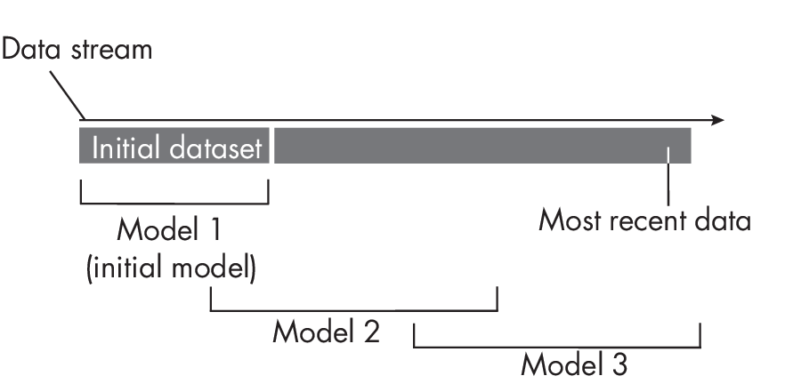
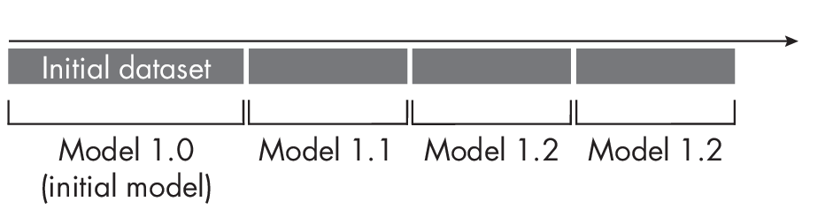

# Chapter 20: Stateless and Stateful Training

**What is the difference between stateless and stateful training
workflows in the context of production and deployment systems?**

Stateless training and stateful training refer to different ways of
training a production model.

> Tips: **无状态训练** `stateless` 和 **有状态训练** `stateful`，是两种不同的训练方式；训练生产模型时，需要考虑用哪种方式。

## Stateless (Re)training

In stateless training, the more conventional approach, we first train an
`initial model` on the original training set and then retrain it as new
data arrives. Hence, stateless training is also commonly referred to as
stateless *retraining*.

> Tips: 无状态训练，是先训练一个`初始模型`，然后在新数据到达时，重新训练模型；可以简单认为是`树状结构`，初始模型是`父节点`、衍生出一堆`叶子节点`模型.

As Figure [1.1](#fig-ch20-fig01) shows, we can think of stateless retraining as a
sliding window approach in which we retrain the initial model on
different parts of the data from a given data stream.

> Tips: 图示中，`初始模型`是`父节点`，`新模型`是`叶子节点`，`新模型`是基于`初始模型`训练的；训练新模型时，会截取`滑动窗口`数据。

For example, to update the initial model in
Figure [1.1](#fig-ch20-fig01) (Model 1) to a newer model (Model 2), we train the
model on 30 percent of the initial data and 70 percent of the most
recent data at a given point in time.

Stateless retraining is a straightforward approach that allows us to
adapt the model to the most recent changes in the data and
feature-target relationships via retraining the model from scratch in
user-defined checkpoint intervals. This approach is prevalent with
conventional machine learning systems that cannot be fine-tuned as part
of a transfer or self-supervised learning workflow (see
Chapter [\[ch02\]](../ch02/_books_ml-q-and-ai-ch02.md)).

> Tips: 传统的模型，中无状态训练，比较流行，比如`随机森林`、`梯度提升`等，这些都是无法`微调`的

For example, standard implementations of tree-based models, such as
random forests and gradient boosting (XGBoost, CatBoost, and LightGBM),
fall into this category.

## Stateful Training

In stateful training, we train the model on an initial batch of data and
then update it periodically (as opposed to retraining it) when new data
arrives.

> Tips: 有状态的训练，可以认为是 `链式结构`，初始模型 -> 新模型 -> 新模型 -> ... ， 每次都基于最新模型叠加而来.

As illustrated in Figure [1.2](#fig-ch20-fig02), we do not retrain the initial model (Model1.0)
from scratch; instead, we update or fine-tune it as new data arrives.
This approach is particularly attractive for models compatible with
transfer learning or self-supervised learning.

The stateful approach mimics a transfer or self-supervised learning
workflow where we adopt a pretrained model for fine-tuning. However,
stateful training differs fundamentally from transfer and
self-supervised learning because it updates the model to accommodate
concept, feature, and label drifts. In contrast, transfer and
self-supervised learning aim to adopt the model for a different
classification task. For instance, in transfer learning, the target
labels often differ. In self-supervised learning, we obtain the target
labels from the dataset features.

> Tips: 有状态的训练，跟`迁移学习`、`自监督学习`，有本质区别；有状态的训练，会更新模型，以适应概念、特征、标签的漂移；而迁移学习、自监督学习，是基于预训练模型，进行微调。

One significant advantage of stateful training is that we do not need to
store data for retraining; instead, we can use it to update the model as
soon as it arrives. This is particularly attractive when data storage is
a concern due to privacy or resource limitations.

## Exercises

20-1. Suppose we train a classifier for stock trading recommendations
using a random forest model, including the moving average of the stock
price as a feature. Since new stock market data arrives daily, we are
considering how to update the classifier daily to keep it up to date.
Should we take a stateless training or stateless retraining approach to
update the classifier?

20-2. Suppose we deploy a large language model (transformer) such as
ChatGPT that can answer user queries. The dialogue interface includes
thumbs-up and thumbs-down buttons so that users can give direct feedback
based on the generated queries. While collecting the user feedback, we
don't update the model immediately as new feedback arrives. However,
we are planning to release a new or updated model at least once per
month. Should we use stateless or stateful retraining for this model?

------------------------------------------------------------------------

