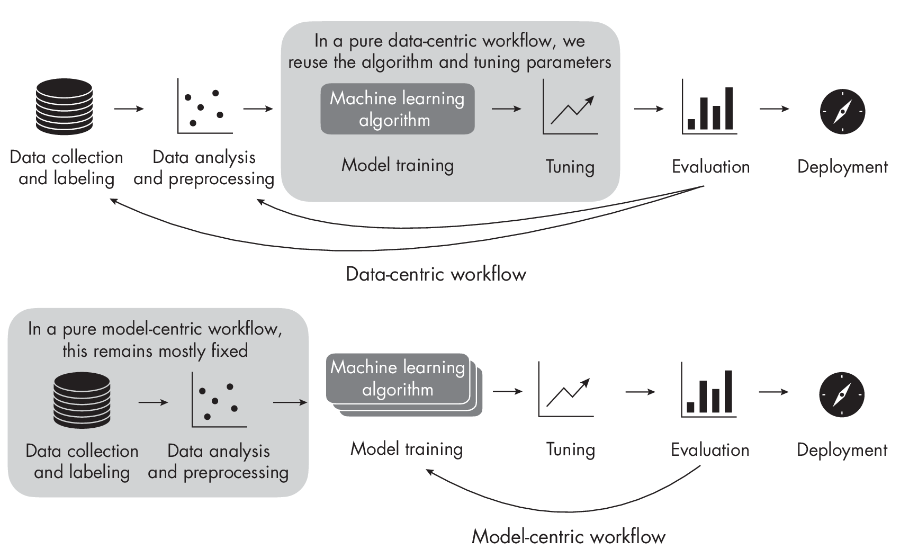

# Chapter 21: Data-Centric AI

**What is data-centric AI, how does it compare to the conventional
modeling paradigm, and how do we decide whether it's the right fit for
a project?**

**Data-centric AI** is a paradigm or workflow in which we keep the model
training procedure fixed and iterate over the dataset to improve the
predictive performance of a model. The following sections define what
data-centric AI means in more detail and compare it to conventional
model-centric approaches.

> Tips: `数据驱动 AI` 是一种范式或工作流，其中我们保持模型训练过程不变，通过**迭代数据集**来提高模型的预测性能。

## Data-Centric vs. Model-Centric AI

In the context of data-centric AI, we can think of the conventional
workflow, which is often part of academic publishing, as model-centric
AI. However, in an academic research setting, we are typically
interested in developing new methods (for example, neural network
architectures or loss functions). Here, we consider existing benchmark
datasets to compare the new method to previous approaches and determine
whether it is an improvement over the status quo.

> Tips: 在`数据驱动 AI` 的上下文中，我们可以将传统的学术届优化的模型视为`模型驱动 AI`。
> 
> - 在学术研究环境中，我们通常对开发**新方法**（例如神经网络架构或损失函数）感兴趣。
> - 我们考虑现有的**基准数据集**，以比较新方法与先前的方法，并确定它是否更优。

  

While *data-centric AI* is a relatively new term, the idea behind it is
not. Many people I've spoken with say they used a data-centric
approach in their projects before the term was coined. In my opinion,
data-centric AI was created to make "caring about data quality"?
attractive again, as data collection and curation are often considered
tedious or thankless. This is analogous to how the term *deep learning*
made neural networks interesting again in the early 2010s.

> Tips: 虽然`数据驱动 AI` 是一个相对较新的术语，但其背后的理念并不新。
> 
> - 许多人告诉我，在他们使用`数据驱动 AI` 之前，他们已经在项目中使用了`数据驱动 AI`。
> - 在我看来，`数据驱动 AI` 的称呼，是为了让`关注数据质量`再次变得有吸引力，因为数据收集和整理通常被认为是很繁琐或无意义的。
> - 这类似于`深度学习` 在2010年代初期让神经网络变得有趣起来。

Do we need to choose between data-centric and model-centric AI, or can
we rely on both? In short, data-centric AI focuses on changing the data
to improve performance, while model-centric approaches focus on
modifying the model to improve performance. Ideally, we should use both
in an applied setting where we want to get the best possible predictive
performance. However, in a research setting or an exploratory stage of
an applied project, working with too many variables simultaneously is
messy. If we change both model and data at once, it's hard to pinpoint
which change is responsible for the improvement.

> Tips: 我们是否需要在`数据驱动 AI` 和`模型驱动 AI` 之间做出选择，或者我们可以依赖两者？
> 
> - 简而言之，`数据驱动 AI` 专注于**改变数据**以提高性能，而`模型驱动 AI` 专注于**修改模型**以提高性能。
> - 理想情况下，我们应该同时使用两者。

It is important to emphasize that data-centric AI is a paradigm and
workflow, not a particular technique. Data-centric AI therefore
implicitly includes the following:

- Analyses and modifications of training data, from outlier removal to
  missing data imputation

- Data synthesis and data augmentation techniques

- Data labeling and label-cleaning methods

- The classic active learning setting where a model suggests which data
  points to label

> Tips: 重要的是要强调，`数据驱动 AI` 是一种范式和流程，而不是一种特定的技术，隐含地包括以下内容：
>  - 训练数据的分析和修改，从异常值去除到缺失数据插补
>  - 数据合成和数据增强技术
>  - 数据标注和标签清理方法
>  - 经典主动学习设置，其中模型建议哪些数据点需要标注

We consider an approach *data centric* if we change only the data (using
the methods listed here), not the other aspects of the modeling
pipeline.

In machine learning and AI, we often use the phrase "garbage in, garbage out"?
 meaning that poor-quality data will result in a poor
predictive model. In other words, we cannot expect a well-performing
model from a low-quality dataset.

I've observed a common pattern in applied academic projects that
attempt to use machine learning to replace an existing methodology.
Often, researchers have only a small dataset of examples (say, hundreds
of training examples). Labeling data is often expensive or considered
boring and thus best avoided. In these cases, the researchers spend an
unreasonable amount of time trying out different machine-learning
algorithms and model tuning. To resolve this issue, investing additional
time or resources in labeling additional data would be worthwhile.

> Tips: 
> 
> - 通常，研究人员，只有一个`小数据集`（例如，几百个训练样本）。
> - **标注数据**通常很`昂贵`或被认为很`无聊`，因此最好避免。
> - 在这些情况下，研究人员**花费了不合理的时间**来尝试不同的机器学习算法和模型调优。
> - 为了解决这个问题，投资额外的时间或资源来`标注更多的数据`将是有价值的。

The main advantage of data-centric AI is that it puts the data first so
that if we invest resources to create a higher-quality dataset, all
modeling approaches will benefit from it downstream.

> Tips: 数据驱动 AI 的主要优势在于，它将数据放在首位，因此如果我们投资资源来创建更高质量的数据集，所有建模方法都将从中受益。

## Recommendations

Taking a data-centric approach is often a good idea in an applied
project where we want to improve the predictive performance to solve a
particular problem. In this context, it makes sense to start with a
modeling baseline and improve the dataset since it's often more
worthwhile than trying out bigger, more expensive models.

If our task is to develop a new or better methodology, such as a new
neural network architecture or loss function, a model-centric approach
might be a better choice. Using an established benchmark dataset without
changing it makes it easier to compare the new modeling approach to
previous work. Increasing the model size usually improves performance,
but so does the addition of training examples. Assuming small training
sets (\< 2*k*) for classification, extractive question answering, and
multiple-choice tasks, adding a hundred examples can result in the same
performance gain as adding billions of parameters.

In a real-world project, alternating between data-centric and
model-centric modes makes a lot of sense. Investing in data quality
early on will benefit all models. Once a good dataset is available, we
can begin to focus on model tuning to improve performance.

> Tips: 在实际项目中，交替使用`数据驱动`和`模型驱动`模式是有意义的。
> 
> - 早期投资于`数据质量`将使所有模型受益。
> - 一旦有了一个好的数据集，我们可以开始专注于`模型调优`以提高性能。

## Exercises

21-1. A recent trend is the increased use of predictive analytics in
healthcare. For example, suppose a healthcare provider develops an AI
system that analyzes patients' electronic health records and provides
recommendations for lifestyle changes or preventive measures. For this,
the provider requires patients to monitor and share their health data
(such as pulse and blood pressure) daily. Is this an example of
data-centric AI?

21-2. Suppose we train a ResNet-34 convolutional neural network to
classify images in the CIFAR-10 and ImageNet datasets. To reduce
overfitting and improve classification accuracy, we experiment with data
augmentation techniques such as image rotation and cropping. Is this
approach data centric?

## References

- An example of how adding more training data can benefit model
  performance more than an increase in model size: Yuval Kirstain et
  al., "A Few More Examples May Be Worth Billions of Parameters"?
  (2021), <https://arxiv.org/abs/2110.04374>.

- Cleanlab is an open source library that includes methods for improving
  labeling errors and data quality in computer vision and natural
  language processing contexts: <https://github.com/cleanlab/cleanlab>.

------------------------------------------------------------------------

