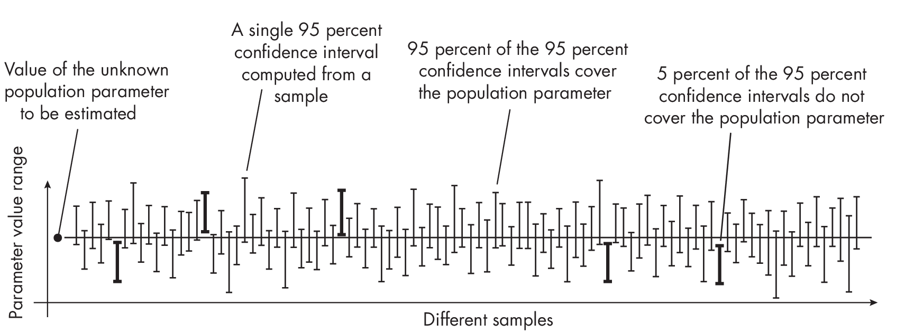
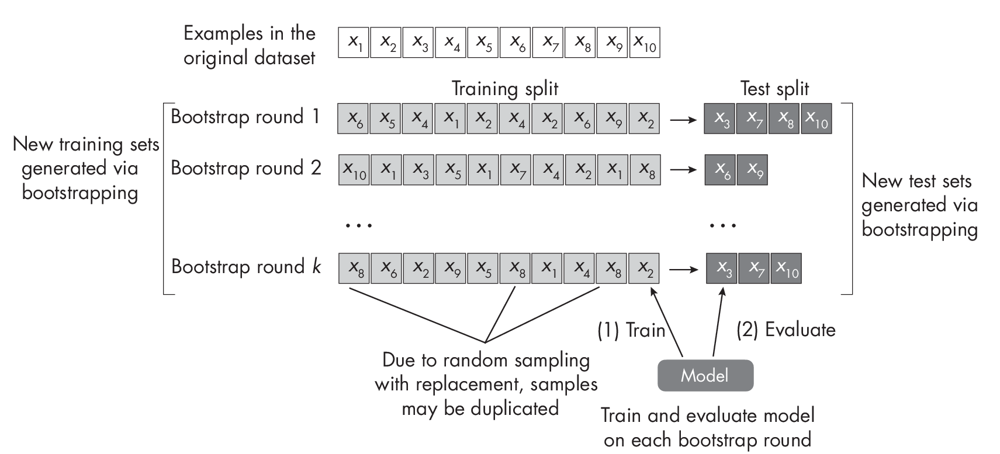
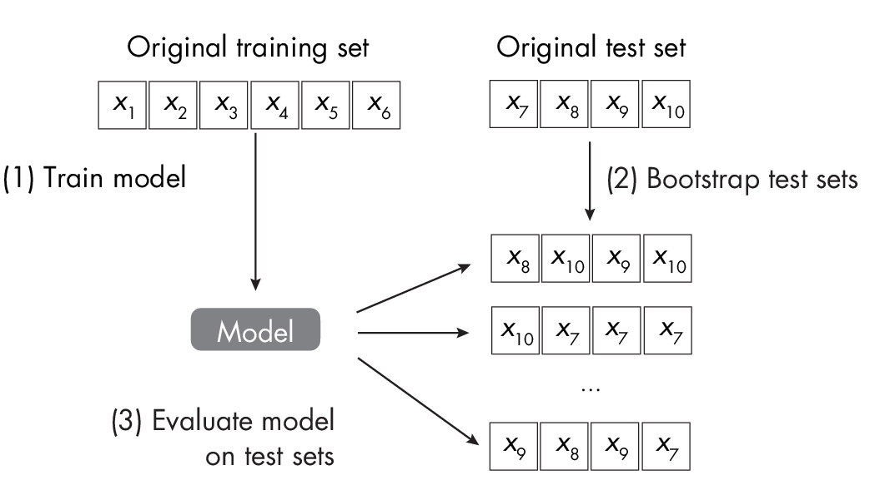

# Chapter 25: Confidence Intervals
[](#chapter-25-confidence-intervals)


**What are the different ways to construct confidence intervals for
machine learning classifiers?**

There are several ways to construct confidence intervals for machine
learning models, depending on the model type and the nature of your
data. For instance, some methods are computationally expensive when
working with deep neural networks and are thus more suitable to less
resource-intensive machine learning models. Others require larger
datasets to be reliable.

The following are the most common methods for constructing confidence
intervals:

- Constructing normal approximation intervals based on a test set

- Bootstrapping training sets

- Bootstrapping the test set predictions

- Confidence intervals from retraining models with different random
  seeds

Before reviewing these in greater depth, let's briefly review the
definition and interpretation of confidence intervals.

## Defining Confidence Intervals
[](#defining-confidence-intervals)

A *confidence interval* is a type of method to estimate an unknown
population parameter. A *population parameter* is a specific measure of
a statistical population, for example, a mean (average) value or
proportion. By "specific"? measure, I mean there is a single, exact
value for that parameter for the entire population. Even though this
value may not be known and often needs to be estimated from a sample, it
is a fixed and definite characteristic of the population. A *statistical
population*, in turn, is the complete set of items or individuals we
study.

In a machine learning context, the population could be considered the
entire possible set of instances or data points that the model may
encounter, and the parameter we are often most interested in is the true
generalization accuracy of our model on this population.

The accuracy we measure on the test set estimates the true
generalization accuracy. However, it's subject to random error due to
the specific sample of test instances we happened to use. This is where
the concept of a confidence interval comes in. A 95 percent confidence
interval for the generalization accuracy gives us a range in which we
can be reasonably sure that the true generalization accuracy lies.

Forinstance,ifwetake100differentdatasamplesandcomputea 95 percent
confidence interval for each sample, approximately 95 of the 100
confidence intervals will contain the true population value (such as the
generalization accuracy), as illustrated in
Figure [\[fig-ch25-fig01\]](#fig-ch25-fig01){reference="fig-ch25-fig01"
reference-type="ref"}.

::: figurewide
{style="width:5.625in"}
:::

More concretely, if we were to draw 100 different representative test
sets from the population (for instance, the entire possible set of
instances that the model may encounter) and compute the 95 percent
confidence interval for the generalization accuracy from each test set,
we would expect about 95 of these intervals to contain the true
generalization accuracy.

We can display confidence intervals in several ways. It is common to use
a bar plot representation where the top of the bar represents the
parameter value (for example, model accuracy) and the whiskers denote
the upper andlower levels of the confidence interval (left chart of
Figure [1.1](#fig-ch25-fig02){reference="fig-ch25-fig02"
reference-type="ref"}). Alternatively, the confidence intervals can be
shown without bars, as in the right chart of
Figure [1.1](#fig-ch25-fig02){reference="fig-ch25-fig02"
reference-type="ref"}.

{#fig-ch25-fig02}

This visualization is functionally useful in a number of ways. For
instance, when confidence intervals for two model performances do *not*
overlap, it's a strong visual indicator that the performances are
signifi-  cantly different. Take the example of statistical
significance tests, such as t-tests: if two 95 percent confidence
intervals do not overlap, it strongly suggests that the difference
between the two measurements is statistically significant at the 0.05
level.

On the other hand, if two 95 percent confidence intervals overlap, we
cannot automatically conclude that there's no significant difference
between the two measurements. Even when confidence intervals overlap,
there can still be a statistically significant difference.

Alternatively, to provide more detailed information about the exact
quantities, we can use a table view to express the confidence intervals.
The two common notations are summarized in
Table [1.1](#confidence-intervals){reference="confidence-intervals"
reference-type="ref"}.

::: {#confidence-intervals}
\| \| \| \| \| \|
\|\-\-\-\--\|\-\-\-\-\-\-\-\-\-\-\-\-\-\-\-\-\-\-\-\-\--\|\-\-\-\-\-\--\|\-\-\-\-\-\--\|\-\-\-\--\|
\| 1 \| 89.1% \$\$\\pm\$\$ 1.7% \| . . . \| . . . \| \| \| 2 \| 79.5%
\$\$\\pm\$\$ 2.2% \| . . . \| . . . \| \| \| 3 \| 95.2% \$\$\\pm\$\$
1.6% \| . . . \| . . . \| \| \| \| \| \| \| \| \| 1 \| 89.1% (87.4%,
90.8%) \| . . . \| . . . \| \| \| 2 \| 79.5% (77.3%, 81.7%) \| . . . \|
. . . \| \| \| 3 \| 95.2% (93.6%, 96.8%) \| . . . \| . . . \| \|
Confidence Intervals
:::

The \\(\\pm\\) notation is often preferred if the confidence interval is
*symmetric*, meaning the upper and lower endpoints are equidistant from
the estimated parameter. Alternatively, the lower and upper confidence
intervals can be written explicitly.

## The Methods
[](#the-methods)

The following sections describe the four most common methods of
constructing confidence intervals.

### Method 1: Normal Approximation Intervals
[](#method-1-normal-approximation-intervals)

The normal approximation interval involves generating the confidence
interval from a single train-test split. It is often considered the
simplest and most traditional method for computing confidence intervals.
This approach is especially appealing in the realm of deep learning,
where training models is computationally costly. It's also desirable
when we are interested in evaluating a specific model, instead of models
trained on various data partitions like in *k*-fold cross-validation.

How does it work? In short, the formula for calculating the confidence
interval for a predicted parameter (for example, the sample mean,
denoted as \\(\\bar{\\text{\\emph{x}}})\\), assuming a normal
distribution, is expressed as \\(\\bar{\\text{\\emph{x}}}\\) \\(\\pm\\)
*z* \\(\\times\\) *SE*.

In this formula, *z* represents the *z*-score, which indicates a
particular value's number of standard deviations from the mean in a
standard normal distribution. *SE* represents the standard error of the
predicted parameter (in this case, the sample mean).

::: note
Most readers will be familiar with [z]{.upright}-score tables that are
usually found in the back of introductory statistics textbooks. However,
a more convenient and preferred way to obtain [z]{.upright}-scores is to
use functions like SciPy's \`stats.zscore\` function, which computes
the [z]{.upright}-scores for given confidence levels.
:::

For our scenario, the sample mean, denoted as
\\(\\bar{\\text{\\emph{x}}}\\), corresponds to the test set accuracy,
ACC~test~, a measure of successful predictions in the context of a
binomial proportion confidence interval.

The standard error can be calculated under a normal approximation as
follows:

``` math
\text{SE} = \sqrt{ \frac{1}{n} \text{ACC}_{\text{test}}\left(1- \text{ACC}_{\text{test}}\right)}
```

In this equation, *n* signifies the size of the test set. Substituting
the standard error back into the previous formula, we obtain the
following:

``` math
\text{ACC}_{\text{test}} \pm z \sqrt{\frac{1}{n} \text{ACC}_{\text{test}}\left(1- \text{ACC}_{\text{test}}\right)}
```

Additional code examples to implement this method can also be found in
the *supplementary/q25_confidence-intervals* subfolder in the
supplementary code repository at
<https://github.com/rasbt/MachineLearning-QandAI-book>. While the normal
approximation interval method is very popular due to its simplicity, it
has some downsides. First, the normal approximation may not always be
accurate, especially for small sample sizes or for data that is not
normally distributed. In such cases, other methods of computing
confidence intervals may be more accurate. Second, using a single
train-test split does not provide information about the variability of
the model performance across different splits of the data. This can be
an issue if the performance is highly dependent on the specific split
used, which may be the case if the dataset is small or if there is a
high degree of variability in the data.

### Method 2: Bootstrapping Training Sets
[](#method-2-bootstrapping-training-sets)

Confidence intervals serve as a tool for approximating unknown
parameters. However, when we are restricted to just one estimate, such
as the accuracy derived from a single test set, we must make certain
assumptions to make this work. For example, when we used the normal
approximation interval described in the previous section, we assumed
normally distributed data, which may or may not hold.

In a perfect scenario, we would have more insight into our test set
sample distribution. However, this would require access to many
independent test datasets, which is typically not feasible. A workaround
is the bootstrap method, which resamples existing data to estimate the
sampling distribution.

::: note
In practice, when the test set is large enough, the normal distribution
approximation will hold, thanks to the central limit theorem. This
theorem states that the sum (or average) of a large number of
independent, identically distributed random variables will approach a
normal distribution, regardless of the underlying distribution of the
individual variables. It is difficult to specify what constitutes a
large-enough test set. However, under stronger assumptions than those of
the central limit theorem, we can at least estimate the rate of
convergence to the normal distribution using the Berry""Esseen theorem,
which gives a more quantitative estimate of how quickly the convergence
in the central limit theorem occurs.
:::

Inamachinelearningcontext,wecantaketheoriginaldatasetanddraw a random
sample *with replacement*. If the dataset has size *n* and we draw a
random sample with replacement of size *n*, this implies that some data
points will likely be duplicated in this new sample, whereas other data
points are not sampled at all.We can then repeat this procedure for
multiple rounds to obtain multiple training and test sets. This process
is known as *out-of-bag bootstrapping*, illustrated in
Figure [\[fig-ch25-fig04\]](#fig-ch25-fig04){reference="fig-ch25-fig04"
reference-type="ref"}.

::: figurewide
{style="width:5.625in"}
:::

Suppose we constructed *k* training and test sets. We can now take each
of these splits to train and evaluate the model to obtain *k* test set
accuracy estimates. Considering this distribution of test set accuracy
estimates, we can take the range between the 2.5th and 97.5th percentile
to obtain the 95 percent confidence interval, as illustrated in
Figure [1.2](#fig-ch25-fig05){reference="fig-ch25-fig05"
reference-type="ref"}.

{#fig-ch25-fig05}

Unlike the normal approximation interval method, we can consider this
out-of-bag bootstrap approach to be more agnostic to the specific
distribution. Ideally, if the assumptions for the normal approximation
are satisfied, both methodologies would yield identical outcomes.

Since bootstrapping relies on resampling the existing test data, its
downside is that it doesn't bring in any new information that could be
available in a broader population or unseen data. Therefore, it may not
always be able to generalize the performance of the model to new, unseen
data.

Note that we are using the bootstrap sampling approach in this chapter
instead of obtaining the train-test splits via *k*-fold
cross-validation, because of the bootstrap's theoretical grounding via
the central limit theorem discussed earlier. There are also more
advanced out-of-bag bootstrap methods, such as the .632 and .632+
estimates, which are reweighting the accuracy estimates.

### Method 3: Bootstrapping Test Set Predictions
[](#method-3-bootstrapping-test-set-predictions)

An alternative approach to bootstrapping training sets is to bootstrap
test sets.The idea is to train the model on the existing training set as
usual and then to evaluate the model on bootstrapped test sets, as
illustrated in Figure [1.3](#fig-ch25-fig06){reference="fig-ch25-fig06"
reference-type="ref"}. After obtaining the test set performance
estimates, we can then apply the percentile method described in the
previous section.

{#fig-ch25-fig06}

Contrary to the prior bootstrap technique, this method uses a trained
model and simply resamples the test set (instead of the training sets).
This approach is especially appealing for evaluating deep neural
networks, as it doesn't require retraining the model on the new data
splits. However, a disadvantage of this approach is that it doesn't
assess the model's variability toward small changes in the training
data.

### Method 4: Retraining Models with Different Random Seeds
[](#method-4-retraining-models-with-different-random-seeds)

In deep learning, models are commonly retrained using various random
seeds since some random weight initializations may lead to much better
models than others. How can we build a confidence interval from these
experiments? If we assume that the sample means follow a normal
distribution, we can employ a previously discussed method where we
calculate the confidence interval around a sample mean, denoted as
\\(\\bar{\\text{\\emph{x}}}\\), as follows:

``` math
\bar{x} \pm z \times \text{SE}
```

Since in this context we often work with a relatively modest number of
samples (for instance, models from 5 to 10 random seeds), assuming a *t*
distribution is deemed more suitable than a normal distribution.
Therefore, we substitute the *z* value with a *t* value in the preceding
formula. (As the sample size increases, the *t* distribution tends to
look more like the standard normal distribution, and the critical values
\[*z* and *t*\] become increasingly similar.)

Furthermore,ifweareinterestedintheaverageaccuracy,denoted as
\\(\\overline{\\text{ACC}}\\)~test~, we consider ACC~test,\ *j*~
corresponding to a unique random seed *j* as a sample. The number of
random seeds we evaluate would then constitute the sample size *n*. As
such, we would calculate:

``` math
\overline{\text{ACC}}_{\text{test}} \pm t \times \text{SE}
```

Here, SE is the standard error, calculated as SE =
SD/\\(\\!\\sqrt{\\text{\\emph{n}}}\\), while

``` math
\overline{\text{ACC}}_{\text{test}} = \frac{1}{r} \sum_{j\,=\,1}^{r} \text{ACC}_{\text{test}, j}
```

is the average accuracy, which we compute over the *r* random seeds. The
standard deviation SD is calculated as follows:

``` math
\mathrm{SD}=\sqrt{\frac{\sum_j\left(A C C_{\mathrm{test}, j}-\overline{A C C}_{\text {test }}\right)^2}{r-1}}
```

Tosummarize,calculatingtheconfidenceintervalsusingvarious random seeds
is another effective alternative. However, it is primarily beneficial
for deep learning models. It proves to be costlier than both the normal
approximation approach (method 1) and bootstrapping the test set
(method 3), as it necessitates retraining the model. On the bright
side, the outcomes derived from disparate random seeds provide us with a
robust understanding of the model's stability.

## Recommendations
[](#recommendations)

Each possible method for constructing confidence intervals has its
unique advantages and disadvantages. The normal approximation interval
is cheap to compute but relies on the normality assumption about the
distribution. The out-of-bag bootstrap is agnostic to these assumptions
but is substantially more expensive to compute. A cheaper alternative is
bootstrapping the test only, but this involves bootstrapping a smaller
dataset and may be misleading for small or nonrepresentative test set
sizes. Lastly, constructing confidence intervals from different random
seeds is expensive but can give us additional insights into the
model's stability.

### Exercises
[](#exercises)

25-1. As mentioned earlier, the most common choice of confidence level
is 95 percent confidence intervals. However, 90 percent and 99 percent
are also common. Are 90 percent confidence intervals smaller or wider
than 95 percent confidence intervals, and why is this the case?

25-2. In ""? on page , we created test sets by bootstrapping and
then applied the already trained model to compute the test set accuracy
on each of these datasets. Can you think of a method or modification to
obtain these test accuracies more efficiently?

## References
[](#references)

- A detailed discussion of the pitfalls of concluding statistical
  significance from nonoverlapping confidence intervals: Martin
  Krzywinski and Naomi Altman, "Error Bars"? (2013),
  <https://www.nature.com/articles/nmeth.2659>.

- A more detailed explanation of the binomial proportion confidence
  interval:
  <https://en.wikipedia.org/wiki/Binomial_proportion_confidence_interval>.

- For a detailed explanation of normal approximation intervals, see
  Section 1.7 of my article: "Model Evaluation, Model Selection, and
  Algorithm Selection in Machine Learning"? (2018),
  <https://arxiv.org/abs/1811.12808>.

- Additional information on the central limit theorem for inde-
   pendent and identically distributed random variables:
  <https://en.wikipedia.org/wiki/Central_limit_theorem>.

- For more on the Berry""Esseen theorem:
  [https://en.wikipedia.org/wiki/Berry""Esseen_theorem](https://en.wikipedia.org/wiki/Berry–Esseen_theorem).

- The .632 bootstrap addresses a pessimistic bias of the regular
  out-of-bag bootstrapping approach: Bradley Efron, "Estimating the
  Error Rate of a Prediction Rule: Improvement on Cross-Validation"?
  (1983), <https://www.jstor.org/stable/2288636>.

- The .632+ bootstrap corrects an optimistic bias introduced in the .632
  bootstrap: Bradley Efron and Robert Tibshirani, "Improvements on
  Cross-Validation: The .632+ Bootstrap Method"? (1997),
  <https://www.jstor.org/stable/2965703>.

- A deep learning research paper that discusses bootstrapping the test
  set predictions: Benjamin Sanchez-Lengeling et al., "Machine
  Learning for Scent: Learning Generalizable Perceptual Representations
  of Small Molecules"? (2019), <https://arxiv.org/abs/1910.10685>.


------------------------------------------------------------------------

