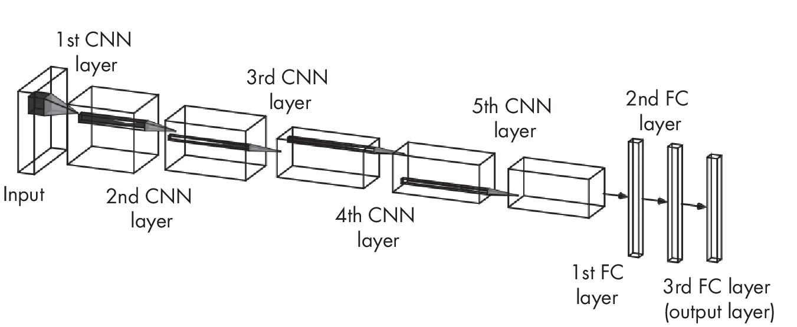

# Part 1: Neural Networks and Deep Learning 

## Chapter 1: Embeddings, Latent Space, and Representations 

[]{#ch01 label="ch01"}

**In deep learning, we often use the terms *embedding vectors*,
*representations*, and *latent space*. What do these concepts have in
common, and how do they differ?**

While these three terms are often used interchangeably, we can make
subtle distinctions between them:

- Embedding vectors are representations of input data where similar
  items are close to each other.

- Latent vectors are intermediate representations of input data.

- Representations are encoded versions of the original input.

The following sections explore the relationship between embeddings,
latent vectors, and representations and how each functions to encode
information in machine learning contexts.

### Embeddings 

Embedding vectors, or *embeddings* for short, encode relatively
high-dimensional data into relatively low-dimensional vectors.

We can apply embedding methods to create a continuous dense (non-sparse)
vector from a (sparse) one-hot encoding. *One-hot encoding* is a method
used to represent categorical data as binary vectors, where each
category is mapped to a vector containing 1 in the position
corresponding to the category’s index, and 0 in all other positions.
This ensures that the categorical values are represented in a way that
certain machine learning algorithms can process. For example, if we have
a categorical variable Color with three categories, Red, Green, and
Blue, the one-hot encoding would represent Red as \[1, 0, 0\], Green as
\[0, 1, 0\], and Blue as \[0, 0, 1\]. These one-hot encoded categorical
variables can then be mapped into continuous embedding vectors by
utilizing the learned weight matrix of an embedding layer or module.

We can also use embedding methods for dense data such as images. For
example, the last layers of a convolutional neural network may yield
embedding vectors, as illustrated in
Figure [1.1](#fig:ch01-fig01){reference="fig:ch01-fig01"
reference-type="ref"}.

{#fig:ch01-fig01}

To be technically correct, all intermediate layer outputs of a neural
network could yield embedding vectors. Depending on the training
objective, the output layer may also produce useful embedding vectors.
For the sake of simplicity, the convolutional neural network in
Figure [1.1](#fig:ch01-fig01){reference="fig:ch01-fig01"
reference-type="ref"} associates the second-to-last layer with
embeddings.

Embeddings can have higher or lower numbers of dimensions than the
original input. For instance, using embeddings methods for extreme
expression, we can encode data into two-dimensional dense and continuous
representations for visualization purposes and clustering analysis, as
illustrated in Figure [1.2](#fig:ch01-fig02){reference="fig:ch01-fig02"
reference-type="ref"}.

{#fig:ch01-fig02}

A fundamental property of embeddings is that they encode *distance* or
*similarity*. This means that embeddings capture the semantics of the
data such that similar inputs are close in the embeddings space.

For readers interested in a more formal explanation using mathematical
terminology, an embedding is an injective and structure-preserving map
between an input space *X* and the embedding space *Y*. This implies
that similar inputs will be located at points in close proximity within
the embedding space, which can be seen as the “structure-preserving�
characteristic of the embedding.

### Latent Space 

*Latent space* is typically used synonymously with *embedding space*,
the space into which embedding vectors are mapped.

Similar items can appear close in the latent space; however, this is not
a strict requirement. More loosely, we can think of the latent space as
any feature space that contains features, often compressed versions of
the original input features. These latent space features can be learned
by a neural network, such as an autoencoder that reconstructs input
images, as shown in
Figure [1.3](#fig:ch01-fig03){reference="fig:ch01-fig03"
reference-type="ref"}.

{#fig:ch01-fig03}

The bottleneck in
Figure [1.3](#fig:ch01-fig03){reference="fig:ch01-fig03"
reference-type="ref"} represents a small, intermediate neural network
layer that encodes or maps the input image into a lower-dimensional
representation. We can think of the target space of this mapping as a
latent space. The training objective of the autoencoder is to
reconstruct the input image, that is, to minimize the distance between
the input and output images. In order to optimize the training
objective, the autoencoder may learn to place the encoded features of
similar inputs (for example, pictures of cats) close to each other in
the latent space, thus creating useful embedding vectors where similar
inputs are close in the embedding (latent) space.

### Representation 

A *representation* is an encoded, typically intermediate form of an
input. For instance, an embedding vector or vector in the latent space
is a representation of the input, as previously discussed. However,
representations can also be produced by simpler procedures. For example,
one-hot encoded vectors are considered representations of an input.

The key idea is that the representation captures some essential features
or characteristics of the original data to make it useful for further
analysis or processing.

### Exercises 

1-1. Suppose we’re training a convolutional network with five
convolutional layers followed by three fully connected (FC) layers,
similar to AlexNet (<https://en.wikipedia.org/wiki/AlexNet>), as
illustrated in
Figure [\[fig:ch01-fig04\]](#fig:ch01-fig04){reference="fig:ch01-fig04"
reference-type="ref"}.

::: minipage
 []{#fig:ch01-fig04
label="fig:ch01-fig04"}
:::

We can think of these fully connected layers as two hidden layers and an
output layer in a multilayer perceptron. Which of the neural network
layers can be utilized to produce useful embeddings? Interested readers
can find more details about the AlexNet architecture and implementation
in the original publication by Alex Krizhevsky, Ilya Sutskever, and
Geoffrey Hinton.

1-2. Name some types of input representations that are not embeddings.

### References 

- The original paper describing the AlexNet architecture and
  implementation: Alex Krizhevsky, Ilya Sutskever, and Geoffrey Hinton,
  “ImageNet Classification with Deep Convolutional Neural Networks�
  (2012),
  <https://papers.nips.cc/paper/4824-imagenet-classification-with-deep-convolutional-neural-networks>.

------------------------------------------------------------------------

