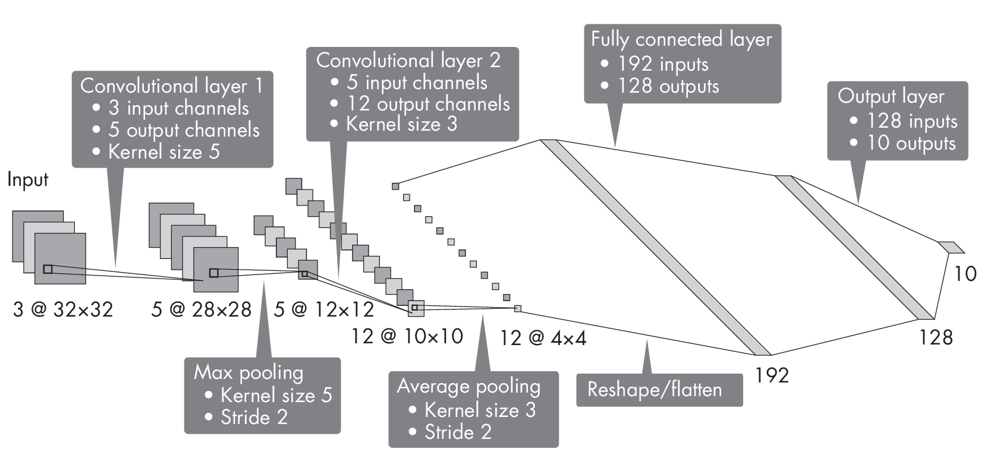

# Part 2: Computer Vision 

## Chapter 11: Calculating the Number of Parameters 

**How do we compute the number of para-  meters in a convolutional
neural network, and why is this information useful?**

Knowing the number of parameters in a model helps gauge the model's
size, which affects storage and memory requirements. The following
sections will explain how to compute the convolutional and fully
connected layer parameter counts.

### How to Find Parameter Counts 

Suppose we are working with a convolutional network that has two con-
 volutional layers with kernel size 5 and kernel size 3, respectively.
The first convolutional layer has 3 input channels and 5 output
channels, and the second one has 5 input channels and 12 output
channels. The stride of these convolutional layers is 1. Furthermore,
the network has two pooling layers, one with a kernel size of 3 and a
stride of 2, and another with a kernel size of 5 and a stride of 2. It
also has two fully connected hidden layers with 192 and 128 hidden units
each, where the output layer is a classification layer for 10 classes.
The architecture of this network is illustrated in
Figure [\[fig:ch11-fig01\]](#fig:ch11-fig01){reference="fig:ch11-fig01"
reference-type="ref"}.

::: figurewide
{style="width:5.625in"}
:::

What is the number of trainable parameters in this convolutional
network? We can approach this problem from left to right, computing the
number of parameters for each layer and then summing up these counts to
obtain the total number of parameters. Each layer's number of
trainable parameters consists of weights and bias units.

#### Convolutional Layers 

In a convolutional layer, the number of weights depends on the
kernel's width and height and the number of input and output channels.
The number of bias units depends on the number of output channels only.
To illu-  strate the computation step by step, suppose we have a kernel
width and height of 5, one input channel, and one output channel, as
illustrated in Figure [1.1](#fig:ch11-fig02){reference="fig:ch11-fig02"
reference-type="ref"}.

{#fig:ch11-fig02}

In this case, we have 26 parameters, since we have 5 \\(\\times\\) 5 =
25 weights via the kernel plus the bias unit. The computation to
determine an output value or pixel *z* is *z* = *b* + \\(\\sum_j\\)
*w~j~* *x~j~*, where *x~j~* represents an input pixel, *w~j~* represents
a weight parameter of the kernel, and *b* is the bias unit.

Now, suppose we have three input channels, as illustrated in
Figure [1.2](#fig:ch11-fig03){reference="fig:ch11-fig03"
reference-type="ref"}.

{#fig:ch11-fig03}

In that case, we compute the output value by performing the
aforementioned operation, \\(\\sum_j\\) *w~j~ x~j~*, for each input
channel and then add the bias unit. For three input channels, this would
involve three different kernels with three sets of weights:

\\\[z = \\sum_j w\^{(1)}\_{j} x_j + \\sum_j w\^{(2)}\_{j} x_j + \\sum_j
w\^{(3)}\_{j} x_j + b\\\]

Since we have three sets of weights
(*w*^(1)^,*w*^(2)^,and*w*^(3)^for*j*=\[1,"¦,25\]), we have 3
\\(\\times\\) 25 + 1 = 76 parameters in this convolutional layer.

We use one kernel for each output channel, where each kernel is unique
to a given output channel. Thus, if we extend the number of output
channels from one to five, as shown in
Figure [1.3](#fig:ch11-fig04){reference="fig:ch11-fig04"
reference-type="ref"}, we extend the number of parameters by a factor of
5. In other words, if the kernel for one output channel has 76
parameters, the 5 kernels required for the five output channels will
have 5 \\(\\times\\) 76 = 380 parameters.

{#fig:ch11-fig04}

Returning to the neural network architecture illustrated in
Figure [\[fig:ch11-fig01\]](#fig:ch11-fig01){reference="fig:ch11-fig01"
reference-type="ref"} at the beginning of this section, we compute the
number of parameters in the convolutional layers based on the kernel
size and number of input and output channels. For example, the first
convolutional layer has three input channels, five output channels, and
a kernel size of 5. Thus, its number of parameters is 5 \\(\\times\\) (5
\\(\\times\\) 5 \\(\\times\\) 3) + 5 = 380. The second convolutional
layer, with five input channels, 12 output channels, and a kernel size
of 3, has 12 \\(\\times\\) (3 \\(\\times\\) 3 \\(\\times\\) 5) + 12 =
552 parameters. Since the pooling layers do not have any trainable
parameters, we can count 380 + 552 = 932 for the convolutional part of
this architecture.

Next, let's see how we can compute the number of parameters of fully
connected layers.

#### Fully Connected Layers 

Counting the number of parameters in a fully connected layer is
relatively straightforward. A fully connected node connects each input
node to each output node, so the number of weights is the number of
inputs times the number of outputs plus the bias units added to the
output. For example, if we have a fully connected layer with five inputs
and three outputs, as shown
inFigure [1.4](#fig:ch11-fig05){reference="fig:ch11-fig05"
reference-type="ref"},wehave5\\(\\times\\)3=15weightsandthreebiasunits,thatis,
18 parameters total.

{#fig:ch11-fig05}

Returning once more to the neural network architecture illustrated in
Figure [\[fig:ch11-fig01\]](#fig:ch11-fig01){reference="fig:ch11-fig01"
reference-type="ref"}, we can now calculate the parameters in the fully
connected layers as follows: 192 \\(\\times\\) 128 + 128 = 24,704 in the
first fully connected layer and 128 \\(\\times\\) 10 + 10 = 1,290 in the
second fully connected layer, the output layer. Hence, we have 24,704 +
1,290 = 25,994 in the fully connected part of this network. After adding
the 932 parameters from the convolutional layers and the 25,994
parameters from the fully connected layers, we can conclude that this
network's total number of parameters is 26,926.

As a bonus, interested readers can find PyTorch code to compute the
number of parameters programmatically in the
*supplementary/q11-conv-size* subfolder at
<https://github.com/rasbt/MachineLearning-QandAI-book>.

### Practical Applications 

Why do we care about the number of parameters at all? First, we can use
this number to estimate a model's complexity. As a rule of thumb, the
more parameters there are, the more training data we'll need to train
the model well.

The number of parameters also lets us estimate the size of the neural
network, which in turn helps us estimate whether the network can fit
into GPU memory. Although the memory requirement during training often
exceeds the model size due to the additional memory required for
carrying out matrix multiplications and storing gradients, model size
gives us a ballpark sense of whether training the model on a given
hardware setup is feasible.

### Exercises 

11-1. Suppose we want to optimize the neural network using a plain
stochastic gradient descent (SGD) optimizer or the popular Adam
optimizer. What are the respective numbers of parameters that need to be
stored for SGD and Adam?

11-2. Suppose we're adding three batch normalization (BatchNorm)
layers: one after the first convolutional layer, one after the second
convolutional layer, and another one after the first fully connected
layer (we typically do not want to add BatchNorm layers to the output
layer). How many additional parameters do these three BatchNorm layers
add to the model?

\

------------------------------------------------------------------------

