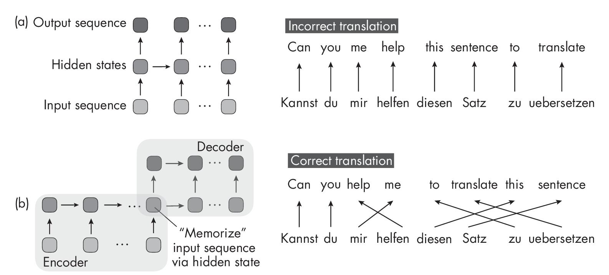

# Machine Learning Q and AI {#machine-learning-q-and-ai .post-title style="text-align: left;"}

## 30 Essential Questions and Answers on Machine Learning and AI {#essential-questions-and-answers-on-machine-learning-and-ai .post-subtitle}

By Sebastian Raschka. [Free to read](#table-of-contents). Published by
[No Starch Press](https://nostarch.com/machine-learning-q-and-ai).\
Copyright © 2024-2025 by Sebastian Raschka.

{.right-image-shadow-30}

> Machine learning and AI are moving at a rapid pace. Researchers and
> practitioners are constantly struggling to keep up with the breadth of
> concepts and techniques. This book provides bite-sized bits of
> knowledge for your journey from machine learning beginner to expert,
> covering topics from various machine learning areas. Even experienced
> machine learning researchers and practitioners will encounter
> something new that they can add to their arsenal of techniques.

\

# Chapter 16: Self-Attention 

[]{#ch16 label="ch16"}

**Where does self-attention get its name, and how is it different from
previously developed attention mechanisms?**

*Self-attention* enables a neural network to refer to other portions of
the input while focusing on a particular segment, essentially allowing
each part the ability to “attend� to the whole input. The original
attention mechanism developed for recurrent neural networks (RNNs) is
applied between two different sequences: the encoder and the decoder
embeddings. Since the attention mechanisms used in transformer-based
large language models is designed to work on all elements of the same
set, it is known as *self*-attention.

This chapter first discusses an earlier attention mechanism developed
for RNNs, the Bahdanau mechanism, in order to illustrate the motivation
behind developing attention mechanism. We then compare the Bahdanau
mechanism to the self-attention mechanism prevalent in transformer
architectures today.

## Attention in RNNs 

One example of an attention mechanism used in RNNs to handle long
sequences is *Bahdanau attention*. Bahdanau attention was developed to
make machine learning models, particularly those used in translating
languages, better at understanding long sentences. Before this type of
attention, the whole input (such as a sentence in English) was squashed
into a single chunk of information, and important details could get
lost, especially if the sentence was long.

Tounderstandthedifferencebetweenregularattentionandself-
attention,let’sbeginwiththeillustrationoftheBahdanauattention
mechanisminFigure [1.1](#fig:ch16-fig01){reference="fig:ch16-fig01"
reference-type="ref"}.

{#fig:ch16-fig01}

In Figure [1.1](#fig:ch16-fig01){reference="fig:ch16-fig01"
reference-type="ref"}, the \\(\\alpha\\) values represent the attention
weights for the second sequence element and each other element in the
sequence from 1 to *T*. Furthermore, this original attention mechanism
involves two RNNs. The RNN at the bottom, computing the attention
weights, represents the encoder, while the RNN at the top, producing the
output sequence, is a decoder.

In short, the original attention mechanism developed for RNNs is applied
between two different sequences: the encoder and decoder embeddings. For
each generated output sequence element, the decoder RNN at the top is
based on a hidden state plus a context vector generated by the encoder.
This context vector involves *all* elements of the input sequence and is
a weighted sum of all input elements where the attention scores
(\\(\\alpha\\)’s) represent the weighting coefficients. This allows
the decoder to access all input sequence elements (the context) at each
step. The key idea is that the attention weights (and context) may
differ and change dynamically at each step.

The motivation behind this complicated encoder-decoder design is that we
cannot translate sentences word by word. This would result in
grammatically incorrect outputs, as illustrated by the RNN architecture
(a) in
Figure [\[fig:ch16-fig02\]](#fig:ch16-fig02){reference="fig:ch16-fig02"
reference-type="ref"}.

::: figurewide
{style="width:5.625in"}
:::

Figure [\[fig:ch16-fig02\]](#fig:ch16-fig02){reference="fig:ch16-fig02"
reference-type="ref"} shows two different sequence-to-sequence RNN
designs for sentence translation.
Figure [\[fig:ch16-fig02\]](#fig:ch16-fig02){reference="fig:ch16-fig02"
reference-type="ref"}(a) represents a regular sequence-to-sequence RNN
that may be used to translate a sentence from German to English word by
word.
Figure [\[fig:ch16-fig02\]](#fig:ch16-fig02){reference="fig:ch16-fig02"
reference-type="ref"}(b) depicts an encoder-decoder RNN that first reads
the whole sentence before translating it.

RNN architecture (a) is best suited for time series tasks in which we
want to make one prediction at a time, such as predicting a given stock
price day by day. For tasks like language translation, we typically opt
for an encoder-decoder RNN, as in architecture (b) in
Figure [\[fig:ch16-fig02\]](#fig:ch16-fig02){reference="fig:ch16-fig02"
reference-type="ref"}. Here, the RNN encodes the input sentence, stores
it in an intermediate hidden representation, and generates the output
sentence. However, this creates a bottleneck where the RNN has to
memorize the whole input sentence via a single hidden state, which does
not work well for longer sequences.

The bottleneck depicted in architecture (b) prompted the Bahdanau
attention mechanism’s original design, allowing the decoder to access
all elements in the input sentence at each time step. The attention
scores also give different weights to the different input elements
depending on the current word that the decoder generates. For example,
when generating the word *help* in the output sequence, the word
*helfen* in the German input sentence may get a large attention weight,
as it’s highly relevant in this context.

## The Self-Attention Mechanism 

The Bahdanau attention mechanism relies on a somewhat complicated
encoder-decoder design to model long-term dependencies in sequence-
 to-sequence language modeling tasks. Approximately three years after
the Bahdanau mechanism, researchers worked on simplifying sequence-to-
 sequence modeling architectures by asking whether the RNN backbone was
even needed to achieve good language translation performance. This led
to the design of the original transformer architecture and
self-attention mechanism.

In self-attention, the attention mechanism is applied between all
elements in the same sequence (as opposed to involving two sequences),
as depicted in the simplified attention mechanism in
Figure [1.2](#fig:ch16-fig03){reference="fig:ch16-fig03"
reference-type="ref"}. Similar to the attention mechanism for RNNs, the
context vector is an attention-weighted sum over the input sequence
elements.

{#fig:ch16-fig03}

While Figure [1.2](#fig:ch16-fig03){reference="fig:ch16-fig03"
reference-type="ref"} doesn’t include weight matrices, the
self-attention mechanism used in transformers typically involves
multiple weight matrices to compute the attention weights.

This chapter laid the groundwork for understanding the inner workings of
transformer models and the attention mechanism. The next chapter covers
the different types of transformer architectures in more detail.

### Exercises 

16-1. Considering that self-attention compares each sequence element
with itself, what is the time and memory complexity of self-attention?

16-2. We discussed self-attention in the context of natural language
processing. Could this mechanism be useful for computer vision
applications as well?

## References 

- The paper introducing the original self-attention mechanism, also
  known as *scaled dot-product* attention: Ashish Vaswani et al.,
  “Attention Is All You Need� (2017),
  <https://arxiv.org/abs/1706.03762>.

- The Bahdanau attention mechanism for RNNs: Dzmitry Bahdanau, Kyunghyun
  Cho, and Yoshua Bengio, “Neural Machine Translation by Jointly
  Learning to Align and Translate� (2014),
  <https://arxiv.org/abs/1409.0473>.

- For more about the parameterized self-attention mechanism, check out
  my blog post: “Understanding and Coding the Self-Attention Mechanism
  of Large Language Models from Scratch� at
  <https://sebastianraschka.com/blog/2023/self-attention-from-scratch.html>.

\

------------------------------------------------------------------------

