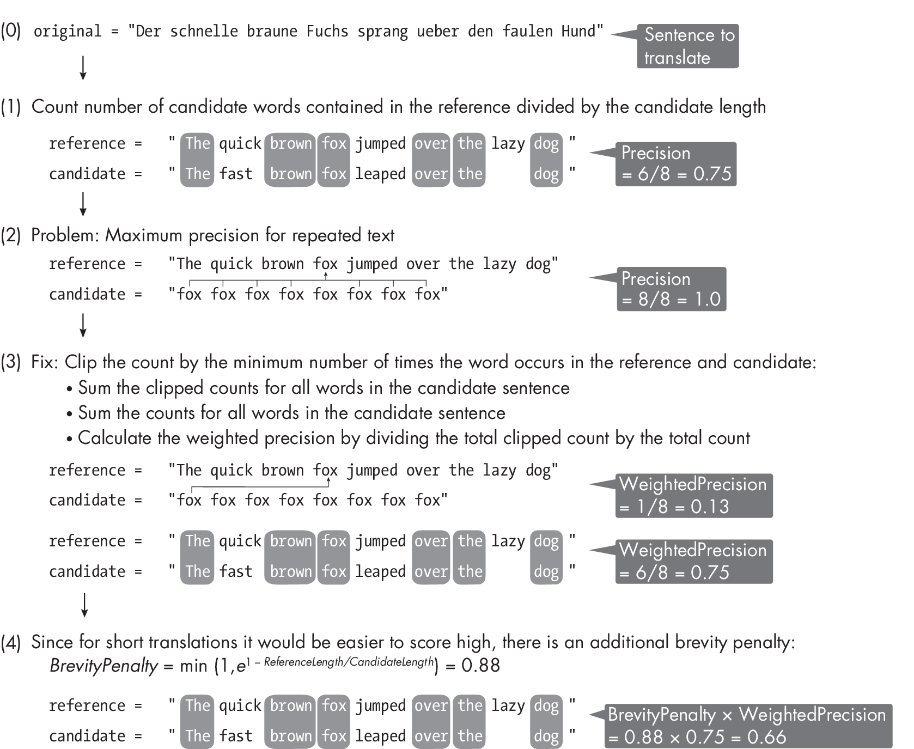
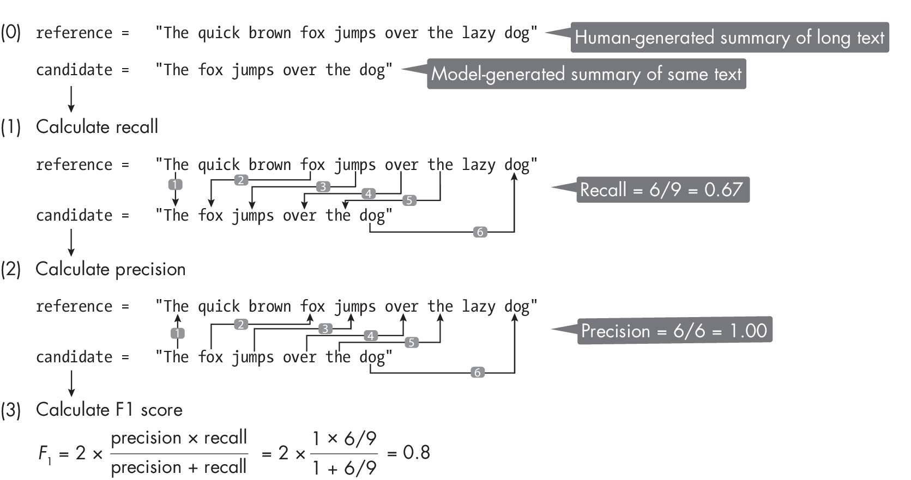
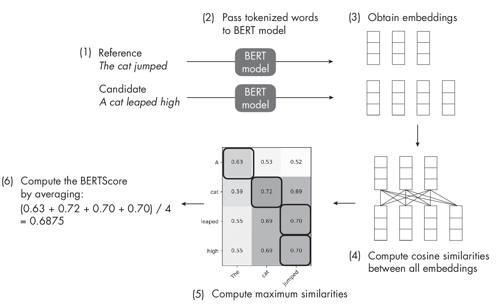

# Machine Learning Q and AI {#machine-learning-q-and-ai .post-title style="text-align: left;"}

## 30 Essential Questions and Answers on Machine Learning and AI {#essential-questions-and-answers-on-machine-learning-and-ai .post-subtitle}

By Sebastian Raschka. [Free to read](#table-of-contents). Published by
[No Starch Press](https://nostarch.com/machine-learning-q-and-ai).\
Copyright © 2024-2025 by Sebastian Raschka.

{.right-image-shadow-30}

> Machine learning and AI are moving at a rapid pace. Researchers and
> practitioners are constantly struggling to keep up with the breadth of
> concepts and techniques. This book provides bite-sized bits of
> knowledge for your journey from machine learning beginner to expert,
> covering topics from various machine learning areas. Even experienced
> machine learning researchers and practitioners will encounter
> something new that they can add to their arsenal of techniques.

\

# Chapter 19: Evaluating Generative Large Language Models 

[]{#ch19 label="ch19"}

**What are the standard metrics for evaluating the quality of text
generated by large language models, and why are these metrics useful?**

Perplexity, BLEU, ROUGE, and BERTScore are some of the most common
evaluation metrics used in natural language processing to assess the
performance of LLMs across various tasks. Although there is ultimately
no way around human quality judgments, human evaluations are tedious,
expensive, hard to automate, and subjective. Hence, we develop metrics
to provide objective summary scores to measure progress and compare
different approaches.

This chapter discusses the difference between intrinsic and extrinsic
performance metrics for evaluating LLMs, and then it dives deeper into
popular metrics like BLEU, ROUGE, and BERTScore and provides simple
hands-on examples for illustration purposes.

## Evaluation Metrics for LLMs 

The *perplexity metric* is directly related to the loss function used
for pretraining LLMs and is commonly used to evaluate text generation
and text completion models. Essentially, it quantifies the average
uncertainty of the model in predicting the next word in a given
contextâ€"the lower the perplexity, the better.

The *bilingual evaluation understudy (BLEU)* score is a widely used
metric for evaluating the quality of machine-generated translations. It
measures the overlap of n-grams between the machine-generated
translation and a set of human-generated reference translations. A
higher BLEU score indicates better performance, ranging from 0 (worst)
to 1 (best).

The *recall-oriented understudy for gisting evaluation (ROUGE)* score is
a metric primarily used for evaluating automatic summarization (and
sometimes machine translation) models. It measures the overlap between
the generated summary and reference summaries.

We can think of perplexity as an *intrinsic metric* and BLEU and ROUGE
as *extrinsic metrics*. To illustrate the difference between the two
types of metrics, think of optimizing the conventional cross entropy to
train an image classifier. The cross entropy is a loss function we
optimize during training, but our end goal is to maximize the
classification accuracy. Since classification accuracy cannot be
optimized directly during training, as it’s not differentiable, we
minimize the surrogate loss function like the cross entropy. Minimizing
the cross entropy loss more or less correlates with maximizing the
classification accuracy.

Perplexity is often used as an evaluation metric to compare the
performance of different language models, but it is not the optimization
target during training. BLEU and ROUGE are more related to
classification accuracy, or rather precision and recall. In fact, BLEU
is a precision-like score to evaluate the quality of a translated text,
while ROUGE is a recall-like score to evaluate summarized texts.

The following sections discuss the mechanics of these metrics in more
detail.

### Perplexity 

Perplexity is closely related to the cross entropy directly minimized
during training, which is why we refer to perplexity as an *intrinsic
metric*.

Perplexity is defined as 2^*H*(*p*,\ *q*)/*n*^, where *H*(*p*, *q*) is
the cross entropy between the true distribution of words *p* and the
predicted distribution of words *q*, and *n* is the sentence length (the
number of words or tokens) to normalize the score. As cross entropy
decreases, perplexity decreases as wellâ€"the lower the perplexity, the
better. While we typically compute the cross entropy using a natural
logarithm, we calculate the cross entropy and perplexity with a base-2
logarithm for the intuitive relationship to hold. (However, whether we
use a base-2 or natural logarithm is only a minor implementation
detail.)

In practice, since the probability for each word in the target sentence
is always 1, we compute the cross entropy as the logarithm of the
probability scores returned by the model we want to evaluate. In other
words, if we have the predicted probability score for each word in a
sentence *s*, we can compute the perplexity directly as follows:

\\\[Perplexity(s) = 2\^{-\\frac{1}{n} \\log_2 (p(s))}\\\]

where *s* is the sentence or text we want to evaluate, such as “The
quick brown fox jumps over the lazy dog,� *p*(*s*) is the probability
scores returned by the model, and *n* is the number of words or tokens.
For example, if the model returns the probability scores \[0.99, 0.85,
0.89, 0.99, 0.99, 0.99, 0.99, 0.99\], the perplexity is:

\\\[\\begin{aligned} & 2\^{-\\frac{1}{8} \\cdot \\sum_i \\log_2 p(w_i)}
\\\\ =\\,& 2\^{-\\frac{1}{8} \\cdot \\sum \\log_2 (0.99 \\,\\times\\,
0.85 \\,\\times\\, 0.89 \\,\\times\\, 0.99 \\,\\times\\, 0.99
\\,\\times\\, 0.99 \\,\\times\\, 0.99 \\,\\times\\, 0.99) }\\\\
=\\,&1.043 \\end{aligned}\\\]

If the sentence was “The fast black cat jumps over the lazy dog,�
with probabilities \[0.99, 0.65, 0.13, 0.05, 0.21, 0.99, 0.99, 0.99\],
the corresponding perplexity would be 2.419.

You can find a code implementation and example of this calculation in
the *supplementary/q19-evaluation-llms* subfolder at
<https://github.com/rasbt/MachineLearning-QandAI-book>.

### BLEU Score 

BLEU is the most popular and most widely used metric for evaluating
translated texts. It’s used in almost all LLMs capable of translation,
including popular tools such as OpenAI’s Whisper and GPT models.

BLEU is a reference-based metric that compares the model output to
human-generated references and was first developed to capture or
automate the essence of human evaluation. In short, BLEU measures the
lexical overlap between the model output and the human-generated
references based on a precision score.

In more detail, as a precision-based metric, BLEU counts how many words
in the generated text (candidate text) occur in the reference text
divided by the candidate text length (the number of words), where the
reference text is a sample translation provided by a human, for example.
This is commonly done for n-grams rather than individual words, but for
simplicity, we will stick to words or 1-grams. (In practice, BLEU is
often computed for 4-grams.)

Figure [\[fig:ch19-fig01\]](#fig:ch19-fig01){reference="fig:ch19-fig01"
reference-type="ref"} demonstrates the BLEU score calculation, using the
example of calculating the 1-gram BLEU score. The individual steps in
Figure [\[fig:ch19-fig01\]](#fig:ch19-fig01){reference="fig:ch19-fig01"
reference-type="ref"} illustrate how we compute the 1-gram BLEU score
based on its individual components, the weighted precision times a
brevity penalty. You can also find a code implementation of this
calculation in the *supplementary/q15-text* *-augment* subfolder at
<https://github.com/rasbt/MachineLearning-QandAI-book>.

::: figurewide
{style="width:5.625in"}
:::

BLEU has several shortcomings, mostly owing to the fact that it measures
string similarity, and similarity alone is not sufficient for capturing
quality. For instance, sentences with similar words but different word
orders might still score high, even though altering the word order can
significantly change the meaning of a sentence and result in poor
grammatical structure. Furthermore, since BLEU relies on exact string
matches, it is sensitive to lexical variations and is incapable of
identifying semantically similar translations that use synonyms or
paraphrases. In other words, BLEU may assign lower scores to
translations that are, in fact, accurate and meaningful.

The original BLEU paper found a high correlation with human evaluations,
though this was disproven later.

Is BLEU flawed? Yes. Is it still useful? Also yes. BLEU is a helpful
tool to measure or assess whether a model improves during training, as a
proxy for fluency. However, it may not reliably give a correct
assessment of the quality of the generated translations and is not well
suited for detecting issues. In other words, it’s best used as a model
selection tool, not a model evaluation tool.

Atthetimeofwriting,themostpopularalternativestoBLEUare METEOR and COMET
(see the “� section at the end of this chapter for more details).

### ROUGE Score 

While BLEU is commonly used for translation tasks, ROUGE is a popular
metric for scoring text summaries.

There are many similarities between BLEU and ROUGE. The
precision-basedBLEUscorecheckshowmanywordsinthecandidatetranslation
occur in the reference translation. The ROUGE score also takes a flipped
approach, checking how many words in the reference text appear in the
generated text (here typically a summarization instead of a
translation); this can be interpreted as a recall-based score.

Modern implementations compute ROUGE as an F1 score that is the harmonic
mean of recall (how many words in the reference occur in the candidate
text) and precision (how many words in the candidate text occur in the
reference text). For example,
Figure [\[fig:ch19-fig02\]](#fig:ch19-fig02){reference="fig:ch19-fig02"
reference-type="ref"} shows a 1-gram ROUGE score computation (though in
practice, ROUGE is often computed for bigrams, that is, 2-grams).

::: figurewide
{style="width:6.5in"}
:::

There are other ROUGE variants beyond ROUGE-1 (the F1 scoreâ€"based
ROUGE score for 1-grams):

ROUGE-N Measures the overlap of n-grams between the candidate and
reference summaries. For example, ROUGE-1 would look at the overlap of
individual words (1-grams), while ROUGE-2 would consider the overlap of
2-grams (bigrams).

ROUGE-L Measures the longest common subsequence (LCS) between the
candidate and reference summaries. This metric captures the longest
co-occurring in-order subsequence of words, which may have gaps in
between them.

ROUGE-S Measures the overlap of *skip-bigrams*, or word pairs with a
flexible number of words in between them. It can be useful to capture
the similarity between sentences with different word orderings.

ROUGE shares similar weaknesses with BLEU. Like BLEU, ROUGE does not
account for synonyms or paraphrases. It measures the n-gram overlap
between the candidate and reference summaries, which can lead to lower
scores for semantically similar but lexically different sentences.
However, it’s still worth knowing about ROUGE since, according to a
study, *all* papers introducing new summarization models at
computational linguistics conferences in 2021 used it, and 69 percent of
those papers used *only* ROUGE.

### BERTScore 

Another more recently developed extrinsic metric is BERTScore.

Forreadersfamiliarwiththeinceptionscoreforgenerativevision models,
BERTScore takes a similar approach, using embeddings from a pretrained
model (for more on embeddings, see
Chapter [\[ch01\]](../ch01){reference="ch01" reference-type="ref"}).
Here, BERT-  Score measures the similarity between a candidate text and
a reference text by leveraging the contextual embeddings produced by the
BERT model (the encoder-style transformer discussed in
Chapter [\[ch17\]](../ch17){reference="ch17" reference-type="ref"}).

The steps to compute BERTScore are as follows:

1.  Obtain the candidate text via the LLM you want to evaluate (PaLM,
    LLaMA, GPT, BLOOM, and so on).

2.  Tokenize the candidate and reference texts into subwords, preferably
    using the same tokenizer used for training BERT.

3.  Use a pretrained BERT model to create the embeddings for all tokens
    in the candidate and reference texts.

4.  Compare each token embedding in the candidate text to all token
    embeddings in the reference text, computing their cosine similarity.

5.  Align each token in the candidate text with the token in the
    reference text that has the highest cosine similarity.

6.  Compute the final BERTScore by taking the average similarity scores
    of all tokens in the candidate text.

Figure [\[fig:ch19-fig03\]](#fig:ch19-fig03){reference="fig:ch19-fig03"
reference-type="ref"} further illustrates these six steps. You can also
find a computational example in the *subfolder/q15-text-augment*
subfolder at <https://github.com/rasbt/MachineLearning-QandAI-book>.

::: figurewide
{style="width:5.625in"}
:::

BERTScore can be used for translations and summaries, and it captures
the semantic similarity better than traditional metrics like BLEU and
ROUGE. However, BERTScore is more robust in paraphrasing than BLEU and
ROUGE and captures semantic similarity better due to its contextual
embeddings. Also, it may be computationally more expensive than BLEU and
ROUGE, as it requires using a pretrained BERT model for the evaluation.
While BERTScore provides a useful automatic evaluation metric, it’s
not perfect and should be used alongside other evaluation techniques,
including human judgment.

## Surrogate Metrics 

All metrics covered in this chapter are surrogates or proxies to
evaluate how useful the model is in terms of measuring how well the
model compares to human performance for accomplishing a goal. As
mentioned earlier, the best way to evaluate LLMs is to assign human
raters who judge the results. However, since this is often expensive and
not easy to scale, we use the aforementioned metrics to estimate model
performance. To quote from the InstructGPTpaper “Training Language
Models to Follow Instructions with Human Feedback�: “Public NLP
datasets are not reflective of how our language models are used
. . . \[They\] are designed to capture tasks that are easy to
evaluate with automatic metrics.�

Besides perplexity, ROUGE, BLEU, and BERTScore, several other popular
evaluation metrics are used to assess the predictive performance of
LLMs.

### Exercises 

19-1. In step 5 of
Figure [\[fig:ch19-fig03\]](#fig:ch19-fig03){reference="fig:ch19-fig03"
reference-type="ref"}, the cosine similarity between the two embeddings
of “cat� is not 1.0, where 1.0 indicates a maximum cosine
similarity. Why is that?

19-2. In practice, we might find that the BERTScore is not symmetric.
This means that switching the candidate and reference sentences could
result in different BERTScores for specific texts. How could we address
this?

## References 

- The paper proposing the original BLEU method: Kishore Papineni et
  al.,“BLEU: A Method for Automatic Evaluation of Machine
  Translation� (2002), <https://aclanthology.org/P02-1040/>.

- A follow-up study disproving BLEU’s high correlation with human
  evaluations: Chris Callison-Burch, Miles Osborne, and Philipp Koehn,
  “Re-Evaluating the Role of BLEU in Machine Translation Research�
  (2006), <https://aclanthology.org/E06-1032/>.

- The shortcomings of BLEU, based on 37 studies published over 20 years:
  Benjamin Marie, “12 Critical Flaws of BLEU� (2022),
  <https://medium.com/@bnjmn_marie/12-critical-flaws-of-bleu-1d790ccbe1b1>.

- The paper proposing the original ROUGE method: Chin-Yew Lin,
  “ROUGE:APackageforAutomaticEvaluationofSummaries� (2004),
  <https://aclanthology.org/W04-1013/>.

- A survey on the usage of ROUGE in conference papers: Sebastian
  Gehrmann, Elizabeth Clark, and Thibault Sellam, “Repairing the
  Cracked Foundation: A Survey of Obstacles in Evaluation Practices for
  Generated Text� (2022), <https://arxiv.org/abs/2202.06935>.

- BERTScore, an evaluation metric based on a large language model:
  Tianyi Zhang et al., “BERTScore: Evaluating Text Generation with
  BERT� (2019), <https://arxiv.org/abs/1904.09675>.

- A comprehensive survey on evaluation metrics for large language
  models: Asli Celikyilmaz, Elizabeth Clark, and Jianfeng Gao,
  “Evaluation of Text Generation: A Survey� (2021),
  <https://arxiv.org/abs/2006.14799>.

- METEOR is a machine translation metric that improves upon BLEU by
  using advanced matching techniques and aiming for better
  correlationwithhumanjudgmentatthesentencelevel:SatanjeevBanerjee and
  Alon Lavie, “METEOR: An Automatic Metric for MT Evaluation with
  Improved Correlation with Human Judgments� (2005),
  <https://aclanthology.org/W05-0909/>.

- COMET is a neural framework that sets new standards for correlating
  machine translation quality with human judgments, using cross-lingual
  pretrained models and multiple types of evaluation: Ricardo Rei et
  al., “COMET: A Neural Framework for MT Evaluation� (2020),
  <https://arxiv.org/abs/2009.09025>.

- The InstructGPT paper: Long Ouyang et al., “Training Language Models
  to Follow Instructions with Human Feedback� (2022),
  <https://arxiv.org/abs/2203.02155>.

\

------------------------------------------------------------------------

