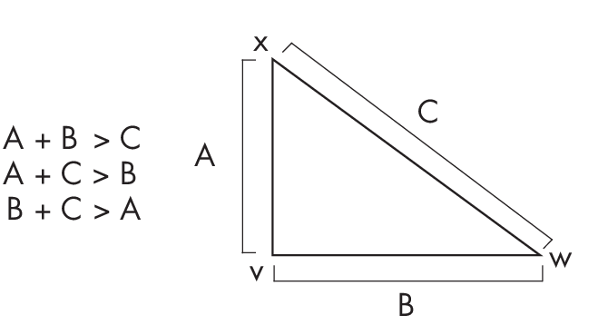

# Chapter 27: Proper Metrics 

**What are the three properties of a distance function that make it a
*proper* metric?**

Metrics are foundational to mathematics, computer science, and various
other scientific domains. Understanding the fundamental properties that
define a good distance function to measure distances or differences
between points or datasets is important. For instance, when dealing with
functions like loss functions in neural networks, understanding whether
they behave like proper metrics can be instrumental in knowing how
optimization algorithms will converge to a solution.

This chapter analyzes two commonly utilized loss functions, the mean
squared error and the cross-entropy loss, to demonstrate whether they
meet the criteria for proper metrics.

## The Criteria 

To illustrate the criteria of a proper metric, consider two vectors or
points **v** and **w** and their distance *d*(**v**, **w**), as shown in
Figure [1.1](#fig:ch27-fig01){reference="fig:ch27-fig01"
reference-type="ref"}.

{#fig:ch27-fig01}

The criteria of a proper metric are the following:

- The distance between two points is always non-negative, *d*(**v**,
  **w**) \\(\\geq\\) 0, and can be 0 only if the two points are
  identical, that is, **v** = **w**.

- The distance is symmetric; for instance, *d*(**v**, **w**) =
  *d*(**w**, **v**).

- The distance function satisfies the *triangle inequality* for any
  three points: **v**, **w**, **x**, meaning *d*(**v**, **w**)
  \\(\\leq\\) *d*(**v**, **x**) + *d*(**x**, **w**).

To better understand the triangle inequality, think of the points as
vertices of a triangle. If we consider any triangle, the sum of two of
the sides is always larger than the third side, as illustrated in
Figure [1.2](#fig:ch27-fig02){reference="fig:ch27-fig02"
reference-type="ref"}.

{#fig:ch27-fig02}

Considerwhatwouldhappenifthetriangleinequalitydepictedin
Figure [1.2](#fig:ch27-fig02){reference="fig:ch27-fig02"
reference-type="ref"} weren't true. If the sum of the lengths of sides
AB and BC was shorter than AC, then sides AB and BC would not meet to
form a triangle; instead, they would fall short of each other. Thus, the
fact that they meet and form a triangle demonstrates the triangle
inequality.

## The Mean Squared Error 

The *mean squared error (MSE)* loss computes the squared Euclidean
distance between a target variable *y* and a predicted target value
\\(\\hat{\\text{\\emph{y}}}\\):

\$\$ \\mathrm{MSE}=\\frac{1}{n} \\sum\_{i\\,=\\,1}\^n\\left(y\^{(i)} -
\\hat{y}\^{(i)}\\right)\^2

The index *i* denotes the *i*th data point in the dataset or sample. Is
this loss function a proper metric?

For simplicity's sake, we will consider the *squared error (SE)* loss
between two data points (though the following insights also hold for the
MSE). As shown in the following equation, the SE loss quantifies the
squared difference between the predicted and actual values for a single
data point, while the MSE loss averages these squared differences over
all data points in a dataset:

\\\[\\mathrm{SE}(y, \\hat{y})=\\left(y - \\hat{y}\\right)\^2\\\]

In this case, the SE satisfies the first part of the first criterion:
the distance between two points is always non-negative. Since we are
raising the difference to the power of 2, it cannot be negative.

How about the second criterion, that the distance can be 0 only if the
two points are identical? Due to the subtraction in the SE, it is
intuitive to see that it can be 0 only if the prediction matches the
target variable, *y* = \\(\\hat{\\text{\\emph{y}}}\\). As with the first
criterion, we can use the square to confirm that SE satisfies the second
criterion: we have (*y* â€" \\(\\hat{\\text{\\emph{y}}}\\))^2^ =
(\\(\\hat{\\text{\\emph{y}}}\\) â€" *y*)^2^.

At first glance, it seems that the squared error loss also satisfies the
third criterion, the triangle inequality. Intuitively, you can check
this by choosing three arbitrary numbers, here 1, 2, 3:

- (1 â€" 2)^2^ \\(\\leq\\) (1 â€" 3)^2^ + (2 â€" 3)^2^

- (1 â€" 3)^2^ \\(\\leq\\) (1 â€" 2)^2^ + (2 â€" 3)^2^

- (2 â€" 3)^2^ \\(\\leq\\) (1 â€" 2)^2^ + (1 â€" 3)^2^

However, there are values for which this is not true. For example,
consider the values *a* = 0, *b* = 2, and *c* = 1. This gives us
*d*(*a*, *b*) = 4, *d*(*a*, *c*) = 1, and *d*(*b*, *c*) = 1, such that
we have the following scenario, which violates the triangle inequality:

- (0 â€" 2)^2^ \\(\\nleq\\) (0 â€" 1)^2^ + (2 â€" 1)^2^

- (2 â€" 1)^2^ \\(\\leq\\) (0 â€"1)^2^ + (0 â€" 2)^2^

- (0 â€" 1)^2^ \\(\\leq\\) (0 â€"2)^2^ + (1 â€" 2)^2^

Since it does not satisfy the triangle inequality via the example above,
we conclude that the (mean) squared error loss is not a proper metric.

However, if we change the squared error into the *root-squared error*

\\\[\\sqrt\\text{(\\emph{y} \-- }
\\hat{\\text{\\emph{y}}})\\textsuperscript{2}\\\]

the triangle inequality can be satisfied:

\\\[\\sqrt{\\text{(0 \-- 2)\\textsuperscript{2}}} \\leq \\sqrt{\\text{(0
\-- 1)\\textsuperscript{2} +}} \\sqrt{\\text{(2 \--
1)\\textsuperscript{2}}}\\\]

::: note
You might be familiar with the [L]{.upright}~2~ distance or Euclidean
distance, which is known to satisfy the triangle inequality. These two
distance metrics are equivalent to the root-squared error when
considering two scalar values.
:::

## The Cross-Entropy Loss 

*Cross entropy* is used to measure the distance between two probability
distributions. In machine learning contexts, we use the discrete
cross-entropy loss (CE) between class label *y* and the predicted
probability *p* when we train logistic regression or neural network
classifiers on a dataset consisting of *n* training examples:

\\\[\\mathrm{CE}(\\mathbf{y}, \\mathbf{p}) = -\\frac{1}{n}
\\sum\_{i\\,=\\,1}\^n y\^{(i)} \\times \\log \\left(p\^{(i)}\\right)\\\]

Is this loss function a proper metric? Again, for simplicity's sake,
we will look at the cross-entropy function (*H*) between only two data
points:

\\\[H(y, p) = - y \\times \\log(p)\\\]

The cross-entropy loss satisfies one part of the first criterion: the
distance is always non-negative because the probability score is a
number in the range \[0, 1\]. Hence, log(*p*) ranges between
â€"\\(\\infty\\) and 0. The important part is that the *H* function
includes a negative sign. Hence, the cross entropy ranges between
\\(\\infty\\) and 0 and thus satisfies one aspect of the first criterion
shown above.

However, the cross-entropy loss is not 0 for two identical points. For
example, *H*(0.9, 0.9) = â€"0.9 \\(\\times\\) log(0.9) = 0.095.

The second criterion shown above is also violated by the cross-entropy
loss because the loss is not symmetric: â€"*y* \\(\\times\\) log(*p*)
\\(\\neq\\) â€"*p* \\(\\times\\) log(*y*). Let's illustrate this with
a concrete, numeric example:

- If *y* = 1 and *p* = 0.5, then â€"1 \\(\\times\\) log(0.5) = 0.693.

- If *y* = 0.5 and *p* = 1, then â€"0.5 \\(\\times\\) log(1) = 0.

Finally, the cross-entropy loss does not satisfy the triangle
inequality, *H*(*r*, *p*) \\(\\geq\\) *H*(*r*, *q*) + *H*(*q*, *p*).
Let's illustrate this with an example as well. Suppose we choose *r* =
0.9, *p* = 0.5, and *q* = 0.4. We have:

- *H*(0.9, 0.5) = 0.624

- *H*(0.9, 0.4) = 0.825

- *H*(0.4, 0.5) = 0.277

As you can see, 0.624 \\(\\geq\\) 0.825 + 0.277 does not hold here.

In conclusion, while the cross-entropy loss is a useful loss function
for training neural networks via (stochastic) gradient descent, it is
not a proper distance metric, as it does not satisfy any of the three
criteria. \### Exercises

27-1. Suppose we consider using the mean absolute error (MAE) as an
alternative to the root mean square error (RMSE) for measuring the
performance of a machine learning model, where MAE =
\\(\\frac{\\text{1}}{\\text{\\emph{n}}}
\\sum\_{\\text{\\emph{i}\\,=\\,1}}\^{\\text{\\emph{n}}}\|\\) *y*^(*i*)^
â€"
\\(\\hat{\\text{\\emph{y}}}\\textsuperscript{(\\text{\\emph{i}})}\|\\)
and RMSE = \\(\\sqrt{\\frac{\\text{1}}{\\text{\\emph{n}}}
\\sum\_{\\text{\\emph{i}\\,=\\,1}}\^{\\text{\\emph{n}}}(
\\emph{\\text{y}}\\textsuperscript{(\\emph{\\text{i}})} -
\\hat{\\text{\\emph{y}}}\\textsuperscript{(\\emph{\\text{i}})})}\^\\text{2}\\).
However, a colleague argues that the MAE is not a proper distance metric
in metric space because it involves an absolute value, so we should use
the RMSE instead. Is this argument correct?

27-2. Based on your answer to the previous question, would you say that
the MAE is better or is worse than the RMSE?

\

------------------------------------------------------------------------

